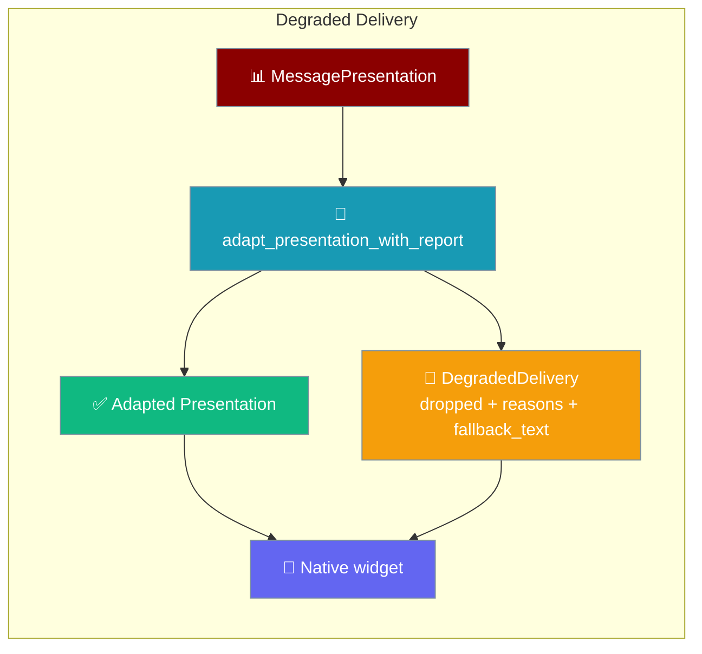
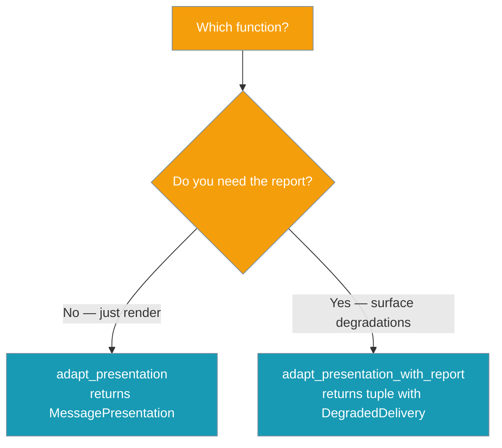
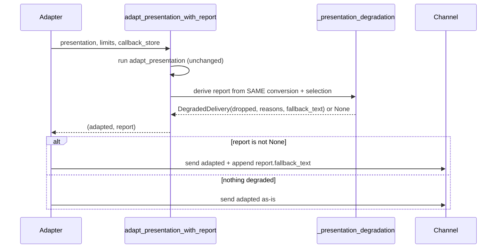
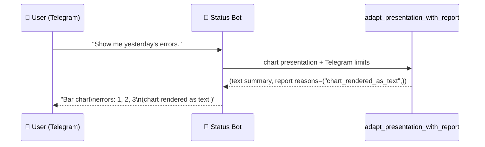

Degraded Delivery makes presentation downgrades **visible** — when a chart becomes text, a select becomes buttons, or a long callback is shortened, the adapter appends a short fallback note and records a machine-readable reason instead of degrading silently.

```python
from praisonaiagents.bots import (
    MessagePresentation,
    PresentationBlock,
    PresentationLimits,
    adapt_presentation_with_report,
)

# Model / tool returns a chart presentation.
presentation = MessagePresentation([
    PresentationBlock.make_chart("bar", [{"label": "errors", "points": [1, 2, 3]}]),
])

# Adapting for Telegram (supports_charts=False):
adapted, report = adapt_presentation_with_report(
    presentation, PresentationLimits.telegram()
)

if report:
    print(report.fallback_text)  # e.g. "(chart rendered as text.)"
    print(report.reasons)        # ("chart_rendered_as_text",)
```



## Quick Start

<Steps>
<Step title="Adapt and report in one call">
`adapt_presentation_with_report` returns the adapted presentation plus a typed report you can append to the last text block:

```python
from praisonaiagents.bots import (
    MessagePresentation,
    PresentationBlock,
    PresentationLimits,
    adapt_presentation_with_report,
)

presentation = MessagePresentation([
    PresentationBlock.make_chart("bar", [{"label": "errors", "points": [1, 2, 3]}]),
])

adapted, report = adapt_presentation_with_report(
    presentation, PresentationLimits.telegram()
)
if report is not None:
    print(report.fallback_text)  # append this to the outgoing message
```
</Step>

<Step title="Preserve lossless callbacks">
Attach a `callback_store` so long `reply` / `select` values round-trip losslessly — `DEGRADE_CALLBACK_DATA_TOO_LONG` is then **not** reported:

```python
from praisonaiagents.bots import (
    InMemoryCallbackPayloadStore,
    adapt_presentation_with_report,
)

adapted, report = adapt_presentation_with_report(
    presentation,
    PresentationLimits.telegram(),
    callback_store=InMemoryCallbackPayloadStore(),
)
```
</Step>

<Step title="Aggregate by reason code">
Count `DEGRADE_*` codes across a run to find channels or UIs that consistently degrade. Compare against the module constants, not string literals:

```python
from praisonaiagents.bots import DEGRADE_CHART_AS_TEXT

if report and DEGRADE_CHART_AS_TEXT in report.reasons:
    metrics.increment("presentation.chart_degraded")
```
</Step>
</Steps>

<Note>
`adapt_presentation()` already downgrades unsupported controls to text, but returned **no record** of what it dropped — the user and the model never learned that a button vanished or a chart became text. `adapt_presentation_with_report()` is a drop-in replacement that returns both the adapted presentation and a typed report. The original `adapt_presentation()` is retained unchanged.
</Note>

---

## Which function?



| Function | Returns | When to use |
|----------|---------|-------------|
| `adapt_presentation(...)` | `MessagePresentation` | Legacy callers; you don't need the drop report. |
| `adapt_presentation_with_report(...)` | `(MessagePresentation, DegradedDelivery \| None)` | You want the downgrade to be visible — recommended for all new adapters. |

---

## DegradedDelivery

`adapt_presentation_with_report()` is a drop-in replacement for `adapt_presentation()` that also reports what degraded.

- **Import:** `from praisonaiagents.bots import DegradedDelivery, adapt_presentation_with_report`
- **Signature:** `adapt_presentation_with_report(presentation, limits, *, callback_store=None) -> tuple[MessagePresentation, DegradedDelivery | None]`
- **`None` when nothing degrades** — an adapter that always appends `report.fallback_text` should guard on `report is not None`.

| Field | Type | Description |
|-------|------|-------------|
| `dropped` | `Tuple[str, ...]` | Human-readable descriptions of each degraded/dropped control (e.g. `"1 button(s) dropped (over channel cap)"`). |
| `reasons` | `Tuple[str, ...]` | Machine-readable reason codes (the `DEGRADE_*` constants), aligned by intent with `dropped`. |
| `fallback_text` | `str` | Short, user-facing note the adapter can append so the degradation is never silent. Empty when nothing degraded — but in that case the whole report is `None`. |

---

## Reason codes

All exported from `praisonaiagents.bots`. Compare against the `DEGRADE_*` constants, not string literals.

| Constant | String value | When it fires |
|----------|--------------|---------------|
| `DEGRADE_SELECT_UNSUPPORTED` | `"select_unsupported"` | Channel has `supports_select=False` — a SELECT block became a BUTTONS block. |
| `DEGRADE_WEB_APP_UNAVAILABLE` | `"web_app_unavailable"` | Channel has `supports_web_apps=False` — a `web_app` action became a plain URL. |
| `DEGRADE_BUTTONS_TRUNCATED` | `"buttons_truncated"` | Buttons block exceeded `max_buttons * max_button_rows` — lowest-`priority` buttons were dropped. |
| `DEGRADE_OPTIONS_TRUNCATED` | `"options_truncated"` | Select block had more options than `max_options` — extras were dropped. |
| `DEGRADE_TABLE_AS_TEXT` | `"table_rendered_as_text"` | Channel has `supports_tables=False` — TABLE became a markdown-table TEXT block. |
| `DEGRADE_CHART_AS_TEXT` | `"chart_rendered_as_text"` | Channel has `supports_charts=False` — CHART became a text-summary TEXT block. |
| `DEGRADE_CALLBACK_DATA_TOO_LONG` | `"callback_data_too_long"` | A `reply` or `select` callback overflowed the channel byte-cap **and no `callback_store` was attached** — value was hashed (lossy). |

---

## How It Works

The report is derived from the **same** conversion and selection decisions as `adapt_presentation`, so it never disagrees with the adaptation.



The report respects the adaptation order and priority:

- `select → buttons` is applied first, then buttons truncation runs — so a huge select on Telegram reports `select_unsupported` **and** (if it overflows the cap) `buttons_truncated`.
- A `web_app` / lossy-callback on a *dropped* button is **not** reported — the user never saw it.
- Callback shortening is reported **only** when the adapter genuinely emitted a lossy payload — a callback that round-trips losslessly via a `callback_store` is **not** reported.
- Plain-callback actions (already channel-safe) are **never** reported.

Attaching a callback store turns lossy callback shortening into lossless round-tripping — the `DEGRADE_CALLBACK_DATA_TOO_LONG` code stops firing.

---

## User Interaction Flow

A user in Telegram asks a status bot for a bar chart of yesterday's errors. Telegram cannot render charts natively. The bot delivers a compact text summary and appends `"(chart rendered as text.)"` — so the user knows the numbers are the whole picture. The operator dashboard buckets this event under `chart_rendered_as_text`.



---

## Common Patterns

**Append the fallback to the last text block** — a one-liner in the adapter's send path keeps every channel's fallback consistent:

```python
adapted, report = adapt_presentation_with_report(presentation, limits)
if report is not None:
    text = f"{text}\n{report.fallback_text}"
```

**Attach a `callback_store` on channels with byte-capped callbacks** — the built-in `InMemoryCallbackPayloadStore` (already used by `TelegramBot`) turns lossy shortening into lossless round-tripping.

**Alert on repeated `buttons_truncated` / `options_truncated`** — signals a UI that consistently over-builds for the target channel.

---

## Best Practices

<AccordionGroup>
<Accordion title="Prefer adapt_presentation_with_report in new adapters">
Silent downgrades hide UX issues from users and operators alike — surface them.
</Accordion>
<Accordion title="Compare against DEGRADE_* constants, not string literals">
The reason codes are stable module constants for exactly this reason.
</Accordion>
<Accordion title="Empty dropped means the whole report is None">
Guard with `if report is not None:` before appending `report.fallback_text`.
</Accordion>
<Accordion title="Attach a callback store when you can">
It eliminates the only lossy adaptation (`DEGRADE_CALLBACK_DATA_TOO_LONG`) and makes long-value round-trips exact.
</Accordion>
</AccordionGroup>

---

## Related

<CardGroup cols={2}>
<Card title="Interactive Bot Messages" icon="hand-pointer" href="/features/bot-presentations">
  Buttons, selects, tables, and charts across channels
</Card>
<Card title="Interactive Callback Store" icon="database" href="/features/interactive-callback-store">
  Lossless round-tripping for long callback payloads
</Card>
<Card title="Failure Reply" icon="triangle-exclamation" href="/features/failure-reply">
  The failure-path counterpart
</Card>
<Card title="Visible-Outcome Guarantee" icon="eye" href="/features/visible-outcome-guarantee">
  Every turn ends in a visible outcome
</Card>
</CardGroup>

<Note>
Introduced in [PraisonAI commit 892b9fb](https://github.com/MervinPraison/PraisonAI/commit/892b9fb63361f9e543983c3d648d4f09aca6298f) (fixes [#3799](https://github.com/MervinPraison/PraisonAI/issues/3799)).
</Note>
