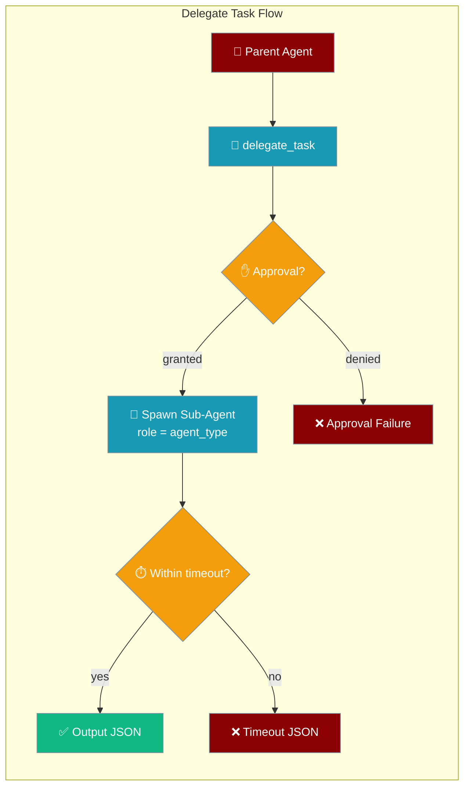
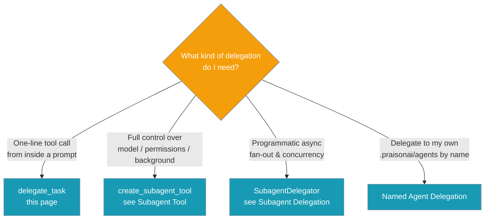
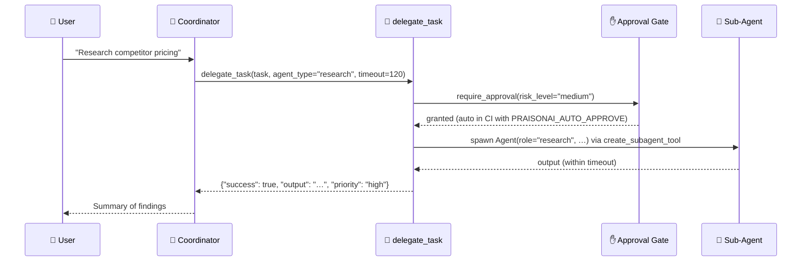

`delegate_task` gives an agent a single tool to spawn a specialist sub-agent for one task and return its output.



## Quick Start

<Steps>
<Step title="Agent picks the tool">
```python
from praisonaiagents import Agent
from praisonaiagents.tools import delegate_task

agent = Agent(
    name="Coordinator",
    instructions="Delegate specialist work to a sub-agent when useful.",
    tools=[delegate_task],
)

agent.start("Delegate a market research task on competitor pricing.")
```

The coordinator picks `delegate_task`, spins up a sub-agent whose role is derived from `agent_type`, and returns the result.
</Step>

<Step title="Direct call (headless / CI)">
```python
import json
from praisonaiagents.tools.delegation_tools import delegate_task

# In headless / CI, set PRAISONAI_AUTO_APPROVE=true to bypass the approval gate.
raw = delegate_task(
    task_description="Summarise Q3 competitor pricing changes",
    agent_type="research",
    priority="high",
    timeout=120,
)
print(json.loads(raw)["output"])
```
</Step>
</Steps>

---

## Which Delegation Primitive?

Three delegation entry points overlap — pick the simplest one that fits.



| Feature | `delegate_task` (this page) | `create_subagent_tool` | `SubagentDelegator` |
|---------|-----------------------------|------------------------|--------------------|
| Shape | Single tool function | Tool factory returning `{function, result_tool}` | Async class with methods |
| Sync / async | Sync | Sync **or** background | Async |
| Timeout | ✅ enforced (thread-bounded) | Per-call via subagent runtime | ✅ config + per-call |
| Approval | ✅ built-in `@require_approval("medium")` | Depends on agent config | Depends on agent config |
| Model / permission mode | Fixed lightweight defaults | ✅ Fully configurable | ✅ Fully configurable |
| Background jobs | ❌ | ✅ (`background=True`, `deliver=...`) | ✅ `delegate_parallel(...)` |
| Named-agent resolution | ❌ | ✅ (`agent_resolver=`) | ✅ (profile registry) |
| When to use | You want a **one-line drop-in delegation tool** an agent can invoke in a prompt | You want full control over the sub-agent | You want async fan-out and per-task cancellation |

---

## How It Works

`delegate_task` runs the sub-agent, waits for it (bounded by `timeout`), and returns a JSON string.



`agent_type` maps to the sub-agent's identity:

- `role` = `agent_type` (unless `agent_type == "general"`, in which case `role="assistant"`)
- `name` = `f"{agent_type}_agent"`
- `goal` = `f"Complete delegated {agent_type} tasks accurately."`
- `verbose=False`

This is intentionally lightweight — no extra config knobs and no separate registry of agent profiles. For richer control (custom LLM, permission mode, background execution, named-agent resolution), reach for `create_subagent_tool` directly — see [Subagent Tool](/features/subagent-tool).

---

## Signature

```python
@require_approval(risk_level="medium")
def delegate_task(
    task_description: str,
    agent_type: str = "general",
    priority: str = "medium",
    timeout: int = 300,
) -> str
```

| Parameter | Type | Default | Description |
|-----------|------|---------|-------------|
| `task_description` | `str` | required | Description of the task to delegate to the sub-agent |
| `agent_type` | `str` | `"general"` | Type/role of agent (e.g. `"research"`, `"reviewer"`). Used as the sub-agent's `role` so the model can be steered toward a specialisation without extra config. `"general"` falls back to a plain `"assistant"` role. |
| `priority` | `str` | `"medium"` | Task priority hint — `"low"`, `"medium"`, or `"high"`. Echoed back in the success response for observability. |
| `timeout` | `int` | `300` | Maximum execution time in seconds. Enforced via a bounded worker thread — on expiry the tool returns a structured timeout failure. `timeout <= 0` disables the bound. |

---

## Return Shapes

The tool returns a JSON string in one of four shapes.

<CodeGroup>
```json Success
{
  "success": true,
  "task_description": "Summarise Q3 competitor pricing changes",
  "agent_type": "research",
  "priority": "high",
  "output": "…sub-agent output text…"
}
```

```json Runtime failure
{
  "success": false,
  "task_description": "…",
  "agent_type": "research",
  "error": "delegation failed"
}
```

```json Timeout
{
  "success": false,
  "task_description": "…",
  "agent_type": "research",
  "error": "Delegated task timed out after 120s"
}
```

```json Unhandled exception
{
  "success": false,
  "task_description": "…",
  "agent_type": "research",
  "error": "Error delegating task: <exception message>"
}
```
</CodeGroup>

---

## Approval Gate

`delegate_task` is decorated with `@require_approval(risk_level="medium")` because spawning a sub-agent is a medium-risk action.

- **Interactive:** users get a prompt to approve or deny the call.
- **Headless / CI:** set `PRAISONAI_AUTO_APPROVE=true` (or configure per-tool auto-approval) or the call is blocked before the sub-agent is spawned.

<Warning>
In CI, set `PRAISONAI_AUTO_APPROVE=true` explicitly rather than removing the approval decorator.
</Warning>

See [Approval Protocol](/features/approval-protocol) for how the gate works.

---

## Timeout Enforcement

The `timeout` parameter is now enforced (it was previously discarded).

- `timeout > 0` (default `300`): the sub-agent runs on a single-worker `ThreadPoolExecutor`; if it does not return in time, a structured timeout JSON is returned.
- `timeout <= 0`: bound disabled — the call blocks for as long as the sub-agent takes. Use this only when you have another way to cap runtime (e.g. an outer scheduler).

---

## Bot / Registry Usage

`delegate_task` is **not** auto-injected into the bot default toolset. Opt in explicitly:

```python
from praisonaiagents import BotConfig

config = BotConfig(
    token="YOUR_TOKEN",
    default_tools=[
        "search_web", "store_memory",
        "delegate_task",  # opt in
    ],
)
```

The tool is also available under the plain function and workspace-scoped forms:

```python
from praisonaiagents.tools import delegate_task              # module-level function
from praisonaiagents.tools.delegation_tools import DelegationTools, create_delegation_tools

# Optional: workspace-scoped instance
tools = create_delegation_tools(workspace=my_workspace)
```

---

## Common Patterns

**Ad-hoc research delegation** — a coordinator agent has `delegate_task` in its tool list; when it needs research it calls the tool and inlines the result.

```python
from praisonaiagents import Agent
from praisonaiagents.tools import delegate_task

coordinator = Agent(
    name="Coordinator",
    instructions="When you need research, delegate it and summarise the result.",
    tools=[delegate_task],
)
coordinator.start("Find competitor pricing changes this quarter.")
```

**Headless batch job** — set `PRAISONAI_AUTO_APPROVE=true`, call `delegate_task(...)` directly for each work item, parse the JSON return.

```python
import json
from praisonaiagents.tools.delegation_tools import delegate_task

items = ["Region A pricing", "Region B pricing"]
for item in items:
    raw = delegate_task(task_description=item, agent_type="research", timeout=120)
    result = json.loads(raw)
    print(result["success"], result.get("output") or result.get("error"))
```

**Priority-tagged workqueue** — pass `priority="high"` to record intent (echoed back in the response) even though it does not currently affect scheduling.

```python
delegate_task(task_description="Urgent audit", agent_type="reviewer", priority="high")
```

---

## Best Practices

<AccordionGroup>
<Accordion title="Prefer delegate_task for one-line delegation">
Use `delegate_task` when you want a **single-line tool** an agent can pick up automatically. For anything else — background jobs, a custom model, or a named agent — reach for [create_subagent_tool](/features/subagent-tool).
</Accordion>

<Accordion title="Always pass a realistic timeout">
The default is 300 s, but a scoped task usually completes in under 60 s. Set `timeout` to bound runtime and get a structured timeout JSON instead of a hang.
</Accordion>

<Accordion title="Set PRAISONAI_AUTO_APPROVE in CI">
In headless runs, set `PRAISONAI_AUTO_APPROVE=true` explicitly rather than removing the approval decorator — the gate stays in place for interactive use.
</Accordion>

<Accordion title="Treat priority as an observability tag">
`priority` is echoed back in the success response only. There is no scheduler behind it — don't rely on it to reorder work.
</Accordion>
</AccordionGroup>

---

## Related

<CardGroup cols={2}>
<Card title="Subagent Tool" icon="wrench" href="/features/subagent-tool">
Full-featured factory with model / permission mode / background.
</Card>
<Card title="Subagent Delegation" icon="users" href="/features/subagent-delegation">
Programmatic async delegation with concurrency control.
</Card>
<Card title="Named Agent Delegation" icon="user" href="/features/named-agent-delegation">
Delegate to your own `.praisonai/agents/*.md` by name.
</Card>
<Card title="Bot Default Tools" icon="robot" href="/features/bot-default-tools">
Where `delegate_task` sits in the opt-in registry.
</Card>
</CardGroup>
