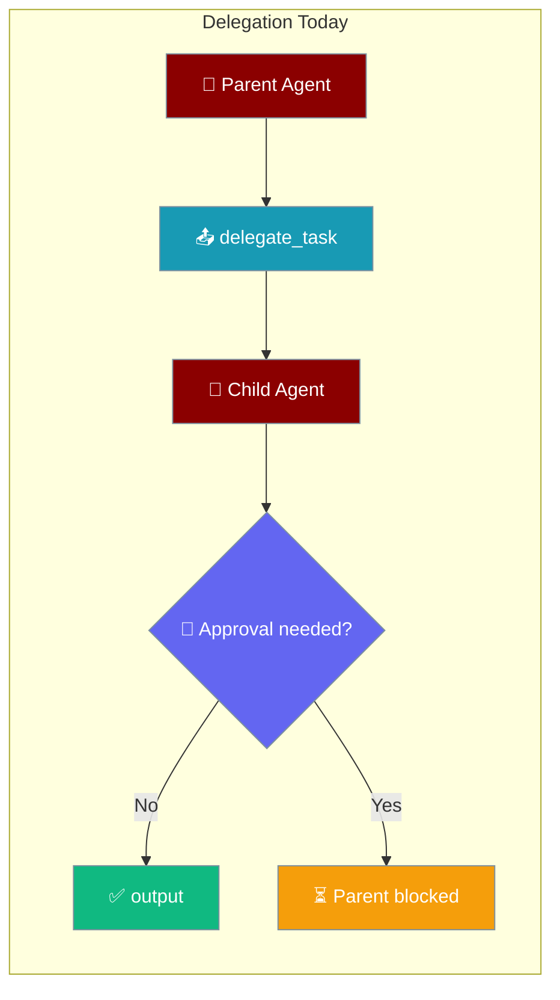
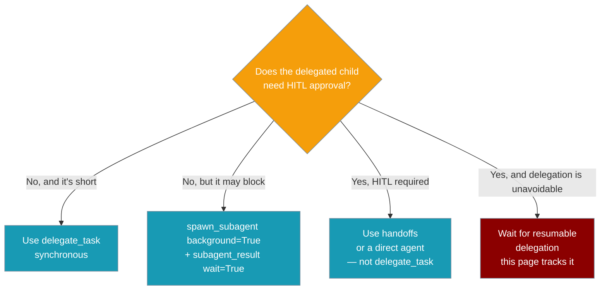

Delegated sub-agent runs execute synchronously today, so a child that pauses for human-in-the-loop (HITL) approval blocks the parent instead of returning a durable, resumable handle.

<Warning>
Do not assume delegated sub-agent runs are durable, restart-safe, or resumable after a HITL pause. The pieces required for resumable delegation are listed below.
</Warning>



An agent hits this limitation the moment a delegated child needs approval — the parent turn stalls. The background sub-agent path avoids the stall for long work but still does not resume a paused child:

```python
from praisonaiagents import Agent
from praisonaiagents.tools.subagent_tool import create_subagent_tool

# create_subagent_tool() returns spawn_subagent (+ subagent_result).
# Use background=True so a long child run never blocks the parent turn.
# Do NOT rely on this for HITL — see limitations below.
subagent = create_subagent_tool()

manager = Agent(
    name="manager",
    instructions="Delegate long analysis to a specialist in the background.",
    tools=[subagent["function"], subagent["result_tool"]["function"]],
)

manager.start("Analyse the Q3 report — dispatch it to a background subagent.")
```

## Quick Start

<Steps>
<Step title="See the blocking limitation">
`delegate_task` runs the child synchronously. If that child reaches a HITL approval pause, the parent turn hangs — there is no durable handle to resume it.

```python
from praisonaiagents.tools.delegation_tools import delegate_task

# Synchronous: the parent waits (bounded only by timeout).
# If the child pauses for approval, this call cannot resume it.
raw = delegate_task(
    task_description="Review the migration and apply it",
    agent_type="engineer",
    timeout=120,
)
print(raw)  # JSON string: success / output / error
```
</Step>

<Step title="Use the non-blocking workaround">
Spawn the child in the background so the parent stays responsive, then collect the completed output with `wait=True`.

```python
from praisonaiagents.tools.subagent_tool import create_subagent_tool

subagent = create_subagent_tool()
spawn_subagent = subagent["function"]
subagent_result = subagent["result_tool"]["function"]

job = spawn_subagent(task="Long analysis of the Q3 report", background=True)
result = subagent_result(job["job_id"], wait=True)  # blocks until terminal
print(result["status"], result.get("result"))
```

`subagent_result` defaults to `wait=False`, returning a `{"status": "running", ...}` handle if the job is unfinished. Pass `wait=True` (or poll until `status` is terminal) to collect the output. This avoids blocking the parent turn but is not a HITL resume flow.
</Step>
</Steps>

---

## How It Works

A HITL approval pause inside a delegated child has no path back to the parent turn, so the parent blocks on the child's `chat()` call until the timeout fires.

```mermaid
sequenceDiagram
    participant User
    participant Parent as Parent Agent
    participant Delegate as delegate_task
    participant Child
    participant Approval as ApprovalRegistry
    participant Shell as shell_execute

    User->>Parent: start("delegate a risky task")
    Parent->>Delegate: delegate_task(task, agent_type)
    Delegate->>Child: child.chat(prompt)  [synchronous]
    Child->>Shell: run @require_approval tool
    Shell->>Approval: request approval
    Approval-->>Child: pause — awaiting human
    Note over Parent,Child: 🛑 Child paused; parent still blocked on chat()
    Note over Parent: ⏳ No durable handle — parent waits until timeout
    Delegate-->>Parent: timeout / opaque failure
    Parent-->>User: no resume path for the paused child
```

Convert the behaviour into what it means for you:

| Behaviour today | Why it matters |
|---|---|
| `delegate_task` runs the child synchronously and in memory | The parent tool call blocks while the child runs |
| A delegated child is not guaranteed to survive a process restart | A daemon restart mid-child loses that work |
| A child approval pause has no durable bubble-up to the parent | The parent hangs or fails opaquely instead of pausing cleanly |
| No stable child-run result contract (`pending`/`completed`/`halted`) | Callers cannot classify outcomes or resume in place |

---

## Which option should I pick?

Pick the delegation style by whether the child needs HITL approval and whether it may block.



---

## Missing pieces for resumable delegation

The following pieces are required before delegated children can be considered resumable:

1. Durable child session persistence through the session store.
2. A child-run result-state contract, for example `pending`, `completed`, `failed`, and `halted`.
3. HITL bubble-up from child to parent, so an approval pause creates a durable pending handle.
4. A `drive_child` or equivalent continuation seam to resume the paused child.
5. Ownership and lifecycle rules for cancellation, timeouts, and result collection.

Prefer a core-first increment: introduce an internal `v0` child-run pause/resume contract before designing the full gateway UX. The first contract should be explicitly internal and anti-freeze — keep the resume handle opaque so later metadata (approval IDs, gateway routing, cancellation state) can be added without changing the parent-facing shape.

---

## Proposed `v0` state shape

<AccordionGroup>
<Accordion title="Proposed v0 state shape (for maintainers)">
A possible `v0` state shape for the internal child-run contract:

```python
from typing import Any, Literal, TypedDict

class ChildRunStateV0(TypedDict):
    schema_version: Literal['v0']
    child_run_id: str
    parent_run_id: str
    status: Literal['pending', 'completed', 'failed', 'halted']
    pause_reason: Literal['approval_required'] | None
    resume_token: str | None
    result: Any | None
    error: str | None
```

Semantics:

- `pending`: the child reached a HITL approval pause; the parent should receive a durable handle rather than block indefinitely. `pause_reason` is set (e.g. `approval_required`) and `resume_token` is non-null so the parent can continue the child. `result` and `error` are null.
- `completed`: the child reached a terminal **success** state; the parent can collect the output from `result`. `pause_reason`, `resume_token`, and `error` are null.
- `failed`: the child reached a terminal **failure** state; failure details are available in `error`. `pause_reason`, `resume_token`, and `result` are null.
- `halted`: the child was cancelled or stopped in a non-resumable way that is not a normal success/failure (e.g. timeout or explicit cancellation). `pause_reason` and `resume_token` are null.

Separating `completed` (success) from `failed` (failure) lets consumers classify terminal outcomes consistently and know exactly where to read the result or the failure reason.
</Accordion>
</AccordionGroup>

---

## Best Practices

<AccordionGroup>
<Accordion title="Do not use delegate_task for approval-heavy child flows">
Nested `@require_approval` tools inside a delegated child do not bubble their approval prompt to the parent turn today — the parent hangs or fails opaquely. Keep approval-gated work out of synchronous delegation.
</Accordion>

<Accordion title="Prefer spawn_subagent(background=True) for anything that may block">
Run potentially blocking work in the background and pass `wait=True` to `subagent_result(job_id)` to collect the completed output. Poll with `wait=False` if you need to stay responsive between checks.
</Accordion>

<Accordion title="Do not assume child state survives a process restart">
Delegated child sessions are not persisted through the session store today, so a daemon restart mid-child loses that work. Treat delegated results as ephemeral until resumable delegation ships.
</Accordion>

<Accordion title="When you need HITL, prefer handoffs">
Route the user directly to the specialist with `Agent(..., handoffs=[specialist])` so approvals happen in the user's live turn, not in a blocked worker thread.
</Accordion>
</AccordionGroup>

---

## Related

<CardGroup cols={2}>
<Card title="Delegate Task" icon="share-nodes" href="/features/delegate-task">
Sub-agent delegation from a parent agent.
</Card>
<Card title="Named Agent Delegation" icon="users" href="/features/named-agent-delegation">
Delegate to specific named agents.
</Card>
<Card title="Approval" icon="shield-check" href="/features/approval">
Human-in-the-loop approval framework.
</Card>
<Card title="Run-State Journal" icon="book-bookmark" href="/features/run-state-journal">
Durable per-event cursor for run resume — the primitive that would unblock Missing Piece #1.
</Card>
</CardGroup>
