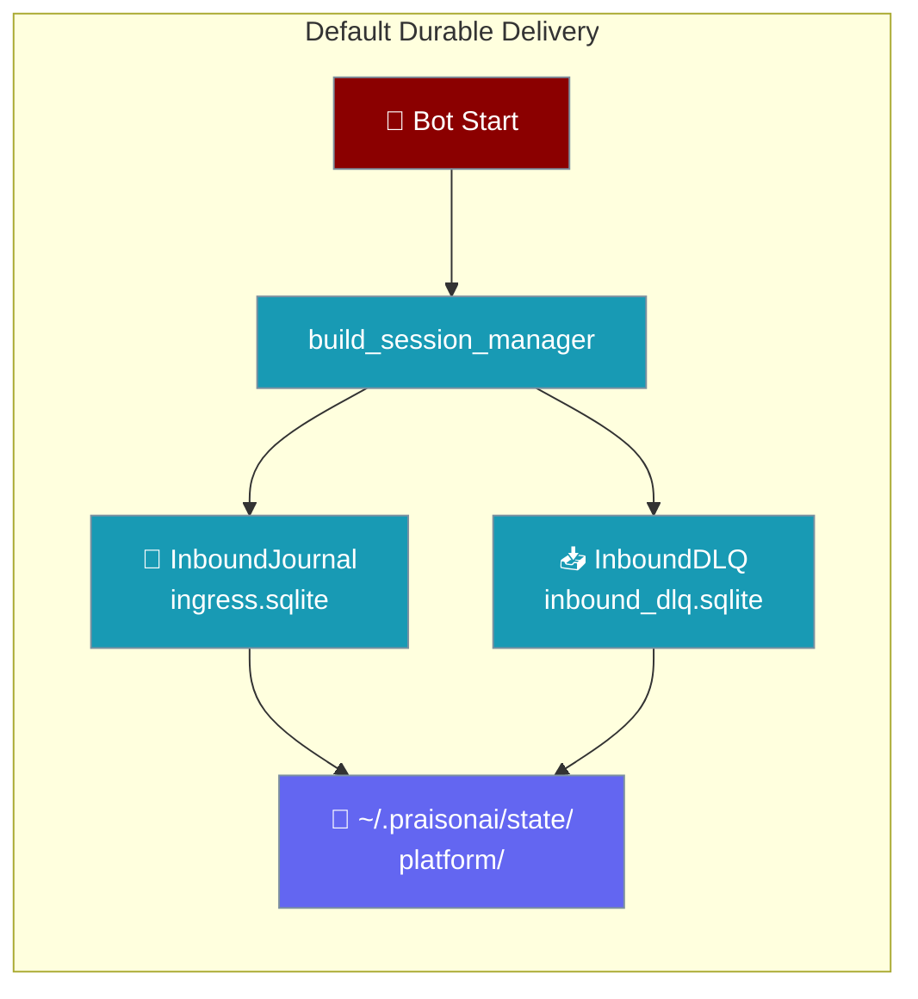
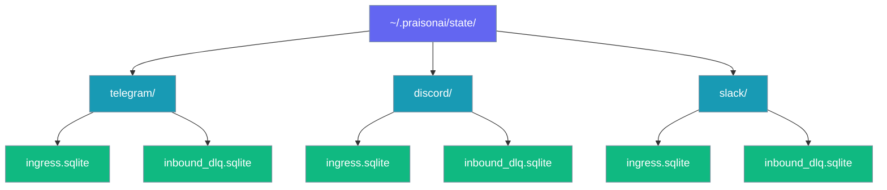

Every bot channel automatically gets crash-safe inbound delivery: a deduplicating journal and a dead-letter queue, stored in `~/.praisonai/state/<platform>/`.



## What's on by default

When you start any bot via `praisonai bot start`, `onboard`, or `bot.yaml`, PraisonAI automatically wires:

- **Inbound Journal** (`ingress.sqlite`) — deduplicates webhook redeliveries and replays in-flight messages on crash recovery
- **Inbound DLQ** (`inbound_dlq.sqlite`) — persists failed-LLM messages for later replay

Both live in one canonical per-platform directory. No configuration needed.

## Canonical path

```
~/.praisonai/state/<platform>/ingress.sqlite
~/.praisonai/state/<platform>/inbound_dlq.sqlite
```

`<platform>` is the sanitized platform name (characters outside `[A-Za-z0-9_.-]` replaced with `_`).

| Platform | Journal path | DLQ path |
|----------|-------------|----------|
| `telegram` | `~/.praisonai/state/telegram/ingress.sqlite` | `~/.praisonai/state/telegram/inbound_dlq.sqlite` |
| `discord` | `~/.praisonai/state/discord/ingress.sqlite` | `~/.praisonai/state/discord/inbound_dlq.sqlite` |
| `slack` | `~/.praisonai/state/slack/ingress.sqlite` | `~/.praisonai/state/slack/inbound_dlq.sqlite` |
| `whatsapp` | `~/.praisonai/state/whatsapp/ingress.sqlite` | `~/.praisonai/state/whatsapp/inbound_dlq.sqlite` |

Set `PRAISONAI_HOME` to change the base directory:

```bash
export PRAISONAI_HOME=/var/lib/praisonai
# → /var/lib/praisonai/state/telegram/ingress.sqlite
```

## `delivery:` schema

The `delivery` block is part of each channel configuration in `bot.yaml` / `gateway.yaml`:

| Field | Type | Default | Description |
|-------|------|---------|-------------|
| `durable` | `bool` | `true` | Set to `false` to fully opt out and return to in-memory delivery. |
| `store` | `str` | `None` | Path override. If it has a file suffix, sibling DBs are placed in its parent directory. `None` resolves to the canonical per-platform path. |

## How to configure

<Steps>
<Step title="Default (nothing to do)">
Just start your bot — durable delivery is already on.

```bash
praisonai bot start --config bot.yaml
```
</Step>

<Step title="Opt out for a channel">
```yaml
# bot.yaml
channels:
  telegram:
    token: "${TELEGRAM_BOT_TOKEN}"
    delivery:
      durable: false   # returns to in-memory delivery
```
</Step>

<Step title="Override the store directory">
```yaml
channels:
  telegram:
    token: "${TELEGRAM_BOT_TOKEN}"
    delivery:
      store: /var/lib/praisonai/telegram-state
      # → ingress.sqlite and inbound_dlq.sqlite in /var/lib/praisonai/telegram-state/
```
</Step>
</Steps>

## Per-platform isolation

Each platform gets its own directory so DLQ replays never cross platforms:



A Discord DLQ replay never consumes a Telegram failed event. Dedup keys never collide cross-platform.

## Failure mode

If durability is requested but the SQLite components fail to initialise (permissions, disk full, etc.), `_build_durable_components` logs a warning and the manager safely falls back to in-memory delivery. Your bot continues working — no crash.

## Best Practices

<AccordionGroup>
<Accordion title="Keep the default ON unless you have a reason to opt out">
Durable delivery costs a tiny SQLite write per message. The benefit — zero silent message loss on crash or LLM failure — is almost always worth it.
</Accordion>

<Accordion title="Use PRAISONAI_HOME for containerized deployments">
Mount a persistent volume and point `PRAISONAI_HOME` at it so the SQLite files survive container restarts.

```bash
docker run -e PRAISONAI_HOME=/data -v /host/data:/data my-bot
```
</Accordion>

<Accordion title="Override store for multi-bot setups on one host">
If you run two Telegram bots on the same host for different use cases, give each bot its own store directory to keep their journals isolated.

```yaml
# bot-support.yaml
channels:
  telegram:
    token: "${SUPPORT_BOT_TOKEN}"
    delivery:
      store: /var/lib/praisonai/support-telegram

# bot-sales.yaml
channels:
  telegram:
    token: "${SALES_BOT_TOKEN}"
    delivery:
      store: /var/lib/praisonai/sales-telegram
```
</Accordion>

<Accordion title="Monitor DLQ size as a reliability indicator">
A growing DLQ (`praisonai bot dlq list`) signals chronic LLM failures. Wire `dlq.size()` into your alerting stack.
</Accordion>
</AccordionGroup>

---

## Related

<CardGroup cols={2}>
<Card title="Inbound Journal" icon="book" href="/docs/features/inbound-journal">
  Deduplication and crash-safe replay for inbound messages
</Card>
<Card title="Inbound DLQ" icon="inbox" href="/docs/features/inbound-dlq">
  Dead-letter queue for failed LLM calls — inspect and replay
</Card>
<Card title="Durable Outbound Delivery" icon="shield-check" href="/docs/features/durable-delivery">
  Outbound counterpart — persist outgoing messages with retry
</Card>
<Card title="Gateway Channel Config" icon="tower-broadcast" href="/docs/features/gateway">
  Full channel configuration reference including the `delivery` field
</Card>
</CardGroup>
