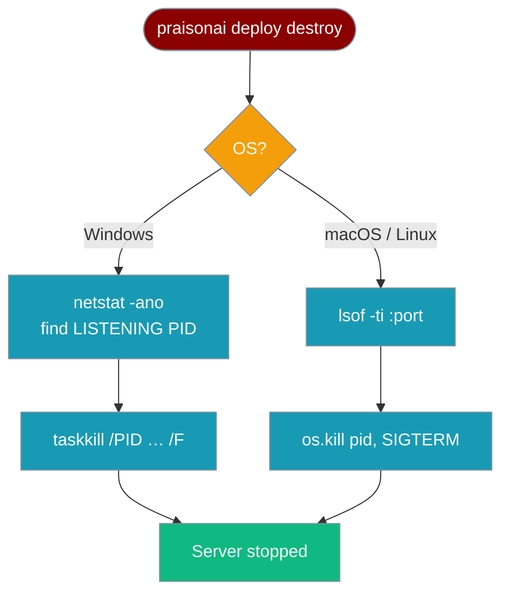

`praisonai deploy` runs, inspects, and tears down a deployment from the terminal.

```bash
praisonai deploy run --file agents.yaml
```

<Info>
**Platform support.** `praisonai-deploy` and `praisonai deploy` work on Linux, macOS, and Windows out of the box — the CLI forces UTF-8 on `stdout`/`stderr` at entry so the Rich emoji banners (🏥 🔍 📋 🚀 ❌) never crash on default Windows consoles (cp1252). No PowerShell/Terminal encoding tweaks required. Background API deploys also launch the child process with `sys.executable`, so the API server always starts under the same interpreter as the parent venv. Fixed in [PraisonAI PR #3611](https://github.com/MervinPraison/PraisonAI/pull/3611) and [PR #3608](https://github.com/MervinPraison/PraisonAI/pull/3608).
</Info>


## Quick Start

<Steps>
<Step title="Validate the config">
```bash
praisonai deploy validate --file agents.yaml
```
</Step>

<Step title="Run the deployment">
```bash
praisonai deploy run --file agents.yaml
```
</Step>

<Step title="Check status">
```bash
praisonai deploy status --file agents.yaml
```
</Step>
</Steps>

---

## Commands

The `praisonai deploy` group and the standalone `praisonai-deploy` console script share the same commands.

| Command | Description |
|---------|-------------|
| `run` | Execute the deployment |
| `init` | Generate a sample `agents.yaml` with a `deploy:` section |
| `validate` | Validate the `deploy:` configuration |
| `plan` | Print the deployment plan without executing |
| `status` | Print the current deployment state |
| `doctor` | Check deployment readiness |
| `destroy` | Tear down the deployment |
| `docker` | Deploy as a Docker container |
| `aws` | Deploy to AWS |
| `azure` | Deploy to Azure |
| `gcp` | Deploy to Google Cloud |

### run / validate / plan / status / destroy

These commands read the `deploy:` section of an `agents.yaml` file.

```bash
praisonai deploy run --file agents.yaml
praisonai deploy validate --file agents.yaml
praisonai deploy plan --file agents.yaml
praisonai deploy status --file agents.yaml
praisonai deploy destroy --file agents.yaml --yes
```

| Flag | Type | Default | Description |
|------|------|---------|-------------|
| `--file`, `-f` | string | `agents.yaml` | Path to `agents.yaml` |
| `--type` | choice | — | `api`, `docker`, or `cloud` |
| `--provider` | choice | — | `aws`, `azure`, or `gcp` (for `type=cloud`) |
| `--background` | flag | `false` | Run in background |
| `--json` | flag | `false` | Output as JSON |
| `--yes` | flag | `false` | Skip confirmation prompts |

### How `deploy run --type api` starts the server

The generated Flask server subprocess uses the same Python interpreter as the CLI itself (`sys.executable`) and inherits the parent process environment, so it always resolves the same `praisonaiagents`/`flask` install and picks up secrets like `OPENAI_API_KEY` without extra wiring.

<Note>
On Windows and multi-Python setups, a bare `python` on `PATH` may resolve to a different interpreter than the one running the CLI — that used to break the server with `ModuleNotFoundError: No module named 'flask'`. The interpreter is now pinned so the server always runs where the packages actually are.
</Note>

### How `deploy destroy --type api` stops the server

`praisonai deploy destroy` finds the process bound to the API port and terminates it using OS-native tooling — no extra dependency to install.



| Platform | Discover PID | Terminate |
|----------|--------------|-----------|
| Windows | `netstat -ano` (LISTENING rows) | `taskkill /PID <pid> /F` |
| macOS / Linux | `lsof -ti :<port>` | `SIGTERM` via `os.kill` |

<Note>
If the discovery binary is missing (rare — e.g. a stripped container image), the command reports `No API server running on port <port>` instead of raising. If *some* of the discovered PIDs can't be killed (permission error, gone process), destroy exits with `success=False` and lists the survivors in `error=`.
</Note>

### init

Generate a starter config for any type.

```bash
praisonai deploy init --file agents.yaml --type api
praisonai deploy init --file agents.yaml --type cloud --provider gcp
```

### doctor

Check that required host CLIs are present. See [Doctor](/docs/features/deploy/doctor).

```bash
praisonai deploy doctor --all
```

### docker / aws / azure / gcp

Provider shortcuts take the agent file as a positional argument.

<Tabs>
<Tab title="docker">
```bash
praisonai deploy docker agents.yaml --tag v1
```

| Flag | Alias | Description |
|------|-------|-------------|
| `--tag` | `-t` | Docker image tag |
</Tab>

<Tab title="aws">
```bash
praisonai deploy aws agents.yaml --region us-east-1
```

| Flag | Alias | Description |
|------|-------|-------------|
| `--region` | `-r` | AWS region |
</Tab>

<Tab title="gcp">
```bash
praisonai deploy gcp agents.yaml --project my-project
```

| Flag | Alias | Description |
|------|-------|-------------|
| `--project` | `-p` | GCP project |
</Tab>

<Tab title="azure">
```bash
praisonai deploy azure agents.yaml --resource-group my-rg
```

| Flag | Alias | Description |
|------|-------|-------------|
| `--resource-group` | `-g` | Azure resource group |
</Tab>
</Tabs>

---

## Standalone Script

Installing `praisonai-deploy` adds a `praisonai-deploy` console script that mirrors the `praisonai deploy` group.

```bash
praisonai-deploy --help
```

---

## Troubleshooting

<AccordionGroup>
<Accordion title="UnicodeEncodeError on Windows (older builds)">
Older `praisonai-deploy` builds crashed with `UnicodeEncodeError` on default Windows consoles because the Rich banner prefixes use emoji that cp1252 cannot encode. Every command (`doctor`, `validate`, `plan`, `run`, `api`, `docker`, `status`, `destroy`) was affected. Upgrade to the version that includes [PraisonAI PR #3611](https://github.com/MervinPraison/PraisonAI/pull/3611) — the CLI now reconfigures stdio to UTF-8 with `errors="replace"` at entry, so no workaround is required.
</Accordion>

<Accordion title="ModuleNotFoundError: No module named 'flask' on Windows">
A background API deploy could fail with `ModuleNotFoundError: No module named 'flask'` when a bare `python` resolved to a different interpreter than the parent venv. Upgrade to the version that includes [PraisonAI PR #3608](https://github.com/MervinPraison/PraisonAI/pull/3608) — the CLI now launches the child process with `sys.executable`, so the API server starts under the same interpreter as the parent.
</Accordion>
</AccordionGroup>

---

## Best Practices

<AccordionGroup>
<Accordion title="Use --json for scripting">
`--json` on `status` returns machine-readable output you can pipe into other tools.
</Accordion>

<Accordion title="Confirm destroys in CI">
Pass `--yes` to `destroy` only in automation. Interactive runs should confirm before tearing down.
</Accordion>
</AccordionGroup>

---

## Related

<CardGroup cols={2}>
<Card title="Doctor" icon="stethoscope" href="/docs/features/deploy/doctor">
Preflight readiness checks
</Card>
<Card title="Config Reference" icon="sliders" href="/docs/features/deploy/config-reference">
Every deploy field and default
</Card>
</CardGroup>
