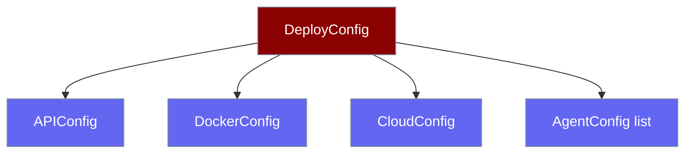

`DeployConfig` and its nested models define exactly what a deployment does.

```python
from praisonai_deploy import DeployConfig, DeployType

config = DeployConfig(type=DeployType.API)
```



## Quick Start

<Steps>
<Step title="API config">
```python
from praisonai_deploy import DeployConfig, DeployType

config = DeployConfig(type=DeployType.API)  # APIConfig() defaults filled in
```
</Step>

<Step title="Cloud config">
```python
from praisonai_deploy import DeployConfig, DeployType
from praisonai_deploy import CloudProvider
from praisonai_deploy.models import CloudConfig

config = DeployConfig(
    type=DeployType.CLOUD,
    cloud=CloudConfig(
        provider=CloudProvider.GCP,
        region="us-central1",
        service_name="my-agent",
    ),
)
```
</Step>
</Steps>

---

## DeployConfig

| Field | Type | Default | Description |
|-------|------|---------|-------------|
| `type` | `DeployType` | *(required)* | Deployment type |
| `api` | `Optional[APIConfig]` | auto when `type="api"` | API server config |
| `docker` | `Optional[DockerConfig]` | auto when `type="docker"` | Docker config |
| `cloud` | `Optional[CloudConfig]` | **required** when `type="cloud"` | Cloud config |
| `agents` | `Optional[List[AgentConfig]]` | `None` | Agent configurations |

Validation rules:

- `type="cloud"` requires a `cloud:` section, otherwise raises `ValueError("cloud config required for cloud deployment type")`.
- `type="api"` fills in `APIConfig()` defaults when omitted.
- `type="docker"` fills in `DockerConfig()` defaults when omitted.

---

## Enums

### DeployType

| Value | Meaning |
|-------|---------|
| `"api"` | Local / hosted Flask API server |
| `"docker"` | Build (and optionally push) a Docker image |
| `"cloud"` | Deploy to AWS ECS / Azure Container Apps / GCP Cloud Run |

### CloudProvider

`"aws"` · `"azure"` · `"gcp"`

### ServiceState

`running` · `stopped` · `pending` · `failed` · `not_found` · `unknown`

---

## APIConfig

| Field | Type | Default | Description |
|-------|------|---------|-------------|
| `host` | `str` | `"127.0.0.1"` | Server host |
| `port` | `int` | `8005` | Server port |
| `workers` | `int` | `1` | Number of worker processes |
| `cors_enabled` | `bool` | `True` | Enable CORS |
| `auth_enabled` | `bool` | `True` | Enable authentication |
| `auth_token` | `Optional[str]` | `None` | Authentication token |
| `reload` | `bool` | `False` | Enable auto-reload for development |

---

## DockerConfig

| Field | Type | Default | Description |
|-------|------|---------|-------------|
| `image_name` | `str` | `"praisonai-app"` | Docker image name |
| `tag` | `str` | `"latest"` | Docker image tag |
| `base_image` | `str` | `"python:3.11-slim"` | Base Docker image |
| `expose` | `List[int]` | `[8005]` | Ports to expose |
| `registry` | `Optional[str]` | `None` | Docker registry URL |
| `push` | `bool` | `False` | Push image to registry after build |
| `build_args` | `Optional[Dict[str, str]]` | `None` | Docker build arguments |

---

## CloudConfig

| Field | Type | Default | Description |
|-------|------|---------|-------------|
| `provider` | `CloudProvider` | *(required)* | Cloud provider |
| `region` | `str` | *(required)* | Deployment region |
| `service_name` | `str` | *(required)* | Service/application name |
| `image` | `Optional[str]` | `None` | Container image URL |
| `cpu` | `Optional[str]` | `"256"` | CPU allocation |
| `memory` | `Optional[str]` | `"512"` | Memory allocation (MB) |
| `min_instances` | `int` | `1` | Minimum instances |
| `max_instances` | `int` | `10` | Maximum instances |
| `env_vars` | `Optional[Dict[str, str]]` | `None` | Environment variables |
| `cluster_name` | `Optional[str]` | `None` | ECS cluster name (AWS) |
| `task_definition` | `Optional[str]` | `None` | Task definition (AWS) |
| `resource_group` | `Optional[str]` | `None` | Resource group (Azure) |
| `subscription_id` | `Optional[str]` | `None` | Subscription ID (Azure) |
| `project_id` | `Optional[str]` | `None` | Project ID (GCP) |

---

## AgentConfig

| Field | Type | Default | Description |
|-------|------|---------|-------------|
| `name` | `str` | *(required)* | Agent name/identifier |
| `entrypoint` | `str` | *(required)* | Agent entrypoint file (e.g. `agents.yaml`) |
| `env` | `Dict[str, str]` | `{}` | Environment variables |
| `secrets` | `Dict[str, str]` | `{}` | Secret references |
| `ports` | `Optional[List[int]]` | `None` | Ports to expose |
| `resources` | `Optional[Dict[str, str]]` | `None` | Resource requirements |

---

## Best Practices

<AccordionGroup>
<Accordion title="Let defaults fill themselves in">
For `type="api"` and `type="docker"`, omit the nested block to accept sensible defaults. Only add fields you need to change.
</Accordion>

<Accordion title="Always set cloud fields explicitly">
`provider`, `region`, and `service_name` are required for cloud deployments and have no defaults.
</Accordion>

<Accordion title="Quote cpu and memory values">
`cpu` and `memory` are strings (`"256"`, `"512"`), not integers — quote them in YAML.
</Accordion>
</AccordionGroup>

---

## Related

<CardGroup cols={2}>
<Card title="Python API" icon="code" href="/docs/features/deploy/python-api">
Deploy class and result models
</Card>
<Card title="Quick Start" icon="play" href="/docs/features/deploy/quickstart">
Minimal agents.yaml per type
</Card>
</CardGroup>
