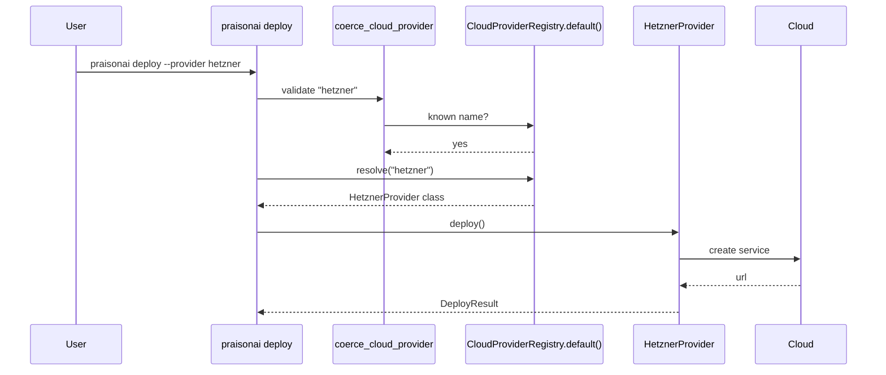

Ship a package that registers under the `praisonai.deploy.providers` entry-point group and `praisonai deploy` will list, validate, and run it just like a built-in.


## Quick Start

<Steps>
<Step title="Write a provider class">
Implement the five methods and accept a `CloudConfig` in `__init__`.

```python
from praisonai_deploy.models import (
    CloudConfig, DeployResult, DeployStatus, DestroyResult, ServiceState
)
from praisonai_deploy.doctor import DoctorReport, DoctorCheckResult


class HetznerProvider:
    def __init__(self, config: CloudConfig):
        self.config = config

    def deploy(self) -> DeployResult:
        return DeployResult(success=True, message="Deployed to Hetzner")

    def doctor(self) -> DoctorReport:
        return DoctorReport(checks=[
            DoctorCheckResult(name="Hetzner token", passed=True, message="HCLOUD_TOKEN set"),
        ])

    def plan(self) -> dict:
        return {"provider": "hetzner", "region": self.config.region}

    def status(self) -> DeployStatus:
        return DeployStatus(state=ServiceState.RUNNING, provider="hetzner")

    def destroy(self, force: bool = False) -> DestroyResult:
        return DestroyResult(success=True, message="Destroyed")
```
</Step>

<Step title="Register it in pyproject.toml">
```toml
[project.entry-points."praisonai.deploy.providers"]
hetzner = "acme_praison.provider:HetznerProvider"
```
</Step>

<Step title="Install and verify">
```bash
pip install acme-praison
python -c "from praisonai_deploy import list_cloud_providers; print(list_cloud_providers())"
```
</Step>

<Step title="Use it in agents.yaml">
```yaml
deploy:
  type: cloud
  cloud:
    provider: hetzner
    region: fsn1
    service_name: my-service
```
</Step>

<Step title="Deploy">
```bash
praisonai deploy --file agents.yaml
```
</Step>
</Steps>

---

## How It Works

`praisonai deploy` validates the provider name against the registry, then resolves your class and calls its hooks.



| Hook | Called by | Purpose |
|------|-----------|---------|
| `deploy()` | `praisonai deploy run` | Create or update the service |
| `doctor()` | `praisonai deploy doctor --provider <name>` | Report readiness / credential checks |
| `plan()` | `praisonai deploy plan` | Return the planned configuration without executing |
| `status()` | `praisonai deploy status` | Report current state |
| `destroy(force=False)` | `praisonai deploy destroy` | Tear the service down |

---

## The Provider Contract

Return the same models the built-in providers return. Signatures below match `praisonai_deploy/providers/base.py`.

| Method | Signature | Returns |
|--------|-----------|---------|
| `__init__` | `__init__(self, config: CloudConfig)` | — |
| `deploy` | `deploy(self)` | `DeployResult` |
| `doctor` | `doctor(self)` | `DoctorReport` |
| `plan` | `plan(self)` | `dict` |
| `status` | `status(self)` | `DeployStatus` |
| `destroy` | `destroy(self, force: bool = False)` | `DestroyResult` |

<Tip>
Subclass `praisonai_deploy.providers.BaseProvider` to inherit the abstract contract and let Python flag any method you forget to implement.
</Tip>

---

## Runtime Registration

For tests or notebooks that can't install a package, register the class directly on the shared registry.

```python
from praisonai_deploy.providers import CloudProviderRegistry

CloudProviderRegistry.default().register("hetzner", HetznerProvider)
```

---

## Validation Behavior

Provider names are normalised with `.strip().lower()`, so `HETZNER`, `hetzner`, and `"  hetzner  "` all resolve. Unknown names raise `ValueError: Invalid cloud provider: X. Must be one of: …`, where the list comes from the registry. Built-ins keep their enum identity (`config.provider is CloudProvider.AWS`); plugin providers are normalised strings.

---

## Common Patterns

Deploy programmatically with a plugin provider.

```python
from praisonai_deploy import Deploy, DeployConfig, DeployType
from praisonai_deploy.models import CloudConfig

config = DeployConfig(
    type=DeployType.CLOUD,
    cloud=CloudConfig(provider="hetzner", region="fsn1", service_name="my-service"),
)
result = Deploy(config).deploy()
print(result.url)
```

List every provider for `deploy doctor`-style tooling.

```python
from praisonai_deploy import list_cloud_providers

for name in list_cloud_providers():
    print(name)  # built-ins first, plugins appended sorted
```

Read `DeployStatus.provider` on a result from a plugin.

```python
from praisonai_deploy import Deploy

status = Deploy.from_yaml("agents.yaml").status()
print(status.provider)  # "hetzner"
```

---

## Best Practices

<AccordionGroup>
<Accordion title="Return the built-in shapes">
Return the same `DeployResult`, `DeployStatus`, and `DestroyResult` models the built-ins return, so any tool that parses `DeployStatus` keeps working.
</Accordion>

<Accordion title="Fail closed in doctor()">
No credentials means a `DoctorCheckResult(passed=False, ...)`. A report where every check passes should guarantee a deploy can start.
</Accordion>

<Accordion title="Prefix the entry-point name with your vendor">
Use a vendor-prefixed name like `acme-hetzner` to avoid collisions with other plugins.
</Accordion>
</AccordionGroup>

---

## Related

<CardGroup cols={2}>
<Card title="Overview" icon="rocket" href="/docs/features/deploy/overview">
Deploy types and providers
</Card>
<Card title="CLI Reference" icon="terminal" href="/docs/features/deploy/cli">
Every praisonai deploy subcommand
</Card>
<Card title="Python API" icon="code" href="/docs/features/deploy/python-api">
Deploy class and programmatic APIs
</Card>
<Card title="Config Reference" icon="sliders" href="/docs/features/deploy/config-reference">
Every DeployConfig field and default
</Card>
</CardGroup>
