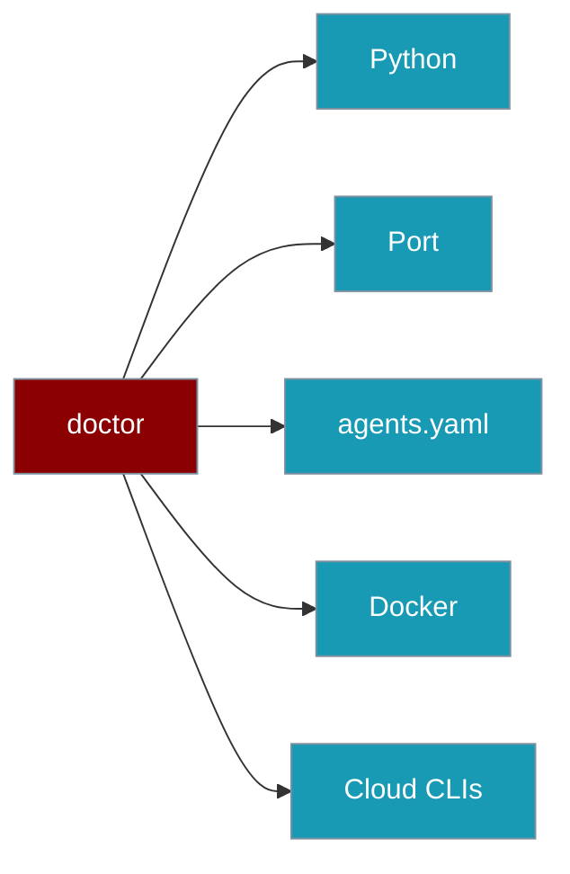

Doctor confirms that Python, ports, `agents.yaml`, and the host CLIs (`docker`, `aws`, `az`, `gcloud`) are ready before you deploy.

```python
from praisonai_deploy import run_all_checks

report = run_all_checks("agents.yaml")
print(report.all_passed)
```



## Quick Start

<Steps>
<Step title="Run every check">
```bash
praisonai deploy doctor --all
```
</Step>

<Step title="From Python">
```python
from praisonai_deploy import run_all_checks

report = run_all_checks("agents.yaml")
for check in report.checks:
    print(check.name, check.passed)
```
</Step>
</Steps>

---

## What It Checks

`run_all_checks` runs local, Docker, and cloud-provider checks.

| Check | Passes when |
|-------|-------------|
| Python Version | Python 3.9 or higher |
| Port | The configured port is free |
| agents.yaml | A valid `deploy:` section is present |
| Docker | `docker --version` succeeds |
| AWS CLI | `aws sts get-caller-identity` succeeds |
| Azure CLI | `az account show` succeeds **and**, when a `subscription_id` is configured, the ambient subscription matches it. A mismatch fails the check with `fix_suggestion: "az account set --subscription <configured id>"`. |
| GCP CLI | `gcloud config get-value project` returns a project |

Each failing check includes a `fix_suggestion` telling you how to resolve it.

---

## DoctorReport

`run_all_checks` returns a `DoctorReport`.

| Property | Type | Description |
|----------|------|-------------|
| `checks` | `List[DoctorCheckResult]` | Individual check results |
| `total_checks` | `int` | Number of checks run |
| `passed_checks` | `int` | Number that passed |
| `failed_checks` | `int` | Number that failed |
| `all_passed` | `bool` | Whether every check passed |

Each `DoctorCheckResult` has `name`, `passed`, `message`, and an optional `fix_suggestion`.

---

## Common Patterns

Gate a deploy on readiness.

```python
from praisonai_deploy import Deploy, run_all_checks

report = run_all_checks("agents.yaml")
if report.all_passed:
    Deploy.from_yaml("agents.yaml").deploy()
else:
    for check in report.checks:
        if not check.passed:
            print(check.name, "->", check.fix_suggestion)
```

---

## Best Practices

<AccordionGroup>
<Accordion title="Run doctor in CI before deploy">
A failing doctor check stops a broken deploy before it starts, saving a slow round-trip to a cloud provider.
</Accordion>

<Accordion title="Read the fix_suggestion">
Every failed check tells you exactly what to run — `aws configure`, `az login`, `gcloud init`, or install a missing CLI.
</Accordion>
</AccordionGroup>

---

## Related

<CardGroup cols={2}>
<Card title="CLI Reference" icon="terminal" href="/docs/features/deploy/cli">
The praisonai deploy command group
</Card>
<Card title="Overview" icon="rocket" href="/docs/features/deploy/overview">
Deploy package overview
</Card>
</CardGroup>
