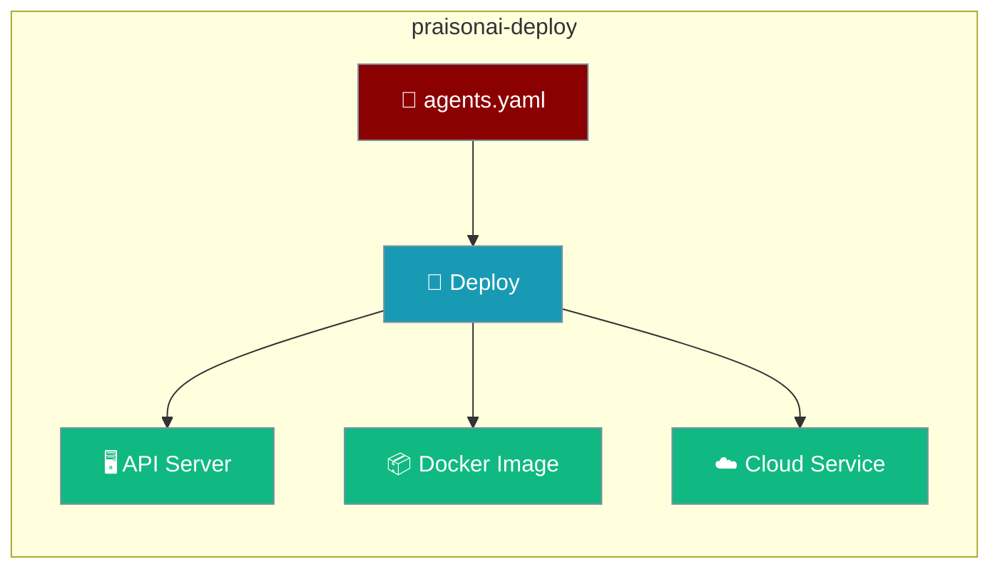
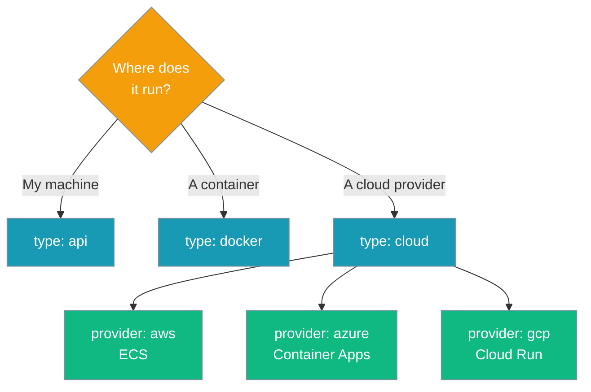
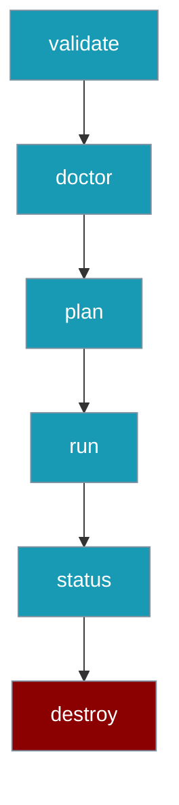

`praisonai-deploy` turns an `agents.yaml` file into a running service — a local API server, a Docker image, or a cloud deployment on AWS, Azure, or GCP.

```python
from praisonai_deploy import Deploy

deploy = Deploy.from_yaml("agents.yaml")
result = deploy.deploy()
status = deploy.status()
```



## Install

<CodeGroup>
```bash Standalone
pip install praisonai-deploy
```

```bash With API server
pip install "praisonai-deploy[api]"
```

```bash Full umbrella
pip install "praisonai[deploy]"
```
</CodeGroup>

`praisonai-deploy` is a tier-2 package (C14, publish slot #8). It drives host CLIs — `docker`, `aws`, `az`, and `gcloud` — directly. No boto3, Azure, or Google Cloud SDKs are required.

## Quick Start

<Steps>
<Step title="Pick a deployment type">
Every deployment is one of three types.

```python
from praisonai_deploy import Deploy

deploy = Deploy.from_yaml("agents.yaml")
```
</Step>

<Step title="Deploy">
```python
result = deploy.deploy()
print(result.url)
```
</Step>

<Step title="Check status">
```python
status = deploy.status()
print(status.state)  # running / stopped / pending / failed / not_found / unknown
```
</Step>
</Steps>

---

## Which Type?

Choose a deployment type based on where the agent runs.



| Type | Runs on | Best for |
|------|---------|----------|
| `api` | Local Flask server | Development, quick demos |
| `docker` | A container | Portable, reproducible builds |
| `cloud` | AWS / Azure / GCP | Production, autoscaling |

---

## User Flow

A full deploy goes from validation to teardown.



```bash
praisonai deploy validate --file agents.yaml   # schema check
praisonai deploy doctor --all                  # docker/aws/az/gcloud present?
praisonai deploy plan --file agents.yaml       # dry-run
praisonai deploy run --file agents.yaml        # execute
praisonai deploy status --file agents.yaml     # poll state
praisonai deploy destroy --file agents.yaml --yes  # teardown
```

---

## What's New

<Info>
`praisonai-deploy` extracts deployment into a standalone tier-2 package. Existing `from praisonai.deploy import ...` imports keep working through backward-compatible shims. See [Migration](/docs/features/deploy/migration).
</Info>

Fixes bundled in this release:

- `/chat` message forwarding now correctly forwards the user message.
- Docker builds use the correct build context, environment variables, and ports, and replace existing containers on rebuild.
- Foreground API deploys block until the process exits.
- The CLI docker shortcut merges the YAML `deploy:` section into invocation flags.
- MCP `deploy.status` accepts an explicit `config_path` argument.
- `praisonai deploy api` (foreground and `--background`) now spawns the Flask server with the same Python interpreter as the CLI (`sys.executable`), so it works on Windows and any multi-Python / venv setup. The previous bare `python` invocation could resolve to a different interpreter and fail with `ModuleNotFoundError: No module named 'flask'`.
- The generated Flask API server subprocess now inherits the parent environment (e.g. `OPENAI_API_KEY`), so the auto-generated `/chat` endpoint reaches the agent runtime without extra wiring.
- Docker deploys now honor an optional sibling `deploy.api` block — set `api.auth_enabled: false` to expose the generated `/chat` endpoint unauthenticated. Previously the block was silently dropped and the container defaulted to auth-on (PR [#3609](https://github.com/MervinPraison/PraisonAI/pull/3609)).

---

## Best Practices

<AccordionGroup>
<Accordion title="Run doctor before every cloud deploy">
`praisonai deploy doctor --all` checks that `docker`, `aws`, `az`, and `gcloud` are installed and authenticated before you spend time on a failed deploy.
</Accordion>

<Accordion title="Prefer the new import path">
Use `from praisonai_deploy import Deploy` in new code. The legacy `praisonai.deploy` path still resolves but is only kept for compatibility.
</Accordion>

<Accordion title="Keep secrets out of agents.yaml">
Use `env_vars` references and provider secret stores rather than committing tokens into the YAML file.
</Accordion>

<Accordion title="ModuleNotFoundError: No module named 'flask' when running deploy api">
As of PraisonAI PR #3608 the server is spawned with the same interpreter as the CLI, so this error should no longer occur on any supported install. If you still see it, verify that `pip install "praisonai-deploy[api]"` ran against the same Python you're running `praisonai` with — `python -c "import sys, flask; print(sys.executable, flask.__version__)"` should print the interpreter path the deploy CLI uses.
</Accordion>
</AccordionGroup>

---

## Related

<CardGroup cols={2}>
<Card title="Quick Start" icon="play" href="/docs/features/deploy/quickstart">
Minimal agents.yaml for each deployment type
</Card>
<Card title="Python API" icon="code" href="/docs/features/deploy/python-api">
The Deploy class and result models
</Card>
<Card title="CLI Reference" icon="terminal" href="/docs/features/deploy/cli">
Every praisonai deploy subcommand
</Card>
<Card title="Config Reference" icon="sliders" href="/docs/features/deploy/config-reference">
All DeployConfig fields and defaults
</Card>
</CardGroup>
