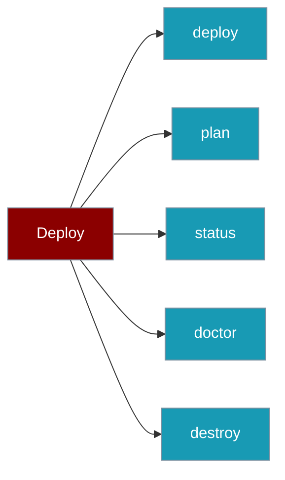

The `Deploy` class runs, inspects, and tears down a deployment from Python.

```python
from praisonai_deploy import Deploy

deploy = Deploy.from_yaml("agents.yaml")
result = deploy.deploy()
status = deploy.status()
```



## Quick Start

<Steps>
<Step title="From a YAML file">
```python
from praisonai_deploy import Deploy

deploy = Deploy.from_yaml("agents.yaml")
result = deploy.deploy()
```
</Step>

<Step title="From a config object">
```python
from praisonai_deploy import Deploy, DeployConfig, DeployType

config = DeployConfig(type=DeployType.API)
deploy = Deploy(config, agents_file="agents.yaml")
result = deploy.deploy()
```
</Step>
</Steps>

---

## Methods

| Method | Returns | Description |
|--------|---------|-------------|
| `Deploy.from_yaml(agents_file="agents.yaml")` | `Deploy` | Build a `Deploy` from the `deploy:` section of a YAML file |
| `Deploy(config, agents_file="agents.yaml")` | `Deploy` | Build a `Deploy` from a `DeployConfig` object |
| `deploy(background=False)` | `DeployResult` | Execute the deployment |
| `plan()` | `dict` | Return the planned configuration without deploying |
| `status()` | `DeployStatus` | Return the current service state |
| `doctor()` | `DoctorReport` | Run readiness checks for the configured type |
| `destroy(force=False)` | `DestroyResult` | Tear down the deployment |

---

## Result Models

Each operation returns a typed model.

### DeployResult

| Field | Type | Description |
|-------|------|-------------|
| `success` | `bool` | Whether the deployment succeeded |
| `message` | `str` | Human-readable result message |
| `url` | `Optional[str]` | Deployed service URL |
| `error` | `Optional[str]` | Error message if it failed |
| `metadata` | `Dict[str, Any]` | Additional metadata |

### DeployStatus

| Field | Type | Default | Description |
|-------|------|---------|-------------|
| `state` | `ServiceState` | *(required)* | `running` / `stopped` / `pending` / `failed` / `not_found` / `unknown` |
| `url` | `Optional[str]` | `None` | Service URL/endpoint |
| `message` | `str` | `""` | Status message |
| `service_name` | `Optional[str]` | `None` | Service name |
| `provider` | `Optional[str]` | `None` | `api` / `docker` / `aws` / `azure` / `gcp` |
| `region` | `Optional[str]` | `None` | Deployment region |
| `healthy` | `bool` | `False` | Whether the service is healthy |
| `instances_running` | `int` | `0` | Running instances |
| `instances_desired` | `int` | `0` | Desired instances |
| `created_at` | `Optional[str]` | `None` | Creation timestamp |
| `updated_at` | `Optional[str]` | `None` | Last update timestamp |
| `metadata` | `Dict[str, Any]` | `{}` | Provider-specific metadata |

`DeployStatus.to_dict()` returns a JSON-serialisable dictionary.

### DestroyResult

| Field | Type | Description |
|-------|------|-------------|
| `success` | `bool` | Whether the destroy succeeded |
| `message` | `str` | Result message |
| `resources_deleted` | `List[str]` | Deleted resource identifiers |
| `error` | `Optional[str]` | Error message if it failed |
| `metadata` | `Dict[str, Any]` | Additional metadata |

---

## Common Patterns

Read the status as JSON.

```python
from praisonai_deploy import Deploy

deploy = Deploy.from_yaml("agents.yaml")
status = deploy.status()
print(status.to_dict())
```

Plan before deploying.

```python
from praisonai_deploy import Deploy

deploy = Deploy.from_yaml("agents.yaml")
print(deploy.plan())  # dict describing the planned deployment
```

Tear down when finished.

```python
from praisonai_deploy import Deploy

deploy = Deploy.from_yaml("agents.yaml")
result = deploy.destroy(force=True)
print(result.resources_deleted)
```

---

## Best Practices

<AccordionGroup>
<Accordion title="Check success before reading url">
`DeployResult.url` is only set when `success` is `True`. Branch on `result.success` first.
</Accordion>

<Accordion title="Use to_dict() for logs and APIs">
`DeployStatus.to_dict()` returns plain JSON types, ready to serialise into logs or an HTTP response.
</Accordion>

<Accordion title="Import from praisonai_deploy">
Use `from praisonai_deploy import Deploy` — the `praisonai.deploy` path is a compatibility shim only.
</Accordion>
</AccordionGroup>

---

## Related

<CardGroup cols={2}>
<Card title="Config Reference" icon="sliders" href="/docs/features/deploy/config-reference">
DeployConfig and nested config models
</Card>
<Card title="CLI Reference" icon="terminal" href="/docs/features/deploy/cli">
The praisonai deploy command group
</Card>
</CardGroup>
