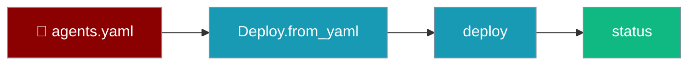

Add a `deploy:` section to `agents.yaml`, then deploy it with three method calls.

```python
from praisonai_deploy import Deploy

deploy = Deploy.from_yaml("agents.yaml")
result = deploy.deploy()
status = deploy.status()
```



## Quick Start

<Steps>
<Step title="Write agents.yaml">
Add a `deploy:` block alongside your agent definition.

```yaml
name: Sample Agent
framework: praisonai

agents:
  assistant:
    role: Assistant
    goal: Help users with tasks
    backstory: Experienced assistant ready to help

deploy:
  type: api
  api:
    host: 127.0.0.1
    port: 8005
```
</Step>

<Step title="Deploy from Python">
```python
from praisonai_deploy import Deploy

deploy = Deploy.from_yaml("agents.yaml")
result = deploy.deploy()
print(result.url)  # http://127.0.0.1:8005
```
</Step>

<Step title="Or deploy from the CLI">
```bash
praisonai deploy run --file agents.yaml
```
</Step>
</Steps>

---

## agents.yaml by Type

Each deployment type reads a matching block under `deploy:`.

<Tabs>
<Tab title="API">
```yaml
deploy:
  type: api
  api:
    host: 127.0.0.1
    port: 8005
    workers: 1
    cors_enabled: true
    auth_enabled: true
```
</Tab>

<Tab title="Docker">
```yaml
deploy:
  type: docker
  docker:
    image_name: praisonai-app
    tag: latest
    base_image: python:3.11-slim
    expose:
      - 8005
    push: false
  # Optional — configure the generated in-container server.
  # Omit to keep default auth on.
  api:
    host: 0.0.0.0
    port: 8005
    auth_enabled: false   # exposes /chat without a token
```

<Tip>
The sibling `api:` block under `type: docker` shipped in PR [#3609](https://github.com/MervinPraison/PraisonAI/pull/3609). Before that, `auth_enabled: false` was silently dropped and the container returned `401` on `/chat`.
</Tip>
</Tab>

<Tab title="Cloud (GCP)">
```yaml
deploy:
  type: cloud
  cloud:
    provider: gcp
    region: us-central1
    service_name: my-agent
    project_id: your-project-id
    min_instances: 1
    max_instances: 10
```
</Tab>
</Tabs>

---

## Generate a Sample

`generate_sample_yaml` produces a ready-to-edit config for any type.

```python
from praisonai_deploy import generate_sample_yaml, DeployType, CloudProvider

yaml_text = generate_sample_yaml(DeployType.CLOUD, CloudProvider.GCP)
print(yaml_text)
```

---

## Best Practices

<AccordionGroup>
<Accordion title="Start with type: api">
The API type needs no cloud credentials and runs on your machine. Validate the agent locally before moving to Docker or cloud.
</Accordion>

<Accordion title="Validate before you deploy">
Run `praisonai deploy validate --file agents.yaml` to catch schema errors early — a `type: cloud` block without a `cloud:` section fails fast.
</Accordion>
</AccordionGroup>

<Tip>
Need a target that isn't built in? See [Custom cloud providers](/docs/features/deploy/custom-providers).
</Tip>

---

## Related

<CardGroup cols={2}>
<Card title="Config Reference" icon="sliders" href="/docs/features/deploy/config-reference">
Every field, type, and default
</Card>
<Card title="Python API" icon="code" href="/docs/features/deploy/python-api">
Deploy class methods and results
</Card>
</CardGroup>
