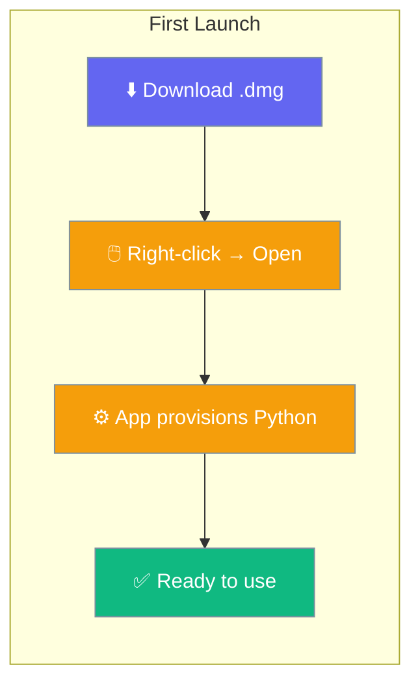
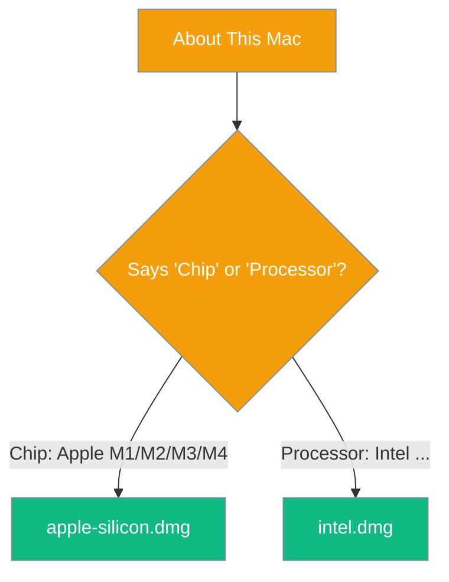
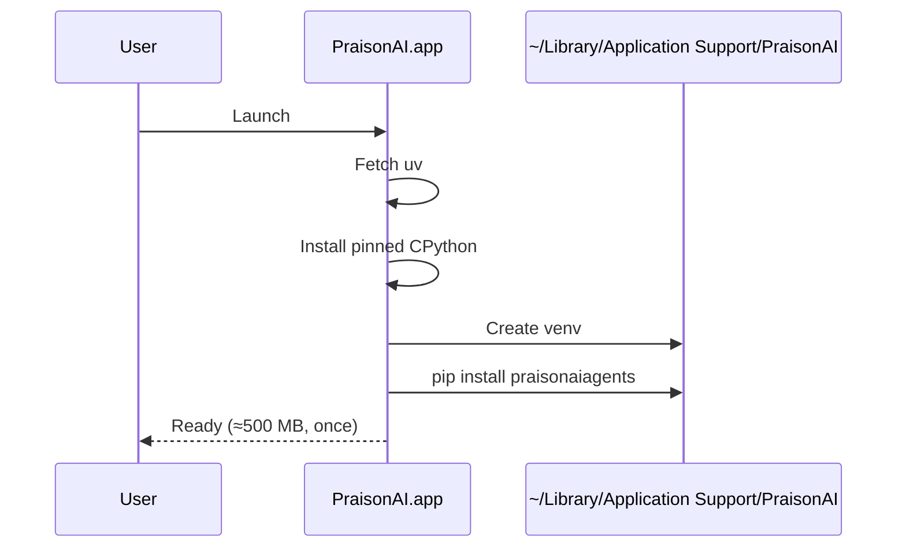

Download the Mac app, drag it to Applications, right-click → Open. That's it — the Python engine sets itself up on first launch.



## Quick Start

<Steps>
<Step title="Pick the right build for your Mac">
There are two separate downloads: one for Apple silicon, one for Intel. There is **no universal build** — a wrong-arch download fails at launch, not at install, which is a worse place to find out.

| Your Mac | Download |
|---|---|
| Apple silicon (M1–M4) | `PraisonAI-<version>-macos-apple-silicon.dmg` |
| Intel | `PraisonAI-<version>-macos-intel.dmg` |

<Tip>
Not sure which you have? Click the Apple menu → **About This Mac**. If you see **"Chip"** (e.g. Apple M2), you have Apple silicon. If you see **"Processor"** (e.g. Intel Core i5), you have Intel.
</Tip>
</Step>

<Step title="Download from Releases">
Grab the latest `.dmg` for your architecture from the releases page:

[github.com/MervinPraison/PraisonAI/releases/latest](https://github.com/MervinPraison/PraisonAI/releases/latest)

Filenames follow these patterns:
- `PraisonAI-<version>-macos-apple-silicon.dmg`
- `PraisonAI-<version>-macos-intel.dmg`
</Step>

<Step title="Drag to Applications, then right-click → Open → Open">
Open the `.dmg`, drag **PraisonAI** into your Applications folder, then in Applications **right-click the app → Open → Open**.

<Warning>
On a double-click, macOS Gatekeeper says **"PraisonAI is damaged and can't be opened."** This message is misleading — nothing is damaged. The app simply has no Apple Developer ID signature yet. Right-click → Open once is enough; after that it launches normally.
</Warning>
</Step>
</Steps>

---

## Which one do I need?

Follow the chip-vs-processor split from **About This Mac**.



---

## If macOS still refuses

Your browser tags downloaded apps with a quarantine attribute; clearing it removes the block.

```sh
xattr -dr com.apple.quarantine /Applications/PraisonAI.app
```

---

## What happens the first time you open it

On first launch the app provisions its own Python environment — roughly 500 MB, once.



Nothing is installed system-wide, and nothing is written inside the app bundle. Everything lands in one directory: `~/Library/Application Support/PraisonAI`.

To remove PraisonAI completely, delete both:
- `/Applications/PraisonAI.app`
- `~/Library/Application Support/PraisonAI`

---

## If it will not start

The setup screen names the failing step and shows what it printed. These are the two common errors.

<AccordionGroup>
<Accordion title="No usable Python">
The setup screen offers to build the environment. If that build fails, the failing step is named along with what it printed — use that message to see what went wrong.
</Accordion>

<Accordion title="Engine did not report ready in time">
The first import of the ML stack is slow on a cold machine. Give it a minute. If it persists, the Engine log in the sidebar has the full traceback.
</Accordion>
</AccordionGroup>

---

## Signing status

<Note>
The Mac build is intentionally unsigned today, which is why the one-time right-click → Open step exists. Signing requires an Apple Developer ID that is not yet in the project's secrets. Once it lands, notarized builds will open on a normal double-click.
</Note>

---

## Related

<CardGroup cols={2}>
<Card title="Install the Python SDK instead" icon="bolt" href="/install/quickstart">
For developers who want the library, not the app.
</Card>
<Card title="All install options" icon="download" href="/installation">
The top-level installation index.
</Card>
</CardGroup>
