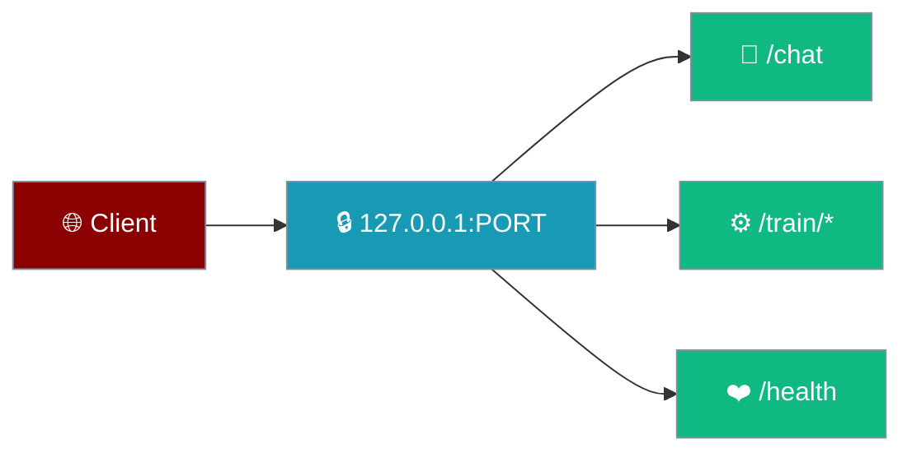
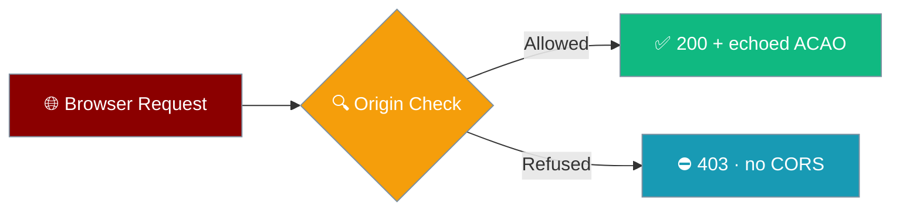

The Desktop engine is a small HTTP server on `127.0.0.1` — the same surface the app uses, stable enough to wire an alternate UI or an integration against.

```python
from praisonaiagents import Agent

agent = Agent(
    name="Assistant",
    instructions="You are a helpful assistant.",
)
# The Desktop app talks to an engine exactly like this one over 127.0.0.1.
agent.start("Hello")
```



Every endpoint binds to `127.0.0.1`, and requests from a browser origin the engine does not recognise are refused with `403`. Nothing leaves your machine unless the model itself does.

## Quick Start

<Steps>
<Step title="Find the port">
The app prints `engine :PORT` when the engine is healthy. That is the loopback port every route below uses.
</Step>

<Step title="Probe /health">
`GET /health` confirms the engine is up and returns the true data directory.

```bash
curl http://127.0.0.1:PORT/health
```
</Step>

<Step title="Call a route">
Every response is JSON except `/chat` (SSE) and `/train/progress` (SSE).
</Step>
</Steps>

---

## Routes

| Route | Purpose |
|-------|---------|
| `GET /health` | Includes `data_dir`, `version`, `shell_version`, and `agents_version` |
| `GET /settings` | Current settings; secrets returned masked as bullets |
| `POST /settings` | Merge a settings patch; the response uses the same redaction as `GET` — a write to any field returns the full settings dict with secrets masked |
| `POST /chat` | SSE stream (covered in [Chat & Streaming](/features/desktop/chat)) |
| `POST /approve/{approval_id}` | Approve or deny a pending tool call; missing body means deny |
| `GET /mcp`, `POST /mcp` | List and manage MCP servers |
| `GET /search?q=` | Full-text search across transcripts |
| `POST /fork/{cid}/{idx}` | Fork a conversation at a message |
| `DELETE /messages/{cid}/{idx}` | Delete a message |
| `POST /project/{cid}` | Assign a conversation to a project |
| `DELETE /chats/{cid}` | Delete a conversation |
| `POST /train/start` | Start a fine-tune; `400` on invalid method or column set |
| `POST /train/stop/{run_id}` | Kill the named run; stale-tab safe |
| `GET /train/progress?run=…&cursor=N` | Replay from a cursor then follow; `400` on a malformed cursor |
| `GET /train/status` | The live run and a tail of its metrics |
| `GET /train/runs` | Finished runs, bounded to the last 50 |

<Note>
Both `/settings` exits share a single `redacted()` helper, so `GET` and `POST` mask secrets identically — a `POST` that only changed `theme` still returns the `api_key` as bullets. Redaction is driven by the `SECRET_KEYS` list, so future secrets are covered without new code. An empty secret comes back as `""`, not bullets, so a client can tell "set" from "unset". What is **stored** is unchanged; only what leaves the process is masked.
</Note>

---

## Browser Origin Gate

The engine refuses browser origins it does not recognise, because loopback keeps other machines out but not other pages a user has open.



A loopback address keeps other machines out, but any page open in the user's browser can reach `127.0.0.1` with a two-line `fetch`. Matching is on the **parsed hostname**, so lookalike hosts never slip through.

| Origin | Verdict |
|--------|---------|
| `tauri://localhost` (macOS, Linux webview) | Allowed |
| `http://tauri.localhost` (Windows, Android webview) | Allowed |
| `http://localhost:<port>` / `http://127.0.0.1:<port>` (dev server) | Allowed |
| *No `Origin` header* (CLI, `curl`, tests, local processes) | Allowed |
| Any other `Origin` (a real web page) | **403** |
| `Origin: null` (sandboxed iframe, `file://`) | **403** |
| Lookalike hosts (`http://tauri.localhost.evil.com`, `http://localhost.evil.com`) | **403** |
| Bogus scheme (`javascript:…`) | **403** |

Allowed responses **echo the caller's own `Origin`** (with `Vary: Origin`) instead of `*` — `Access-Control-Allow-Origin: *` no longer appears anywhere on the surface.

A refusal carries **no CORS headers**, so the calling page cannot read the reply either. `OPTIONS` is gated the same way — a refused preflight returns `403`, which is what stops the follow-up request in a real browser.

<Warning>
This closes the **browser** vector only. A local process on the same machine — a script, `curl`, or any program with no `Origin` header — can still call these routes. Locking that down needs a per-launch token the Rust shell carries into the webview; that follow-up is out of scope for this change.
</Warning>

---

## Status Codes

The engine returns a status that matches the cause, so a client shows the right thing instead of a bare drop.

| Code | Meaning |
|------|---------|
| `200` | Success |
| `400` | Bad request — missing fields, malformed `/train/progress?cursor=`, or a rejected run id |
| `403` | Browser origin refused (the engine does not recognise it) |
| `404` | No such run, chat, or pending approval |
| `409` | A training run is already live — one GPU runs one job |
| `500` | The runs directory could not be created |

<Note>
`/train/progress` with a malformed `cursor` now returns `400 Bad Request`. It used to drop the connection with no response at all.
</Note>

---

## Bounded Responses

The training routes read from bounded buffers, so a long-running engine cannot grow without limit.

| Route | Bound |
|-------|-------|
| `GET /train/runs` | Last 50 finished runs (`MAX_HISTORY=50`) |
| `GET /train/status` | Up to the last 500 metric points; the series itself is capped at `MAX_METRICS=5000` |

---

## The /health Response

`/health` reports the true data directory, honouring `PRAISONAI_DESKTOP_HOME`, `XDG_DATA_HOME`, and `APPDATA` — so the app can copy the real path rather than reproduce a default.

```json
{
  "ok": true,
  "version": 2,
  "shell_version": "unknown",
  "agents_version": "1.7.2",
  "data_dir": "/Users/you/Library/Application Support/PraisonAI"
}
```

---

## Best Practices

<AccordionGroup>
<Accordion title="Read data_dir from /health, not the default">
The path can be overridden by an environment variable. Ask `/health` for `data_dir` instead of assuming the platform default.
</Accordion>

<Accordion title="Stop by run id">
`POST /train/stop/{run_id}` names the run to cancel, so a stale client cannot cancel a newer run. Always include the id.
</Accordion>

<Accordion title="Reconnect with a cursor">
`GET /train/progress` replays from `cursor=N`, so a dropped connection resumes without missing events. A malformed cursor returns `400`.
</Accordion>

<Accordion title="Treat a missing approval body as deny">
`POST /approve/{approval_id}` defaults to deny when the body is absent or malformed — never rely on an empty body to allow.
</Accordion>

<Accordion title="Send an Origin the engine trusts">
Third-party clients should call from a webview served on `localhost` (dev server) or the Tauri webview origin; a browser tab on any other origin gets `403`. A local process (CLI, script, `curl`) with no `Origin` header is allowed.
</Accordion>
</AccordionGroup>

---

## Related

<CardGroup cols={2}>
<Card title="Fine-Tuning" icon="list-check" href="/features/desktop/fine-tune">
The `/train/*` routes in context
</Card>
<Card title="Environment Variables" icon="key" href="/features/desktop/environment-variables">
What shifts `data_dir` and the secret store
</Card>
<Card title="Chat & Streaming" icon="comments" href="/features/desktop/chat">
The `/chat` SSE stream
</Card>
<Card title="Data & Privacy" icon="lock" href="/features/desktop/data">
Why everything stays on loopback
</Card>
</CardGroup>
