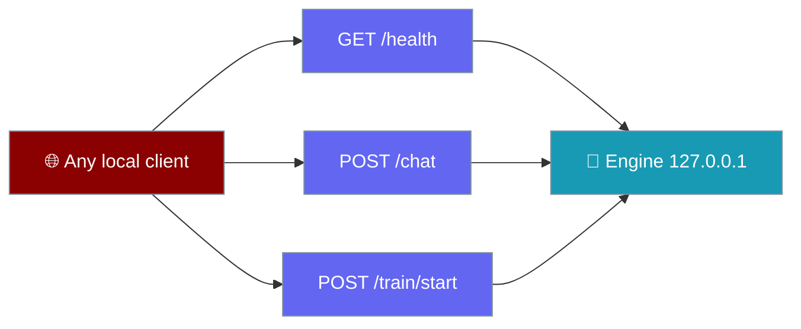

The Desktop engine is a small HTTP server on loopback — document it here if you're wiring an alternate UI or an integration.

```python
from praisonaiagents import Agent

# The engine wraps this agent. Everything below is how a UI talks to it.
agent = Agent(
    name="PraisonAI",
    instructions="You are a helpful assistant.",
)
agent.start("Hello")
```



The engine binds to `127.0.0.1` only — **nothing leaves your machine** unless the model provider does. There is no auth because there is no remote surface: the loopback socket is the boundary.

## Quick Start

<Steps>
<Step title="Find the port">
The shell prints `PRAISONAI_PORT=<port>` on startup and writes it to the lockfile. Every route below is served from `http://127.0.0.1:<port>`.
</Step>

<Step title="Probe health">
`GET /health` returns `{ok, version, data_dir}` — the version confirms it's the engine and not something else on the port.
</Step>

<Step title="Stream a chat">
`POST /chat` returns a Server-Sent Events stream. See [Chat & Streaming](/features/desktop/chat) for the event vocabulary.
</Step>
</Steps>

---

## Routes

| Route | Purpose |
|-------|---------|
| `GET /health` | Liveness. Returns `ok`, `version`, and `data_dir` (the real data folder, honouring overrides). |
| `POST /chat` | SSE token stream. Covered in [Chat & Streaming](/features/desktop/chat). |
| `POST /approve/{approval_id}` | Approve or deny a pending tool call. Body `{choice}`; a missing body means deny. |
| `POST /mcp`, `GET /mcp` | List and manage MCP servers (`add` / `remove` / `toggle`). |
| `GET /search?q=` | Full-text search across transcripts. |
| `POST /fork/{cid}/{idx}` | Copy a transcript up to message `idx` into a new chat. |
| `DELETE /messages/{cid}/{idx}` | Drop one exchange (a user turn and its reply). |
| `POST /project/{cid}` | Set a conversation's project tag. |
| `DELETE /chats/{cid}` | Delete a conversation. |
| `POST /train/start` | Start a fine-tune. `400` on an invalid method or column set. |
| `POST /train/stop/{run_id}` | Stop a run. Stale-tab safe: stopping a run other than the live one is refused. |
| `GET /train/progress?run=…&cursor=N` | SSE replay-then-follow. `400` on a malformed cursor. |
| `GET /train/status` | The live run plus its recent metrics. |
| `GET /train/runs` | Finished-run history (bounded — see caps below). |

---

## Status Codes

The engine returns real codes so a client can act, rather than dropping the connection.

| Code | When |
|------|------|
| `400` | Bad input — invalid training config, or `?cursor=abc` on `/train/progress`. |
| `404` | No such conversation, message, version, or run. |
| `409` | A conflict — a training run is already live, or a stop named the wrong run. |
| `500` | A real server error, such as an unwritable runs directory. |

<Note>
A malformed `/train/progress?cursor=abc` used to drop the connection with no response. It now returns `400 Bad Request` with `{"error": "cursor must be an integer"}`.
</Note>

---

## Bounded Deques

The training routes read from bounded in-memory buffers; the on-disk log is always the full record.

| Buffer | Cap | Served by |
|--------|-----|-----------|
| Run history | `MAX_HISTORY=50` | `GET /train/runs` |
| Metric series (per run) | `MAX_METRICS=5000` | `GET /train/status` (last 500) |

---

## Best Practices

<AccordionGroup>
<Accordion title="Read the port, don't guess it">
The kernel assigns a free port at bind time. Read it from the `PRAISONAI_PORT=` line or the lockfile — never hardcode one.
</Accordion>

<Accordion title="Confirm the version on /health">
`version` distinguishes the engine from anything else that answers on the port. Check it before trusting the rest of the surface.
</Accordion>

<Accordion title="Reconnect training with a cursor">
`/train/progress` replays from `cursor` then follows. Store the last cursor you saw so a reconnect resumes exactly where it left off.
</Accordion>
</AccordionGroup>

---

## Related

<CardGroup cols={2}>
<Card title="Fine-Tuning" icon="list-check" href="/features/desktop/fine-tune">
The training subsystem the `/train/*` routes drive
</Card>
<Card title="Data & Privacy" icon="lock" href="/features/desktop/data">
Why the loopback socket is the whole boundary
</Card>
</CardGroup>
