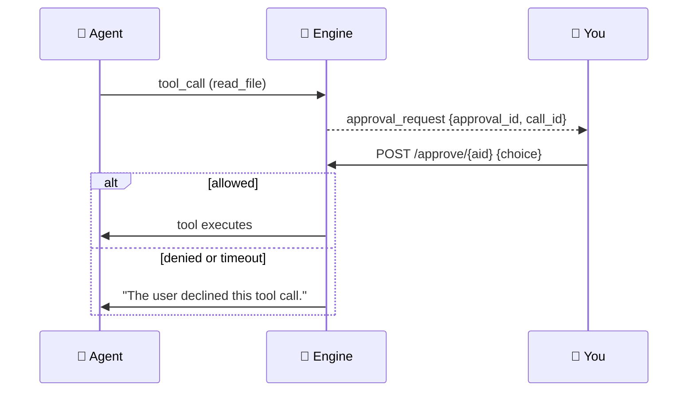
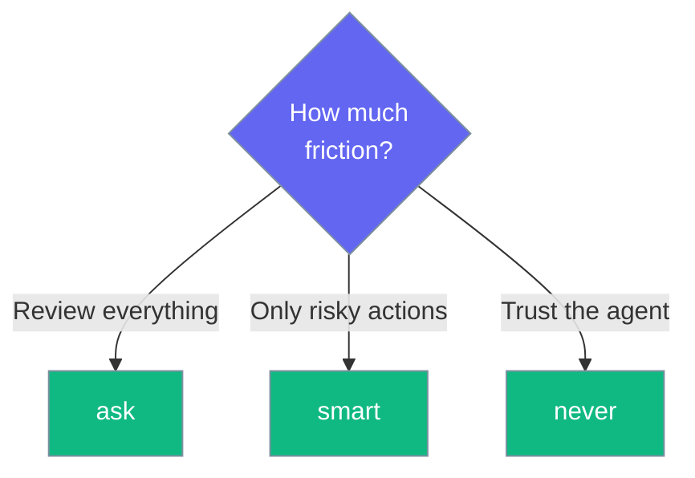

Tools that read your files ask permission first, and an unanswered request always defaults to deny.

```python
from praisonaiagents import Agent

agent = Agent(
    name="Assistant",
    instructions="You are a helpful assistant.",
)
# When this agent calls a file tool in the Desktop app,
# an approval card appears before the tool runs.
agent.start("Read notes.txt and summarize it")
```

```mermaid
graph LR
    Call[🔧 Tool Call] --> Ask{⚿ Approve?}
    Ask -->|Allow| Run[✅ Runs]
    Ask -->|Deny / timeout| Stop[🛑 Declined]

    classDef call fill:#189AB4,stroke:#7C90A0,color:#fff
    classDef ask fill:#F59E0B,stroke:#7C90A0,color:#fff
    classDef run fill:#10B981,stroke:#7C90A0,color:#fff
    classDef stop fill:#8B0000,stroke:#7C90A0,color:#fff

    class Call call
    class Ask ask
    class Run run
    class Stop stop
```

## Quick Start

<Steps>
<Step title="Pick an approval mode">
Open **Settings → Safety → Tool approval** and choose `ask`, `smart`, or `never`.
</Step>

<Step title="Answer the card">
When a tool call arrives, an approval card offers **Allow**, **Always allow**, or **Deny**.
</Step>

<Step title="Let silence deny">
If you do nothing, the request is declined after the timeout — the default is **300 seconds**.
</Step>
</Steps>

---

## How It Works

Each approval carries a `call_id`, so a decision is bound to the specific tool call rather than to whichever prompt happens to be pending.



| Setting | Values | Default |
|---------|--------|---------|
| `approval_mode` | `ask` \| `smart` \| `never` | `ask` |
| `approval_timeout` | seconds (`10`–`3600`) | `300` |
| `confirm_delete` | `true` \| `false` | `true` |

<Warning>
A malformed approval body defaults to **deny**, and an unanswered request defaults to **deny** at the timeout. Silence is never treated as consent.
</Warning>

The three buttons:

| Button | Effect |
|--------|--------|
| **Allow** | Runs this one call |
| **Always allow** | Persists for that tool name for the rest of the session |
| **Deny** | Declines this call |

<Note>
Setting `approval_mode` to `never` prompts a confirmation first: "Tools will read your files without asking. Continue?"
</Note>

---

## Choosing a Mode



| Mode | Behaviour | Best for |
|------|-----------|----------|
| `ask` | Prompts on every file tool call | Maximum control |
| `smart` | Prompts only for risky actions | Balanced |
| `never` | Runs file tools without asking | You fully trust the agent |

---

## Best Practices

<AccordionGroup>
<Accordion title="Start with ask">
The default `ask` mode surfaces every file read. Loosen to `smart` or `never` only once you trust the agent's behaviour.
</Accordion>

<Accordion title="Use Always allow sparingly">
**Always allow** persists for the whole session per tool name. Use it for tools you re-run constantly, not one-offs.
</Accordion>

<Accordion title="Keep the timeout short if unattended">
The timeout declines unanswered requests. A shorter `approval_timeout` frees a stuck turn faster when you step away.
</Accordion>
</AccordionGroup>

---

## Related

<CardGroup cols={2}>
<Card title="Settings Reference" icon="sliders" href="/features/desktop/settings">
Every Safety field and its default
</Card>
<Card title="Chat & Streaming" icon="comments" href="/features/desktop/chat">
Where approval cards appear in a turn
</Card>
</CardGroup>
