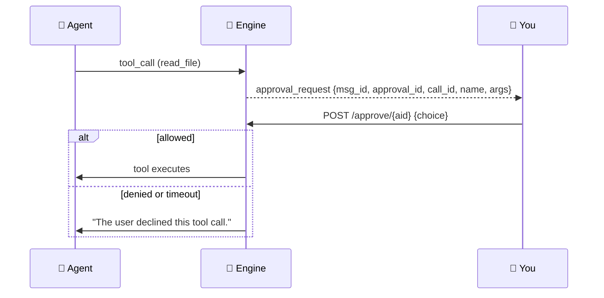
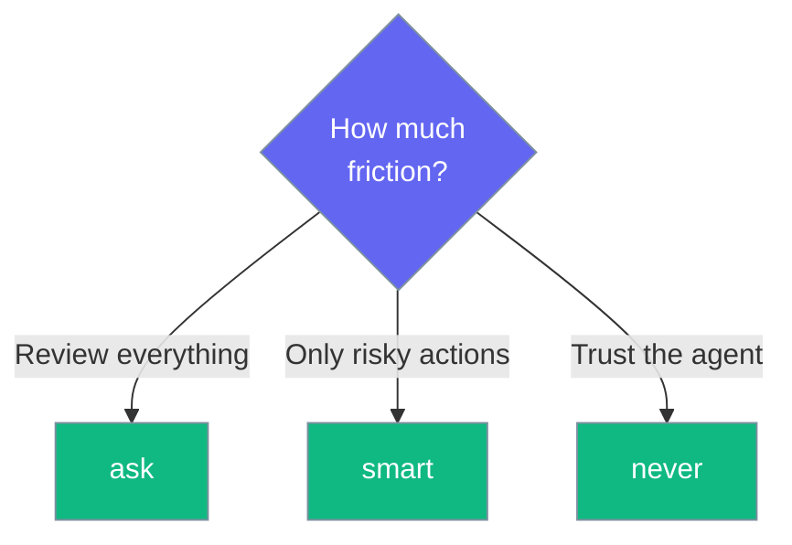

Tools that read your files ask permission first, and an unanswered request always defaults to deny.

```python
from praisonaiagents import Agent

agent = Agent(
    name="Assistant",
    instructions="You are a helpful assistant.",
)
# When this agent calls a file tool in the Desktop app,
# an approval card appears before the tool runs.
agent.start("Read notes.txt and summarize it")
```

```mermaid
graph LR
    Call[🔧 Tool Call] --> Ask{⚿ Approve?}
    Ask -->|Allow| Run[✅ Runs]
    Ask -->|Deny / timeout| Stop[🛑 Declined]

    classDef call fill:#189AB4,stroke:#7C90A0,color:#fff
    classDef ask fill:#F59E0B,stroke:#7C90A0,color:#fff
    classDef run fill:#10B981,stroke:#7C90A0,color:#fff
    classDef stop fill:#8B0000,stroke:#7C90A0,color:#fff

    class Call call
    class Ask ask
    class Run run
    class Stop stop
```

## Quick Start

<Steps>
<Step title="Pick an approval mode">
Open **Settings → Safety → Tool approval** and choose `ask`, `smart`, or `never`.
</Step>

<Step title="Answer the card">
When a tool call arrives, an approval card offers **Allow**, **Always allow**, or **Deny**.
</Step>

<Step title="Let silence deny">
If you do nothing, the request is declined after the timeout — the default is **300 seconds**.
</Step>
</Steps>

---

## How It Works

Each approval carries a `call_id`, so a decision is bound to the specific tool call rather than to whichever prompt happens to be pending.



The event carries `name` (the tool name) and `args` (the tool arguments) so the approval card can show *what* is about to run, not just that something is.

### An approval binds to one URL

`fetch_url` treats the approved URL as *the* URL — nothing else. A page that redirects stops at the redirect and returns an error rather than silently following it. To follow the new URL, ask for it again and get a fresh approval card for it.

```mermaid
sequenceDiagram
    participant You as 👤 You
    participant Engine as 🧠 Engine
    participant Site as 🌐 example.com
    participant Elsewhere as 🌐 elsewhere

    Engine->>You: approval_request (fetch_url, https://example.com/a)
    You->>Engine: Allow
    Engine->>Site: GET /a
    Site-->>Engine: 302 Location: https://elsewhere/x
    Engine-->>Engine: refuse (redirect not approved)
    Engine->>You: "Fetch failed: HTTPError: redirect to https://elsewhere/x was not approved"
    Note over You,Engine: A new URL needs a new approval card.

    classDef prompt fill:#6366F1,stroke:#7C90A0,color:#fff
    classDef site fill:#189AB4,stroke:#7C90A0,color:#fff
    classDef step fill:#F59E0B,stroke:#7C90A0,color:#fff
    classDef allow fill:#10B981,stroke:#7C90A0,color:#fff
    classDef refuse fill:#8B0000,stroke:#7C90A0,color:#fff

    class You prompt
    class Site site
    class Elsewhere step
    class Engine refuse
```

| Situation | What happens |
|-----------|--------------|
| Approved URL returns 200 | Body is returned (up to ~400 KB, UTF-8, replacement chars on decode errors). |
| Approved URL returns 3xx | The fetch stops. The tool returns `Fetch failed: HTTPError: redirect to <url> was not approved`. |
| Non-http(s) URL | Rejected before the gate: `Only http and https URLs are supported.` |
| Any other error | Returned as `Fetch failed: <ExceptionType>: <message>`. |

<Note>
If the model needs the redirected URL, it should ask again with the new URL. That triggers a new approval card, so **you** decide whether the second hop is allowed — the first card doesn't cover it.
</Note>

| Setting | Values | Default |
|---------|--------|---------|
| `approval_mode` | `ask` \| `smart` \| `never` | `ask` |
| `approval_timeout` | seconds (`10`–`3600`) | `300` |
| `confirm_delete` | `true` \| `false` | `true` |

<Warning>
A malformed approval body defaults to **deny**, and an unanswered request defaults to **deny** at the timeout. Silence is never treated as consent. **An approval card names one URL — the fetch cannot follow a redirect to another one under that card. A new URL needs a new card.**
</Warning>

The three buttons:

| Button | Effect |
|--------|--------|
| **Allow** | Runs this one call |
| **Always allow** | Persists for that tool name for the rest of the session |
| **Deny** | Declines this call |

<Note>
Setting `approval_mode` to `never` prompts a confirmation first: "Tools will read your files without asking. Continue?"
</Note>

---

## Choosing a Mode



| Mode | Behaviour | Best for |
|------|-----------|----------|
| `ask` | Prompts on every file tool call | Maximum control |
| `smart` | Prompts only for risky actions | Balanced |
| `never` | Runs file tools without asking | You fully trust the agent |

---

## Best Practices

<AccordionGroup>
<Accordion title="Start with ask">
The default `ask` mode surfaces every file read. Loosen to `smart` or `never` only once you trust the agent's behaviour.
</Accordion>

<Accordion title="Use Always allow sparingly">
**Always allow** persists for the whole session per tool name. Use it for tools you re-run constantly, not one-offs.
</Accordion>

<Accordion title="Keep the timeout short if unattended">
The timeout declines unanswered requests. A shorter `approval_timeout` frees a stuck turn faster when you step away.
</Accordion>

<Accordion title="Re-approve a redirected URL by name">
If `fetch_url` reports `redirect to <url> was not approved`, that's the gate refusing to hand the new URL your approval. Ask the agent to fetch that URL directly if you want the content — you'll get a fresh approval card for it, and *you* decide whether the second hop is allowed.
</Accordion>
</AccordionGroup>

---

## Related

<CardGroup cols={2}>
<Card title="Settings Reference" icon="sliders" href="/features/desktop/settings">
Every Safety field and its default
</Card>
<Card title="Chat & Streaming" icon="comments" href="/features/desktop/chat">
Where approval cards appear in a turn
</Card>
</CardGroup>
