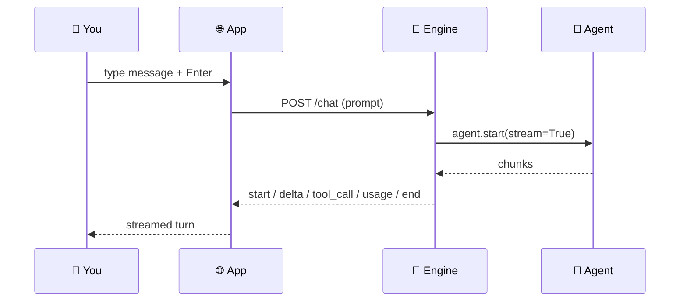

Every reply streams live from your local agent — text, reasoning, tool cards, and usage all arrive as typed events over `127.0.0.1`.

```python
from praisonaiagents import Agent

agent = Agent(
    name="Assistant",
    instructions="You are a helpful assistant.",
)
# The Desktop app streams this agent's reply token-by-token.
agent.start("Write a haiku about the sea", stream=True)
```


## Quick Start

<Steps>
<Step title="Send your first message">
Type in the composer and press `Enter`. The reply streams in as the agent produces it.
</Step>

<Step title="Watch the events render">
Text, a live reasoning panel, tool cards, and a usage line all appear in the same turn as they stream.
</Step>

<Step title="Act on the turn">
Hover a turn to **Copy**, **Regenerate**, **Fork**, or **Delete** it.
</Step>
</Steps>

---

## How It Works

The Desktop app opens `POST /chat` and streams these 11 event types straight into the turn — you write no client code for it.

```python
from praisonaiagents import Agent

agent = Agent(
    name="Assistant",
    instructions="You are a helpful assistant.",
)
# The Desktop app opens POST /chat and streams these 11 event types
# straight into the turn — you write no client code for it.
agent.start("Summarize today's notes", stream=True)
```

The engine sends Server-Sent Events on `POST /chat`.



Each event maps to one visible piece of the turn:


Every event carries a `msg_id` that scopes it to a specific assistant message; `start` additionally carries a `run_id` that scopes it to a specific run, so a `POST /approve/{aid}` or `POST /cancel` sent later addresses the right run and not whichever one happens to be pending. The vocabulary is exactly the **11 events** below — a `StreamProtocolVocabulary` test in the engine fails CI if a new emitter or a new documented event ever drifts from that list, so this table stays a faithful mirror of the wire.

Every event the stream emits (from `engine/server.py`), with the exact payload a client sees on the SSE wire:

| Event | Payload | Rendered as |
|-------|---------|-------------|
| `start` | `{msg_id, run_id}` | New assistant turn container |
| `reasoning` | `{msg_id, text}` (incremental) | Live "Thinking… Xs" panel (collapses to "Thought for Xs") |
| `delta` | `{msg_id, text}` | Streamed text into the current turn |
| `tool_drafting` | `{msg_id, name}` | "Preparing tool…" state / argument preview inside a tool card |
| `tool_call` | `{msg_id, call_id, name, args}` | Tool card (running dot) |
| `tool_result` | `{msg_id, call_id, name, ok, output, seconds}` | Tool card result pane (tail-truncated with **Show all** + **Copy output**) |
| `approval_request` | `{msg_id, approval_id, call_id, name, args}` | [Approval card](/features/desktop/approvals) (Allow / Always allow / Deny) — human-in-the-loop gate |
| `usage` | `{msg_id, chars, seconds, ttft}` | Chars, seconds, time-to-first-token under the reply |
| `cancelled` | `{msg_id, run_id}` | "Stopped" indicator |
| `error` | `{msg_id, message, kind}` — kind ∈ `auth` / `rate_limit` / `no_answer` / `empty` / `internal` | Typed error card |
| `end` | `{msg_id, user_index, assistant_index, versions, active}` | Finalizes the turn |

Clients integrating with the SSE stream should handle **all 11** events — a client written against a subset silently ignores the rest, and `approval_request` in particular will block the run invisibly until the 300 s [approval timeout](/features/desktop/approvals) if the client does not render it.

<Note>
Silence is treated as a failure, and the two shapes are reported differently:

- **`empty`** — nothing at all happened (no text, no tools). Still reported as **"No output"**.
- **`no_answer`** — the tools ran but the model produced no follow-up answer. Reported as **"The tools ran, but no answer came back"** and lists how many tool calls succeeded above.

Tool cards remain rendered even when the answer never arrives — the work isn't hidden by a failure banner.
</Note>

---

## Capabilities

<AccordionGroup>
<Accordion title="Reasoning panel">
When the model emits reasoning, a live "Thinking… Xs" panel shows it and collapses to "Thought for Xs" when the turn ends. Toggle it with **Show reasoning** and **Collapse reasoning by default** in Settings.
</Accordion>

<Accordion title="Tool cards">
A `tool_call` opens a card with a running dot; `tool_drafting` previews the arguments; `tool_result` fills the result pane. Long output is tail-truncated with **Show all** and **Copy output**. Tool cards remain visible even if the model produces no follow-up answer — a `no_answer` banner then explains what didn't come back.
</Accordion>

<Accordion title="Attachments">
Drag-drop or use the **+** button. Chips show each file's size. Limits: **2 MB max**, up to **5 files**, each clipped to **100 kB** of text before it is sent. Long pastes condense into an attachment instead of filling the context.
</Accordion>

<Accordion title="Cancel, regenerate, fork">
**Stop** cancels a live run — the client is told explicitly with a `cancelled` event rather than inferring it from silence. Cancelling with **Stop** no longer double-reports as "No output" — a `cancelled` event is the only banner the user sees. Per-turn hover actions cover **Copy**, **Regenerate**, **Fork** (`POST /fork/{cid}/{idx}`), and **Delete message** (`DELETE /messages/{cid}/{idx}`).
</Accordion>
</AccordionGroup>

---

## Keyboard Shortcuts

| Key | Action |
|-----|--------|
| `⌘N` | New chat |
| `⌘K` | Search all conversations |
| `⌘,` | Open settings |
| `Enter` | Send |
| `Shift+Enter` | Newline |
| `Esc` | Close overlay |

---

## Related

<CardGroup cols={2}>
<Card title="Approvals & Safety" icon="shield-check" href="/features/desktop/approvals">
How tool calls are approved before they run
</Card>
<Card title="Conversations & Search" icon="magnifying-glass" href="/features/desktop/conversations">
Fork, delete, projects, and `⌘K` search
</Card>
</CardGroup>
