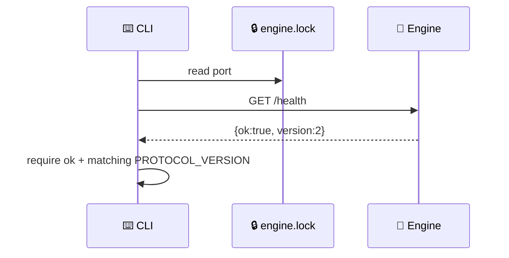
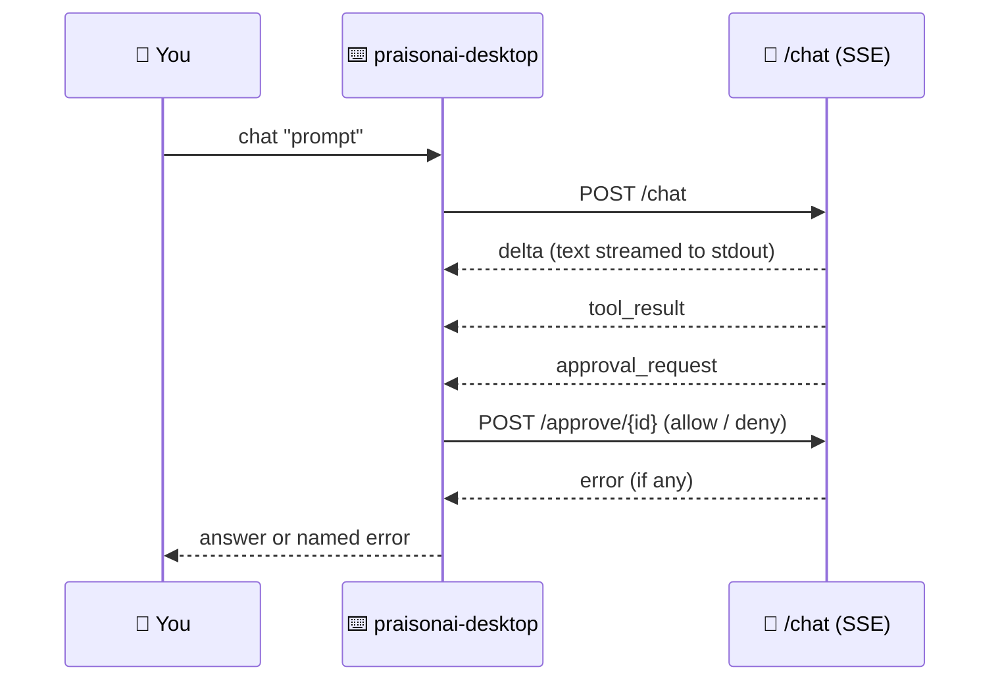

The `praisonai-desktop` CLI drives the same local engine the Desktop app does, from a terminal — no GUI required.


The same agent you run in the app window is reachable from a shell — start the engine, then send it a prompt.

```python
from praisonaiagents import Agent

agent = Agent(
    name="Assistant",
    instructions="You are a helpful assistant.",
)
# Same agent, driven from a shell instead of the app window:
#   praisonai-desktop engine start
#   praisonai-desktop chat "Hello"
agent.start("Hello")
```

## Quick Start

<Steps>
<Step title="Start the engine">
Run the engine in the foreground. The port is printed on the first line the socket is bound; `--home DIR` sets `PRAISONAI_DESKTOP_HOME`.

```bash
praisonai-desktop engine start
```
</Step>

<Step title="Check it's healthy">
In a second terminal, ask the running engine how it's doing — `port`, `pid`, `protocol`, `agents_version`, and `data_dir`.

```bash
praisonai-desktop engine health
```

Exits `1` when no engine is running, with a `Start one with…` hint.
</Step>

<Step title="Run a chat turn">
Send one prompt and stream the answer to stdout.

```bash
praisonai-desktop chat "What time is it?"
```

A turn that ran tools but returned no text prints a **named error** rather than a blank success — for example `3 tool call(s) ran, but the model returned no text.`, the exact `praisonaiagents 1.7.1` signature.
</Step>

<Step title="Diagnose version drift">
Print Python, the installed `praisonaiagents`, the required floor (read from `src-tauri/src/provision.rs` at runtime — never hardcoded), and the engine's running state.

```bash
praisonai-desktop doctor
```

Exits `1` when the installed SDK is below the floor.
</Step>
</Steps>

---

## Command Reference

Each subcommand takes `--home` to point at a specific data directory; `chat` adds the flags a single turn needs.

### `engine start`

Runs the engine with the current interpreter and prints its port once listening.

| Option | Type | Default | Description |
|--------|------|---------|-------------|
| `--home` | `str` | Platform data dir | Data directory (sets `PRAISONAI_DESKTOP_HOME`) |

### `engine health`

Reads the lockfile, probes `/health`, and prints the running engine's status.

| Option | Type | Default | Description |
|--------|------|---------|-------------|
| `--home` | `str` | Platform data dir | Data directory to look for the lockfile in |

### `chat`

Runs one turn against a running engine and streams the answer.

| Option | Type | Default | Description |
|--------|------|---------|-------------|
| `prompt` | `str` | — | Positional: the message to send |
| `--no-tools` | flag | `False` | Disable built-in tools for this turn |
| `--approve` | flag | `False` | Auto-allow tool approval prompts (default: deny) |
| `--chat-id` | `str` | `"cli"` | Conversation id (also used as session and run id) |
| `--home` | `str` | Platform data dir | Data directory to look for the lockfile in |
| `--timeout` | `float` | `120.0` | Seconds to wait for the turn |

### `doctor`

Reports the installed `praisonaiagents` against the provisioned floor and the engine's state.

| Option | Type | Default | Description |
|--------|------|---------|-------------|
| `--home` | `str` | Platform data dir | Data directory to look for the lockfile in |

---

## How It Finds the Running Engine

`engine health`, `chat`, and `doctor` read the lockfile at `<data-dir>/engine.lock`, then probe `/health` on the announced port.



A lockfile alone is not proof — a crashed engine leaves one behind. The `/health` response must report `ok: true` **and** a `version` matching the engine's `PROTOCOL_VERSION`, so a recycled port answered by another loopback service is rejected rather than handed your prompt.

---

## Real Usage Flow

A `chat` turn opens an SSE stream and answers each frame as it arrives.



On a headless turn there is no human to answer the approval gate, so the CLI answers it: `--approve` allows, otherwise it denies. A denied tool is recoverable; a frozen turn is not.

---

## Common Patterns

Reproduce a desktop bug in one command — start the engine in one shell, chat in another:

```bash
praisonai-desktop engine start
# then, in a second terminal:
praisonai-desktop chat "Use a tool and tell me the result"
```

Gate a CI job on the SDK floor — `doctor` exits non-zero when the installed version is too low:

```bash
praisonai-desktop doctor || exit 1
```

Run against a throwaway data directory:

```bash
praisonai-desktop engine start --home ~/tmp/praisonai-test
```

---

## Best Practices

<AccordionGroup>
<Accordion title="Run doctor before opening a bug">
`doctor` names the version gap in one line — `1.7.1 installed, >=1.7.2 required` — so a report resolves without a screen recording.
</Accordion>

<Accordion title="Use --approve only in trusted environments">
Tool approval defaults to deny for a reason. Auto-allowing runs every tool the turn asks for, so reserve `--approve` for environments you trust.
</Accordion>

<Accordion title="Give each unattended run its own --chat-id">
The engine loads history per `chat_id`. A distinct id per run keeps histories from cross-contaminating.
</Accordion>

<Accordion title="It's stdlib-only">
The CLI adds nothing to its environment — it runs in whatever venv you launch it from, exactly like the engine it drives.
</Accordion>
</AccordionGroup>

---

## Related

<CardGroup cols={2}>
<Card title="Engine API" icon="plug" href="/features/desktop/api">
The routes this CLI speaks to
</Card>
<Card title="Troubleshooting" icon="stethoscope" href="/features/desktop/troubleshooting">
Startup pill, engine log, common failures
</Card>
</CardGroup>
