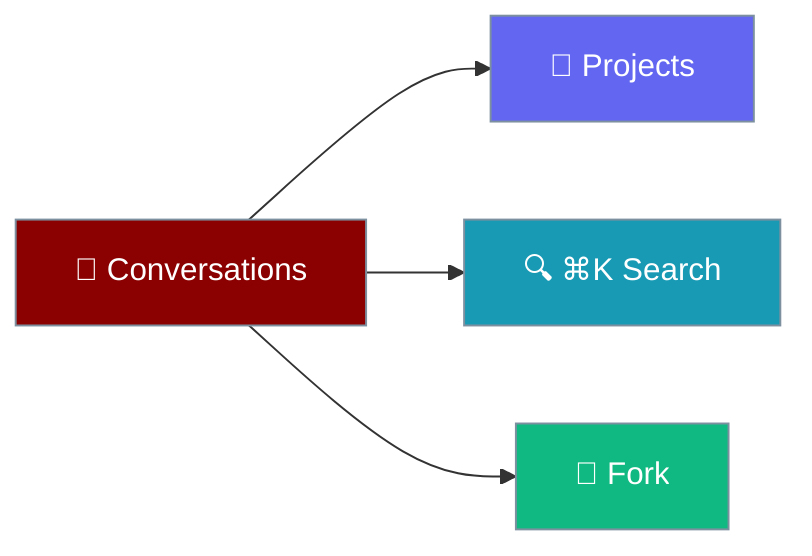
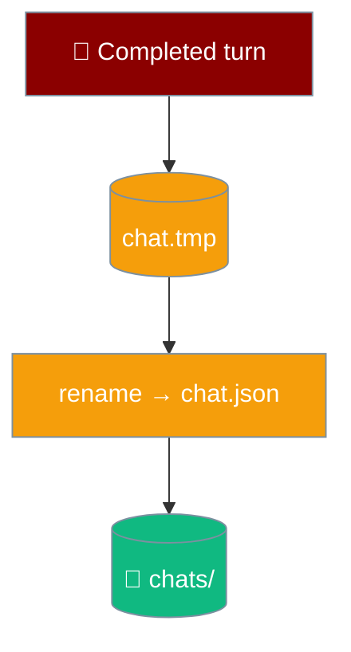

Every conversation is an append-only transcript you can group into projects, search full-text, fork from any turn, or trim a message at a time.

```python
from praisonaiagents import Agent

agent = Agent(
    name="Assistant",
    instructions="You are a helpful assistant.",
)
# Each Desktop conversation is one transcript this agent appends to.
agent.start("Start a new conversation")
```



## Quick Start

<Steps>
<Step title="Group into a project">
Right-click a conversation and choose **Move to project** to group related chats.
</Step>

<Step title="Search everything">
Press `⌘K` and type — the app searches every conversation's text and jumps to the first match.
</Step>

<Step title="Fork from a turn">
Fork any turn to branch a new conversation without changing the original.
</Step>
</Steps>

---

## How It Works

Transcripts are append-only JSON on disk, written with a write-then-rename pattern so a crash mid-write can never truncate an existing chat.



Transcripts live at `~/Library/Application Support/PraisonAI/chats/` as one JSON file per conversation.

<Note>
A transcript is written only after a run completes — never per token — so a chat app never burns through an SSD's write endurance.
</Note>

---

## Actions

| Action | Endpoint | Effect |
|--------|----------|--------|
| Search | `GET /search?q=` | Full-text across every conversation |
| Fork | `POST /fork/{cid}/{idx}` | Copies the transcript up to message N into a new chat |
| Delete message | `DELETE /messages/{cid}/{idx}` | Removes one exchange (a user turn and its reply) |
| Move to project | `POST /project/{cid}` | Assigns the conversation to a project |
| Delete chat | `DELETE /chats/{cid}` | Removes the whole conversation |

<Warning>
A corrupt transcript is surfaced in the sidebar as "(unreadable)" rather than hidden — a chat you can see is recoverable; one silently omitted looks like data loss.
</Warning>

---

## Best Practices

<AccordionGroup>
<Accordion title="Fork instead of editing history">
A fork copies the transcript up to a chosen turn into a new conversation and leaves the original untouched — branch an idea without losing the thread.
</Accordion>

<Accordion title="Group with projects">
Move related conversations into a project so the sidebar stays legible as chats accumulate.
</Accordion>

<Accordion title="Trust auto-titling">
With `auto_title` on, the first message becomes the chat title. Leave it on and rename only the few that need it.
</Accordion>
</AccordionGroup>

---

## Related

<CardGroup cols={2}>
<Card title="Data & Privacy" icon="lock" href="/features/desktop/data">
Where transcripts live and how to export them
</Card>
<Card title="Chat & Streaming" icon="comments" href="/features/desktop/chat">
Per-turn actions like Fork and Delete
</Card>
</CardGroup>
