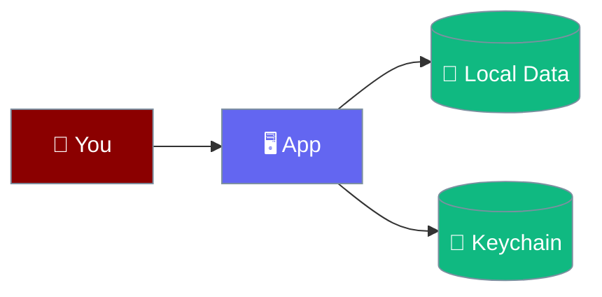
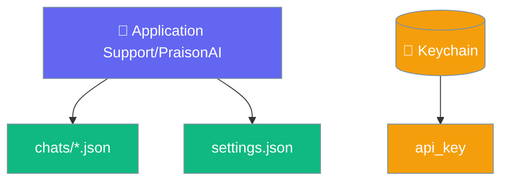

Everything runs on `127.0.0.1`, transcripts stay in your own space, and secrets live only in the macOS keychain.

```python
from praisonaiagents import Agent

agent = Agent(
    name="Assistant",
    instructions="You are a helpful assistant.",
)
# This agent runs on your machine — its transcripts stay local.
agent.start("Nothing leaves this Mac unless the model does")
```



## Quick Start

<Steps>
<Step title="Find your data">
Everything lives under `~/Library/Application Support/PraisonAI`.
</Step>

<Step title="Export it">
Use **Export all** — it copies your data to the clipboard.
</Step>

<Step title="Delete it">
**Delete all** removes stored conversations; **Reveal in Finder** opens the folder.
</Step>
</Steps>

---

## Where Data Lives

The data directory is `~/Library/Application Support/PraisonAI`, overridable with the `PRAISONAI_DESKTOP_HOME` environment variable.

| Path | Contents |
|------|----------|
| `chats/*.json` | One append-only transcript per conversation |
| `settings.json` | Your settings — **no secrets** |
| Engine log ring buffer | Recent engine activity (in memory, bounded) |
| macOS keychain (`ai.praison.desktop`) | Secrets such as `api_key` |



<Note>
Export writes to the **clipboard**, not a file. The webview sandbox blocks self-initiated downloads, so the app copies your data out instead.
</Note>

---

## What Stays Local

Nothing leaves your machine unless the model itself does — the engine listens only on `127.0.0.1`, and cloud API keys are the sole path off-device.

<Warning>
Secrets are never written to `settings.json`. The `api_key` is stored in the macOS keychain and stripped before the file is saved.
</Warning>

---

## Best Practices

<AccordionGroup>
<Accordion title="Back up the chats folder">
Transcripts are plain JSON you can read, diff, and back up. Copy `chats/` to keep your history safe across app updates.
</Accordion>

<Accordion title="Override the home for isolation">
Set `PRAISONAI_DESKTOP_HOME` to point the app at a separate data directory — useful for testing or keeping profiles apart.
</Accordion>

<Accordion title="Use a local model for full privacy">
Point `base_url` at a local server so even the model runs on-device and no data leaves the machine.
</Accordion>
</AccordionGroup>

---

## Related

<CardGroup cols={2}>
<Card title="Models & API Keys" icon="key" href="/features/desktop/models">
How keys are kept in the keychain
</Card>
<Card title="Conversations" icon="comments" href="/features/desktop/conversations">
How transcripts are written and stored
</Card>
</CardGroup>
