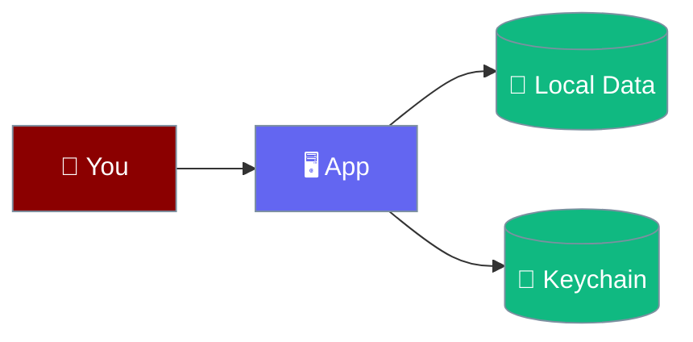
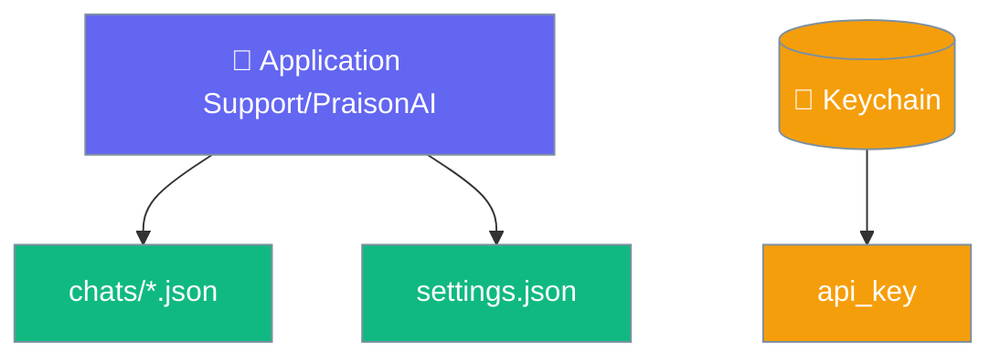
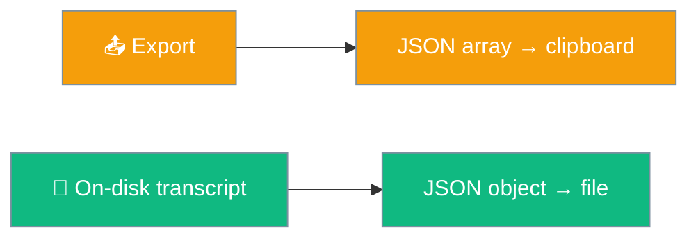

Everything runs on `127.0.0.1`, transcripts stay in your own space, and secrets live only in the platform keychain.

```python
from praisonaiagents import Agent

agent = Agent(
    name="Assistant",
    instructions="You are a helpful assistant.",
)
# This agent runs on your machine — its transcripts stay local.
agent.start("Nothing leaves this Mac unless the model does")
```



## Quick Start

<Steps>
<Step title="Find your data">
The engine reports its real location at `GET /health` as `data_dir` — the app's **Reveal in Finder** uses that path, so it honours any override.
</Step>

<Step title="Export it">
Use **Export all** — it copies your data to the clipboard.
</Step>

<Step title="Delete it">
**Delete all** removes stored conversations; **Reveal in Finder** opens the folder.
</Step>
</Steps>

---

## Where Data Lives

The data directory is platform-specific and overridable with `PRAISONAI_DESKTOP_HOME`. Ask the engine for the true path: `/health` returns `data_dir`, which honours every override — so the **copy data folder** action reports the path the app actually uses.

| Platform | Default data directory |
|----------|------------------------|
| macOS | `~/Library/Application Support/PraisonAI` |
| Windows | `%APPDATA%\PraisonAI` |
| Linux | `$XDG_DATA_HOME/PraisonAI` or `~/.local/share/PraisonAI` |

<Note>
An **empty** env var is treated as **unset**. `PRAISONAI_DESKTOP_HOME=""` or `XDG_DATA_HOME=""` no longer makes the Rust shell and the Python engine pick different directories — both fall back to the default.
</Note>

| Path | Contents |
|------|----------|
| `chats/*.json` | One append-only transcript per conversation |
| `settings.json` | Your settings — **no secrets** |
| `runs/*/` | Fine-tune configs, logs, and checkpoints |
| Engine log ring buffer | Recent engine activity (in memory, bounded) |
| Keychain / DPAPI / secret service | Secrets such as `api_key` |
| `secrets/<service>.json` (fallback) | Plaintext fallback store, mode `0o600` |



<Note>
Export writes to the **clipboard**, not a file. The webview sandbox blocks self-initiated downloads, so the app copies your data out instead. A failed Export now shows a `That did not run: …` toast and leaves the clipboard untouched, so a stale paste cannot masquerade as a backup — see [Troubleshooting](/features/desktop/troubleshooting#common-failures).
</Note>

---

## What Stays Local

The engine listens only on `127.0.0.1`, refuses cross-origin browser requests it does not recognise, and cloud API keys are the sole path off-device.

<Note>
Loopback binding alone is not enough — a page in the user's own browser can reach `127.0.0.1` with a two-line `fetch`. The engine also refuses browser origins it does not recognise; see the [Browser Origin Gate](/features/desktop/api#browser-origin-gate) for the full allowed/refused table.
</Note>

<Warning>
Secrets are never written to `settings.json`. The `api_key` is stored in the platform keychain and stripped before the file is saved.
</Warning>

---

## Secrets

Secrets go to the platform store — the macOS keychain, Windows DPAPI, or the freedesktop secret service — with a plaintext file fallback for machines with no keyring.

| Guarantee | Behaviour |
|-----------|-----------|
| Store isolation | `PRAISONAI_KEYCHAIN_SERVICE` (default `ai.praison.desktop`) names the service; override it to isolate test keys |
| Fallback location | `<data_dir>/secrets/<service>.json`; mode `0o600`, unlinked and recreated on each write |
| Durable reads | An unreadable store **raises** rather than returning empty, so a transient IO failure never causes the next `set` to overwrite a good secret |
| Clean deletes | Delete clears **both** the keychain/DPAPI entry and the fallback file — no plaintext copy survives |

<Warning>
`PRAISONAI_DESKTOP_HOME` isolates the data directory but not the system keyring, which is shared per user. Set `PRAISONAI_KEYCHAIN_SERVICE` too when you need a fully isolated profile.
</Warning>

---

## Secret Store Guarantees

The secret store is durable and tightened, so a transient glitch can never quietly lose or leak a credential.

| Guarantee | What it means |
|-----------|---------------|
| **Unreadable raises** | A store that can't be read raises instead of returning empty, so the next `set` never overwrites a good secret with `{}`. |
| **Delete clears both** | Deleting an `api_key` clears both the keychain/DPAPI store **and** the fallback file — no stale plaintext survives a delete. |
| **Tight file writes** | The fallback file store uses `unlink` + `O_EXCL` + `0o600`, so no reused-mode leftover can leave a secret world-readable. |

| Env var | Default | Effect |
|---------|---------|--------|
| `PRAISONAI_KEYCHAIN_SERVICE` | `ai.praison.desktop` | Isolate secrets under a different service name (CI/test escape hatch). |

---

## Environment & Overrides

Point the app at your own runtime, engine, or data folder with these variables.

| Variable | Purpose | Notes |
|----------|---------|-------|
| `PRAISONAI_ENGINE` | Override the path to the Python engine script | Otherwise resolved from the bundle Resources, then a checkout. |
| `PRAISONAI_PYTHON` | Override the interpreter used for the engine | Skips the managed venv entirely — you own the runtime. |
| `PRAISONAI_DESKTOP_HOME` | Override the data directory (chats, settings, venv, engine log) | The engine mirrors this — one variable, one place. |
| `PRAISONAI_APP_BUNDLE` | The `.app` path so the LaunchAgent can find it | Set by the shell; contributors set it when testing Launch at Login from `cargo run`. |
| `OPENAI_API_KEY` / `OPENAI_API_BASE` | Model credentials | Only cleared on exit when the engine set them itself — existing shell values are preserved. |

<Note>
`OPENAI_API_KEY` and `OPENAI_API_BASE` you set in your own shell survive the app closing. Only values the engine exported from settings are cleared on exit.
</Note>

---

## HTTP Endpoints

The engine speaks plain HTTP on `127.0.0.1`. The routes the app relies on:

| Endpoint | Behaviour |
|----------|-----------|
| `POST /chat` | Stream a turn; accepts `regenerate_of` (message index to re-answer) and a per-turn `tools` override |
| `POST /version/{cid}/{idx}/{n}` | Switch a message row to a specific prior version |
| `GET /chats/{id}` | Returns the transcript; **404** when the id is unknown |
| `GET /settings` | Returns settings with `api_key` masked as bullets, never the real value |
| `GET /update` | Checks PyPI (`https://pypi.org/pypi/praisonaiagents/json`) for a newer release |
| `GET /health` | Reports `{ ok: true, version: 2, data_dir }` |

<Note>
Mutating and reading routes require an allowed `Origin` header when the caller is a browser — a refused browser origin gets `403` with no CORS headers. Local processes (CLI, script, `curl`) with no `Origin` header keep working. See the [Browser Origin Gate](/features/desktop/api#browser-origin-gate).
</Note>

---

## Accessibility

The interface is built for screen readers and keyboard use, and tests enforce each invariant.

| Area | Behaviour |
|------|-----------|
| Landmarks | `main`, `nav`, `header`, `complementary` regions, with a labelled sidebar |
| Transcript | `role="log"` + `aria-live="polite"`, so streamed answers are announced |
| Engine status | `role="status"` + `aria-live="polite"` |
| Icon-only controls | Carry a word `aria-label`; decorative glyphs carry `aria-hidden` |
| Conversation rows | Keyboard-focusable (`role="button"`, `tabindex=0`) with `aria-label` |
| Tools button | Reports `aria-pressed`; the sidebar toggle reports `aria-expanded` |
| Dialogs | Delete confirms and the first-run panel are `role="dialog"` + `aria-modal`, trap focus, and return focus to the opener on close |

---

## UI Scaling

`font_size` drives a `--ui-scale` CSS variable and everything downstream is `rem`, so one change scales the whole interface.

<Note>
A layout test fails on any dimensional pixel value over 3px, so rem-based scaling is a hard invariant — not a nice-to-have.
</Note>

---

## Best Practices

<AccordionGroup>
<Accordion title="Back up the chats folder">
Transcripts are plain JSON you can read, diff, and back up. Copy `chats/` to keep your history safe across app updates.

Restoring: copy individual `chats/<id>.json` object files back into `chats/`. **Do not drop the Export clipboard payload (a JSON array) into `chats/`** — the app surfaces it as an `(unreadable)` row and moves on, but the transcripts inside will not appear as chats. Split the array into per-conversation object files first, or re-import a copy of the original `chats/` folder.


</Accordion>

<Accordion title="Override the home for isolation">
Set `PRAISONAI_DESKTOP_HOME` to point the app at a separate data directory — useful for testing or keeping profiles apart.
</Accordion>

<Accordion title="Use a local model for full privacy">
Point `base_url` at a local server so even the model runs on-device and no data leaves the machine.
</Accordion>
</AccordionGroup>

---

## Related

<CardGroup cols={2}>
<Card title="Models & API Keys" icon="key" href="/features/desktop/models">
How keys are kept in the keychain
</Card>
<Card title="Environment Variables" icon="key" href="/features/desktop/environment-variables">
Every variable that changes where data and secrets live
</Card>
</CardGroup>
