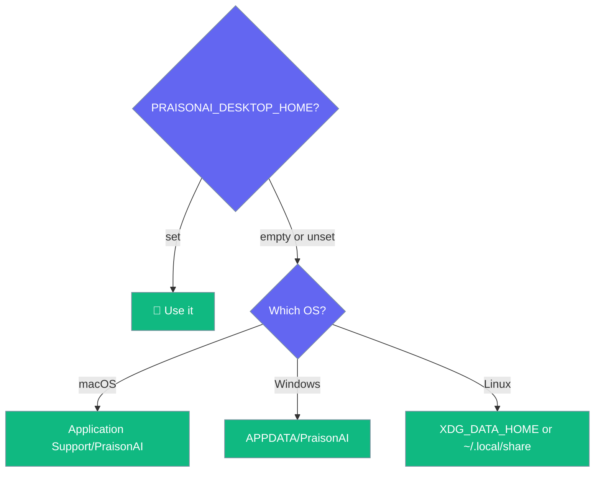
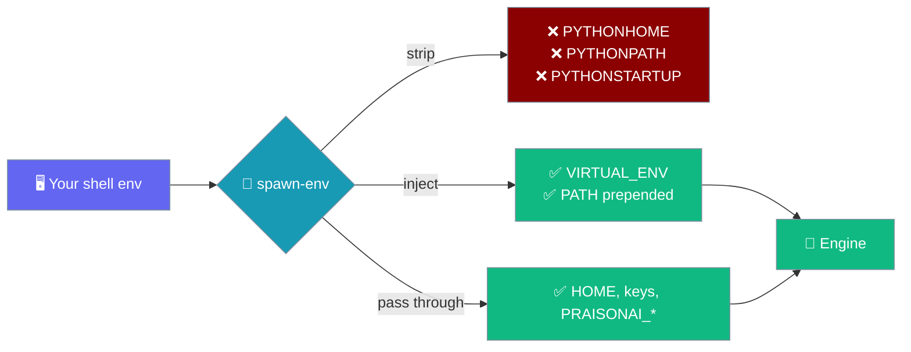

Environment variables move the data directory, isolate secrets, and keep the engine's output readable on non-English locales.

```python
import os
from praisonaiagents import Agent

os.environ["PRAISONAI_DESKTOP_HOME"] = "/tmp/praison-profile"
agent = Agent(
    name="Assistant",
    instructions="You are a helpful assistant.",
)
# The app reads the same variable to pick its data directory.
agent.start("Where does my data live?")
```



An empty value is treated as unset — `PRAISONAI_DESKTOP_HOME=""` no longer picks a different directory for the Rust shell than for the Python engine.

## Quick Start

<Steps>
<Step title="Override the data directory">
Set `PRAISONAI_DESKTOP_HOME` to a folder before launching to keep a separate profile.
</Step>

<Step title="Isolate secrets">
Set `PRAISONAI_KEYCHAIN_SERVICE` to keep test keys out of your real keychain entry.
</Step>

<Step title="Leave the encoding vars alone">
`PYTHONUTF8` and `PYTHONIOENCODING` are set by the shell for the engine. You do not need to set them yourself.
</Step>
</Steps>

---

## How the engine gets its environment

The Desktop shell **rebuilds** the engine's environment from the resolved venv before spawning it — it does not hand the engine your shell untouched.



**Most variables pass through unchanged** — provider keys (`OPENAI_API_KEY`, `TAVILY_API_KEY`), Desktop vars (`PRAISONAI_DESKTOP_HOME`, `PRAISONAI_KEYCHAIN_SERVICE`, `PRAISONAI_AGENTS_SOURCE`, `PRAISONAI_TRAIN_CMD`, `PRAISONAI_MODEL`), and platform vars (`HOME`, `APPDATA`, `XDG_DATA_HOME`).

**Three variables are stripped by the shell** before the engine spawns: `PYTHONHOME`, `PYTHONPATH`, `PYTHONSTARTUP`. Setting them in your shell does nothing for the engine — they would otherwise redirect the engine's stdlib or `site-packages` away from the venv the shell just resolved.

**Two variables are always set by the shell**: `VIRTUAL_ENV` (points at the resolved venv root) and `PATH` (the venv's `bin`/`Scripts` prepended to whatever `PATH` you exported).

<Warning>
`PYTHONHOME`, `PYTHONPATH`, and `PYTHONSTARTUP` set in your shell do not reach the engine. If you need the engine to import a local `praisonaiagents` checkout, set `PRAISONAI_AGENTS_SOURCE` instead.
</Warning>

---

## Reference

| Variable | Set by | Effect |
|----------|--------|--------|
| `PRAISONAI_DESKTOP_HOME` | User | Override the data directory. Empty is treated as unset. |
| `XDG_DATA_HOME` | User (Linux) | Fallback data root when `PRAISONAI_DESKTOP_HOME` is unset. Empty is unset. |
| `APPDATA` | Windows | Fallback data root on Windows. |
| `PRAISONAI_KEYCHAIN_SERVICE` | User / CI | Secret store service name. Default `ai.praison.desktop`. |
| `PRAISONAI_AGENTS_SOURCE` | User | Point the engine at a local `praisonai-agents` checkout. |
| `PRAISONAI_TRAIN_CMD` | User | Override the fine-tune launcher; `--config <path>` is always appended. |
| `PRAISONAI_MODEL` | User | Default model id when no setting is stored. |
| `PYTHONUTF8` | Shell → engine | Set to `1` so the engine decodes as UTF-8 on non-UTF-8 locales. |
| `PYTHONIOENCODING` | Shell → engine | Set to `utf-8` for the same reason. Do not override. |
| `PYTHONHOME` | (stripped) | Ignored — the shell drops it before spawning the engine so the venv's stdlib is used. |
| `PYTHONPATH` | (stripped) | Ignored — the shell drops it so the engine only imports from the venv's `site-packages`. |
| `PYTHONSTARTUP` | (stripped) | Ignored — the shell drops it so a stray startup script cannot run in the engine. |
| `VIRTUAL_ENV` | Shell → engine | Set to the resolved venv root; do not override. |
| `PATH` | Shell → engine | Venv's `bin` (POSIX) or `Scripts` (Windows) prepended to your exported `PATH`. |
| `OPENAI_API_KEY` (and peers) | User | Provider key used when `api_key` is blank in settings. |
| `OPENAI_API_BASE` | Engine | Set from the `base_url` setting; cleared when you clear that setting. |
| `TAVILY_API_KEY` | User | Enables the built-in `web_search` tool. |

---

## Data Directory Precedence

The data directory follows one order per platform, and both the Rust shell and the Python engine derive it the same way.

| Platform | Order |
|----------|-------|
| macOS | `PRAISONAI_DESKTOP_HOME` → `~/Library/Application Support/PraisonAI` |
| Windows | `PRAISONAI_DESKTOP_HOME` → `%APPDATA%\PraisonAI` |
| Linux | `PRAISONAI_DESKTOP_HOME` → `$XDG_DATA_HOME/PraisonAI` → `~/.local/share/PraisonAI` |

<Warning>
An empty string counts as unset. `XDG_DATA_HOME=""` used to make the shell join onto an empty path and look in the working directory while the engine used the home directory — so the two disagreed on every launch.
</Warning>

---

## Encoding on Non-English Locales

The shell exports `PYTHONUTF8=1` and `PYTHONIOENCODING=utf-8` to the engine so its output decodes cleanly on CP932 (Japanese) or CP1252 (Western European) systems.


Setting these yourself is redundant — the shell already does it.

---

## Best Practices

<AccordionGroup>
<Accordion title="Unset rather than blank">
An empty value is unset. To fall back to the platform default, remove the variable rather than setting it to `""`.
</Accordion>

<Accordion title="Isolate secrets for testing">
Set `PRAISONAI_KEYCHAIN_SERVICE` to a distinct name so a test run never overwrites the key you actually use — `PRAISONAI_DESKTOP_HOME` isolates data, not the system keyring.
</Accordion>

<Accordion title="Leave a provider key in the environment">
Export `OPENAI_API_KEY` and leave the settings `api_key` blank to keep the credential out of the app entirely.
</Accordion>

<Accordion title="Point the engine at a local checkout with PRAISONAI_AGENTS_SOURCE, not PYTHONPATH">
`PYTHONPATH` is stripped by design before the engine spawns, so it never reaches the engine. Set `PRAISONAI_AGENTS_SOURCE` to your `praisonaiagents` checkout instead — that variable passes through unchanged.
</Accordion>

<Accordion title="Don't override the UTF-8 exports">
The shell already sets `PYTHONUTF8=1` and `PYTHONIOENCODING=utf-8` so the engine starts on non-English locales. Overriding them reintroduces the startup-timeout bug they fix.
</Accordion>
</AccordionGroup>

---

## Related

<CardGroup cols={2}>
<Card title="Data & Privacy" icon="lock" href="/features/desktop/data">
Where the data directory lives and what it holds
</Card>
<Card title="Models & API Keys" icon="key" href="/features/desktop/models">
How provider keys and the keychain interact
</Card>
<Card title="Engine API" icon="plug" href="/features/desktop/api">
Read the true `data_dir` from `/health`
</Card>
<Card title="Troubleshooting" icon="stethoscope" href="/features/desktop/troubleshooting">
The non-UTF-8 startup timeout
</Card>
</CardGroup>
