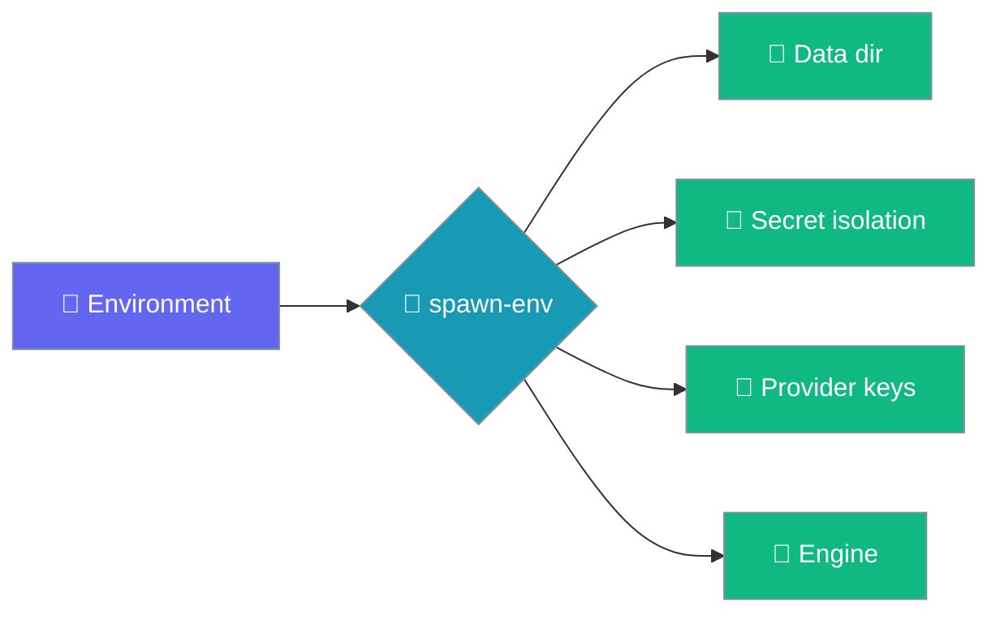
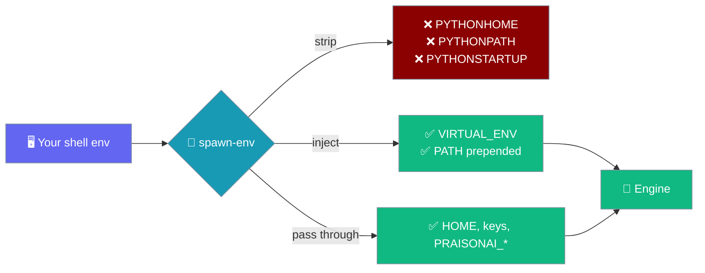
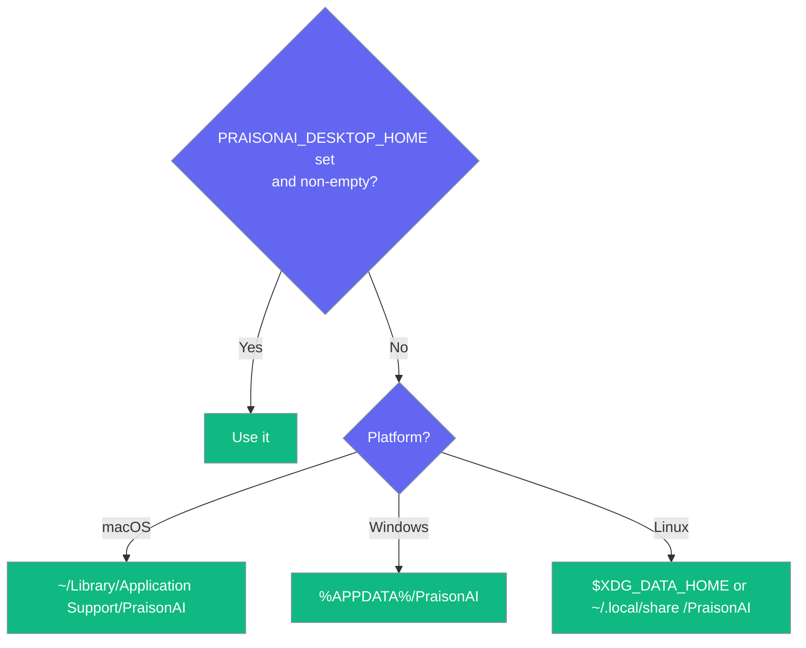

A single reference for the environment variables that change where the Desktop app stores data, how it isolates secrets, and which provider keys it uses.

```python
import os
from praisonaiagents import Agent

# The engine reads provider keys from the environment when the
# in-app api_key is left blank.
os.environ.setdefault("OPENAI_API_KEY", "sk-...")
agent = Agent(name="Assistant", instructions="You are helpful.")
agent.start("Hello")
```



An **empty** value is treated as **unset** everywhere — `PRAISONAI_DESKTOP_HOME=""` no longer makes the Rust shell and the Python engine disagree about where data lives.

## Quick Start

<Steps>
<Step title="Set a variable before launch">
Export the variable in the shell that starts the app. Most variables pass through to the engine unchanged — but three Python variables are stripped and two are always set for you (see **How the engine gets its environment** below).
</Step>

<Step title="Leave api_key blank to use the environment">
If you already export `OPENAI_API_KEY`, leave the in-app `api_key` blank and the engine uses the environment value.
</Step>
</Steps>

---

## How the engine gets its environment

The Desktop shell **rebuilds** the engine's environment from the resolved venv before spawning it — it does not hand the engine your shell untouched.



**Most variables pass through unchanged** — provider keys (`OPENAI_API_KEY`, `TAVILY_API_KEY`), Desktop vars (`PRAISONAI_DESKTOP_HOME`, `PRAISONAI_KEYCHAIN_SERVICE`, `PRAISONAI_AGENTS_SOURCE`, `PRAISONAI_TRAIN_CMD`, `PRAISONAI_MODEL`), and platform vars (`HOME`, `APPDATA`, `XDG_DATA_HOME`).

**Three variables are stripped by the shell** before the engine spawns: `PYTHONHOME`, `PYTHONPATH`, `PYTHONSTARTUP`. Setting them in your shell does nothing for the engine. This is deliberate — they would otherwise redirect the engine's stdlib or `site-packages` away from the venv the shell just resolved.

**Two variables are always set by the shell**: `VIRTUAL_ENV` (points at the resolved venv root) and `PATH` (the venv's `bin`/`Scripts` prepended to whatever `PATH` you exported).

<Warning>
`PYTHONHOME`, `PYTHONPATH`, and `PYTHONSTARTUP` set in your shell do not reach the engine — the Desktop shell strips them so the venv's stdlib is used. If you need the engine to import a local `praisonaiagents` checkout, set `PRAISONAI_AGENTS_SOURCE` instead.
</Warning>

---

## Reference

| Variable | Set by | Effect |
|----------|--------|--------|
| `PRAISONAI_DESKTOP_HOME` | You | Override the data directory. Empty = unset. |
| `XDG_DATA_HOME` | You (Linux) | Data-dir root when `PRAISONAI_DESKTOP_HOME` is unset. Empty = unset. |
| `APPDATA` | Windows | Data-dir root on Windows. |
| `PRAISONAI_KEYCHAIN_SERVICE` | You / CI | Isolate secrets under a different service name (default `ai.praison.desktop`). |
| `PRAISONAI_AGENTS_SOURCE` | You | Point the engine at a local `praisonai-agents` checkout. |
| `PRAISONAI_TRAIN_CMD` | You | Choose the interpreter that runs a fine-tune (`--config` is always appended). |
| `PRAISONAI_MODEL` | You | Default model id when no setting is stored. |
| `PYTHONUTF8=1` | Shell → engine | Non-UTF-8 locale startup fix. Set for you; don't override. |
| `PYTHONIOENCODING=utf-8` | Shell → engine | Same. Don't override. |
| `PYTHONHOME` | (stripped) | Ignored — the shell drops it before spawning the engine so the venv's stdlib is used. |
| `PYTHONPATH` | (stripped) | Ignored — the shell drops it so the engine only imports from the venv's `site-packages`. |
| `PYTHONSTARTUP` | (stripped) | Ignored — the shell drops it so a stray startup script cannot run in the engine. |
| `VIRTUAL_ENV` | Shell → engine | Set to the resolved venv root; do not override. |
| `PATH` | Shell → engine | Venv's `bin` (POSIX) or `Scripts` (Windows) prepended to your exported `PATH`. |
| `OPENAI_API_KEY` | You | Provider key, used when the in-app `api_key` is blank. |
| `OPENAI_API_BASE` | Engine | Set from the `base_url` setting; cleared when you clear that setting. |
| `TAVILY_API_KEY` | You | Enables the built-in `web_search` tool. |

---

## Data Directory Precedence

The data directory resolves per platform, and an empty variable is skipped rather than joined onto a partial path.



<Warning>
Never set `PRAISONAI_DESKTOP_HOME=""` or `XDG_DATA_HOME=""` expecting a different directory — an empty value is unset, so the app falls back to the platform default.
</Warning>

---

## Best Practices

<AccordionGroup>
<Accordion title="Isolate test runs with the keychain service">
`PRAISONAI_DESKTOP_HOME` isolates the data directory but **not** the system keyring, which is shared per user. Set `PRAISONAI_KEYCHAIN_SERVICE` too, or a test run overwrites the key you actually use.
</Accordion>

<Accordion title="Don't override the UTF-8 exports">
The shell already sets `PYTHONUTF8=1` and `PYTHONIOENCODING=utf-8` so the engine starts on non-English locales. Overriding them reintroduces the startup-timeout bug they fix.
</Accordion>

<Accordion title="Leave api_key blank to inherit provider keys">
A blank in-app `api_key` means "use the environment". The engine only exports its own key when one is set, and clears only what it exported — so your shell's `OPENAI_API_KEY` survives.
</Accordion>

<Accordion title="Point the engine at a local checkout with PRAISONAI_AGENTS_SOURCE, not PYTHONPATH">
`PYTHONPATH` is stripped by design before the engine spawns, so it never reaches the engine. Set `PRAISONAI_AGENTS_SOURCE` to your `praisonaiagents` checkout instead — that variable passes through unchanged.
</Accordion>
</AccordionGroup>

---

## Related

<CardGroup cols={2}>
<Card title="Data & Privacy" icon="lock" href="/features/desktop/data">
Where each variable sends your data and secrets
</Card>
<Card title="Models & API Keys" icon="key" href="/features/desktop/models">
How provider keys and `base_url` are applied
</Card>
</CardGroup>
