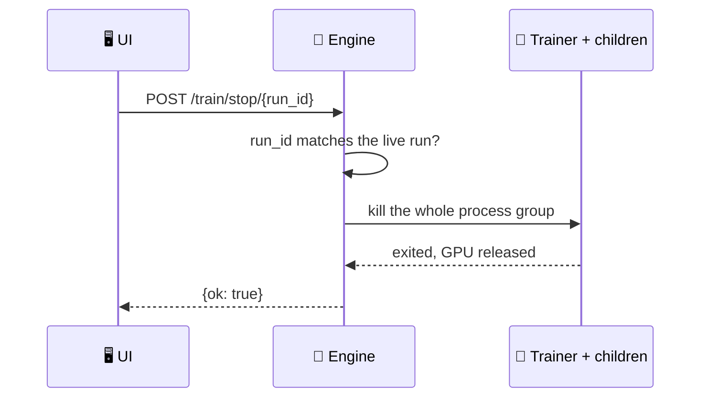

Fine-tune a model from the Desktop app: pick a method and a dataset, watch the loss live, and load the checkpoint straight back into chat.

```python
from praisonaiagents import Agent

# A fine-tune produces a checkpoint on disk. Point an agent at it and chat.
agent = Agent(
    name="Assistant",
    instructions="You are a helpful assistant.",
    llm="./runs/run-1/checkpoint",
)
agent.start("You now answer in my house style")
```


A training run is a subsystem, not a single request: it survives the window closing and the engine restarting, keeps a ring buffer of progress you can reconnect to, and derives its status from the subprocess itself — so a client that missed the ending still learns how it ended.

<Note>
On Windows this required PraisonAI [#4515](https://github.com/MervinPraison/PraisonAI/pull/4515); earlier releases killed the trainer on every relaunch.
</Note>

<Note>
Persistent run state (a run reappears in history after any engine restart) landed in PraisonAI [#4510](https://github.com/MervinPraison/PraisonAI/pull/4510); earlier releases dropped the live run on restart and would start a second trainer beside it.
</Note>

## Quick Start

<Steps>
<Step title="Fill in the training form">
Choose a base model, a dataset, and a method. The form collects the config; the engine writes it to `runs/<run-id>/config.yaml`.
</Step>

<Step title="Start the run">
The app posts to `/train/start`. Invalid configs are rejected **before** any model download begins, so you find out in seconds, not after a multi-gigabyte pull.
</Step>

<Step title="Watch progress">
The loss chart and log stream live from the run. Closing the lid doesn't lose it — reconnecting replays from where you left off.
</Step>

<Step title="Load the checkpoint">
When the run reports `done`, point an agent's `llm=` at the checkpoint directory to chat with your fine-tuned model.
</Step>
</Steps>

---

## Supported Methods

Pick a method by what your dataset looks like. Each method needs specific columns, checked when the run starts.

| Method | Required dataset columns |
|--------|--------------------------|
| **SFT** | Any (falls back to the default dataset) |
| **CPT** | `text` |
| **DPO** | `prompt`, `chosen`, `rejected` |
| **ORPO** | `prompt`, `chosen`, `rejected` |
| **CPO** | `prompt`, `chosen`, `rejected` |
| **KTO** | `prompt`, `completion`, `label` |
| **Reward** | `chosen`, `rejected` |

<Note>
**GRPO is not configurable from the UI form.** It needs `reward_funcs`, which the form doesn't collect — the engine rejects a GRPO start with a message telling you to run it from the command line instead.
</Note>

---

## Run IDs

A run id becomes a directory name, so it must be unique — and uniqueness is **case-insensitive**.

macOS and Windows filesystems fold case, so `run-x` and `RUN-X` would share one directory and overwrite each other's config and log. The engine compares ids with `casefold()` against both the run history and the filesystem, and refuses a collision. Auto-generated ids used to resolve to the second, so two starts in the same second collided; a numeric suffix (`run-1724759100-2`) now prevents that.

<Warning>
A run id must be 1–64 characters of letters, digits, dot, dash, or underscore, starting alphanumeric. Reserved Windows device names (`CON`, `PRN`, `COM1`…) and trailing dots are refused.
</Warning>

---

## Stop Semantics

The **Stop** button posts to `/train/stop/{run_id}`, not a bare `/train/stop`.



Because the id is checked against the live run, a **stale tab cannot cancel a newer run** — stopping the wrong job is refused with a 409. The kill releases the GPU on every platform: `taskkill /T /F` on Windows (a console-less child can't be signalled politely), and a process-group kill on macOS and Linux, so anything the trainer spawned dies with it.

---

## History & Retention

Finished runs stay listed, but bounded — the full log file on disk is always the complete record.

| Cap | Value | What it bounds |
|-----|-------|----------------|
| `MAX_HISTORY` | `50` | Finished runs kept in the history pane |
| `MAX_METRICS` | `5000` | Loss/metric points kept in memory per run |
| — | full log | `runs/<run-id>/train.log` is never truncated |

Only **one run at a time**: two fine-tunes on one GPU OOM, so `start` refuses while a run is live (409) rather than queueing.

---

## Preflight Rejection

Configs that can't work are rejected before anything downloads.

| Check | Response |
|-------|----------|
| Missing `model_name` or `dataset` | `400 Bad Request` |
| GRPO without `reward_funcs` | `400 Bad Request` |
| A run already live | `409 Conflict` |
| Unwritable runs directory | `500` with a real message |

Everything checkable from the config alone is checked up front, so you never wait an hour for a multi-gigabyte model to load only to be told your config was never going to work.

---

## Best Practices

<AccordionGroup>
<Accordion title="Keep the trainer in its own environment">
`praisonai-train` pulls torch and unsloth, which you may keep in a separate CUDA-matched venv. Set `PRAISONAI_TRAIN_CMD` to choose the interpreter — `--config <path>` is always appended, so the override picks the interpreter, not the contract.
</Accordion>

<Accordion title="Name your runs">
Provide a `run_id` you'll recognise instead of the auto-generated `run-<timestamp>`. Remember ids are compared case-insensitively, so `Nightly` and `nightly` are the same run.
</Accordion>

<Accordion title="Reconnect, don't restart — even after the engine restarts">
Progress is a ring buffer replayed from a cursor, and the run's state is written to `runs/<run-id>/run.json` at every transition. Close the window and reopening the run replays what you missed. Kill the engine (or crash it) and the next boot reads that state file back: a run whose child process is still alive reappears in history as `running` and Stop still reaches it; an interrupted run whose pid is gone reads as `failed`, not missing. Either way, a second fine-tune while an old one is still live is still refused — the single-GPU guard survives the restart.
</Accordion>

<Accordion title="Match the method to your columns">
Pick the method whose required columns your dataset already has. A mismatch is caught, but you'll save a round trip by checking the table above first.
</Accordion>
</AccordionGroup>

---

## Related

<CardGroup cols={2}>
<Card title="Chat & Streaming" icon="comments" href="/features/desktop/chat">
Chat with your fine-tuned checkpoint
</Card>
<Card title="Engine API" icon="plug" href="/features/desktop/api">
The `/train/*` HTTP routes in full
</Card>
</CardGroup>
