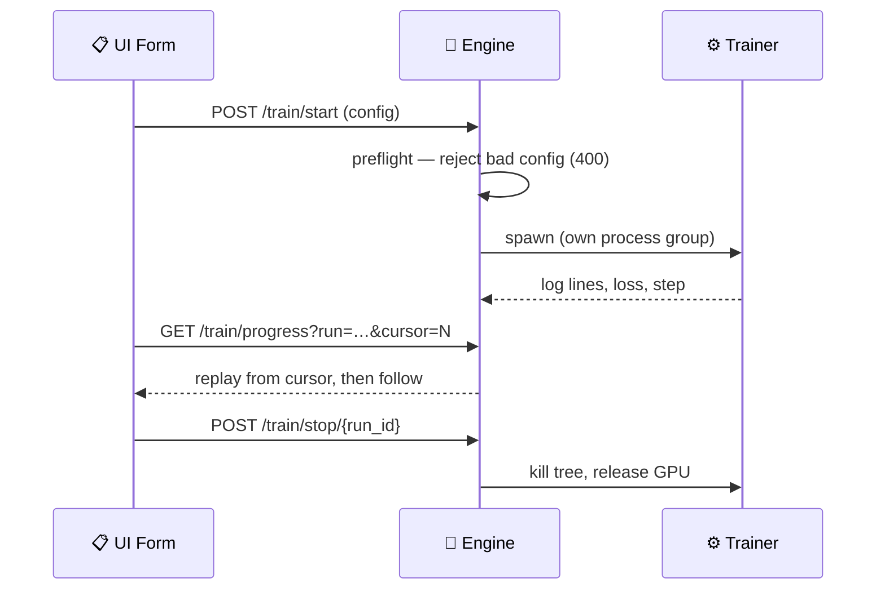

Fine-tune a model in the Desktop app, then point your agent at the checkpoint it produced.

```python
from praisonaiagents import Agent

agent = Agent(
    name="Assistant",
    instructions="You are a helpful assistant.",
    llm="./runs/run-1/checkpoint",  # the checkpoint your fine-tune produced
)
# Train in the Desktop app, then load the result like any other model.
agent.start("Answer in the style I trained you on")
```


The app runs one training job at a time — two fine-tunes on one GPU do not co-exist — and the job survives closing the window, so you can reconnect and keep watching.

<Note>
On Windows this required PraisonAI [#4515](https://github.com/MervinPraison/PraisonAI/pull/4515); earlier releases killed the trainer on every relaunch.
</Note>

<Note>
Persistent run state (a run reappears in history after any engine restart) landed in PraisonAI [#4510](https://github.com/MervinPraison/PraisonAI/pull/4510); earlier releases dropped the live run on restart and would start a second trainer beside it.
</Note>

<Note>
Quit-safety on macOS and Linux (the trainer dies with the engine on **Quit**, not just on **Stop**) landed in PraisonAI [#4508](https://github.com/MervinPraison/PraisonAI/pull/4508); earlier releases orphaned the trainer to `init` and held the GPU until reboot.
</Note>

## Quick Start

<Steps>
<Step title="Open the Fine-Tuning tab">
Pick a method, a base model, and a dataset. The form collects everything the engine needs to start a run.
</Step>

<Step title="Start the run">
The app posts your config to `/train/start`. Invalid configs are rejected immediately, before any model download begins.
</Step>

<Step title="Watch progress and stop when needed">
Loss, step, and log lines stream live. **Stop** ends the run and releases the GPU. The checkpoint stays on disk under the run's directory.
</Step>

<Step title="Load the checkpoint">
When the run reports `done`, point an agent's `llm=` at the checkpoint directory to chat with your fine-tuned model.
</Step>
</Steps>

---

## Supported Methods

The form supports these training methods. GRPO is validated but cannot be launched from the UI form — it needs `reward_funcs`, which the form does not collect, so run it from the command line.

| Method | Required dataset columns |
|--------|--------------------------|
| `sft` | any (falls back to the default dataset) |
| `cpt` | `text` |
| `dpo` | `prompt`, `chosen`, `rejected` |
| `orpo` | `prompt`, `chosen`, `rejected` |
| `cpo` | `prompt`, `chosen`, `rejected` |
| `kto` | `prompt`, `completion`, `label` |
| `reward` | `chosen`, `rejected` |
| `grpo` | needs `reward_funcs` — **CLI only** |

<Note>
Column requirements come from the dataset's contents, so the app names them in the per-method hint rather than checking them up front. The trainer still enforces them.
</Note>

---

## How It Works

The engine writes your config, spawns a training subprocess in its own process group, and follows its output.



---

## Run IDs

Each run becomes a directory, so run ids are unique **case-insensitively** — `run-x` and `RUN-X` are the same run because macOS and Windows filesystems fold case. Auto-generated ids append a numeric suffix, so two starts inside the same second no longer collide.

| Rule | Behaviour |
|------|-----------|
| Case | Ids are compared with `casefold()` — `run-x` collides with `RUN-X` |
| Same second | Auto-ids get a `-2`, `-3`… suffix instead of overwriting |
| Format | 1–64 characters of letters, digits, dot, dash, or underscore, starting alphanumeric |

Starting a run with an id that already exists returns `400 Bad Request`.

<Warning>
Reserved Windows device names (`CON`, `PRN`, `COM1`…) and trailing dots are refused.
</Warning>

---

## Stop Semantics

The **Stop** button posts to `/train/stop/{run_id}`, naming the run to cancel — so a stale tab cannot cancel a newer run.

| Platform | How the trainer is killed |
|----------|---------------------------|
| macOS / Linux | The process group is signalled, killing the trainer and everything it spawned |
| Windows | `taskkill /T /F` walks the child tree |

The GPU is released in every case. Stopping a run this engine did not spawn (adopted after a restart) signals the recorded pid's group.

---

## History & Retention

Finished runs stay in memory so the history pane can show them, within bounded caps. The full log file stays on disk.

| Cap | Value | What it bounds |
|-----|-------|----------------|
| `MAX_HISTORY` | `50` | Finished runs listed in history |
| `MAX_METRICS` | `5000` | Loss/metric points kept per run |

<Note>
`train.log` in each run directory is the complete record. The in-memory metric series is a tail for the chart, not an archive.
</Note>

---

## Preflight Validation

Invalid configs are rejected before a single byte is downloaded, so you learn about a mistake in seconds rather than after a multi-gigabyte model load.

| Response | Cause |
|----------|-------|
| `400 Bad Request` | Missing `model_name` or `dataset`, GRPO without `reward_funcs`, or a rejected run id |
| `409 Conflict` | A run is already live — one GPU runs one job |
| `500` | The runs directory could not be created |

---

## Best Practices

<AccordionGroup>
<Accordion title="Name your runs">
An explicit run id makes the checkpoint directory predictable. Remember ids are case-insensitive — `Exp-1` and `exp-1` are the same run.
</Accordion>

<Accordion title="Run GRPO from the command line">
GRPO needs `reward_funcs`, which the form cannot collect. Launch it with `praisonai train` instead and watch it from the same engine.
</Accordion>

<Accordion title="Keep the trainer in its own environment">
`praisonai-train` pulls torch and unsloth, which you may keep in a separate CUDA-matched venv. Set `PRAISONAI_TRAIN_CMD` to choose the interpreter — `--config <path>` is always appended, so the override picks the interpreter, not the contract.
</Accordion>

<Accordion title="Reconnect, don't restart">
Progress is a ring buffer replayed from a cursor and the run's state is written to `runs/<run-id>/run.json` at every transition. Close the window and reopening the run replays what you missed. A run whose child process is still alive after an engine restart reappears as `running` and Stop still reaches it.
</Accordion>

<Accordion title="Keep the log file for the full record">
The chart shows only recent metrics. For the complete series, read `train.log` in the run directory.
</Accordion>

<Accordion title="Stop from the run's own tab">
Stop names the run it cancels, so a stale tab is refused. Trigger Stop from the tab showing the run you actually want to end.
</Accordion>
</AccordionGroup>

---

## Related

<CardGroup cols={2}>
<Card title="Engine API" icon="plug" href="/features/desktop/api">
The `/train/*` routes and their status codes
</Card>
<Card title="Settings Reference" icon="sliders" href="/features/desktop/settings">
Model, sampling, and safety fields
</Card>
<Card title="Chat & Streaming" icon="comments" href="/features/desktop/chat">
Talk to your fine-tuned model
</Card>
<Card title="Models & API Keys" icon="key" href="/features/desktop/models">
Point the app at a local checkpoint
</Card>
</CardGroup>
