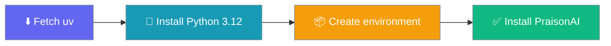
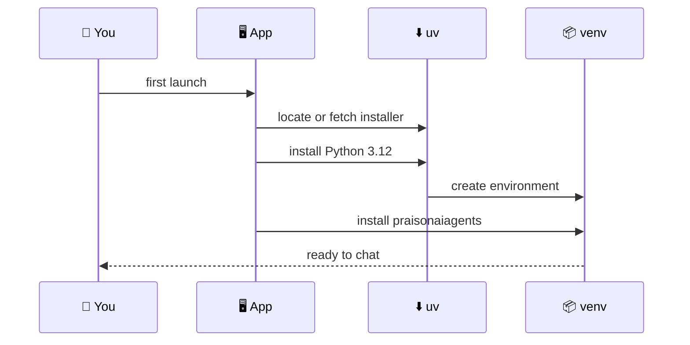
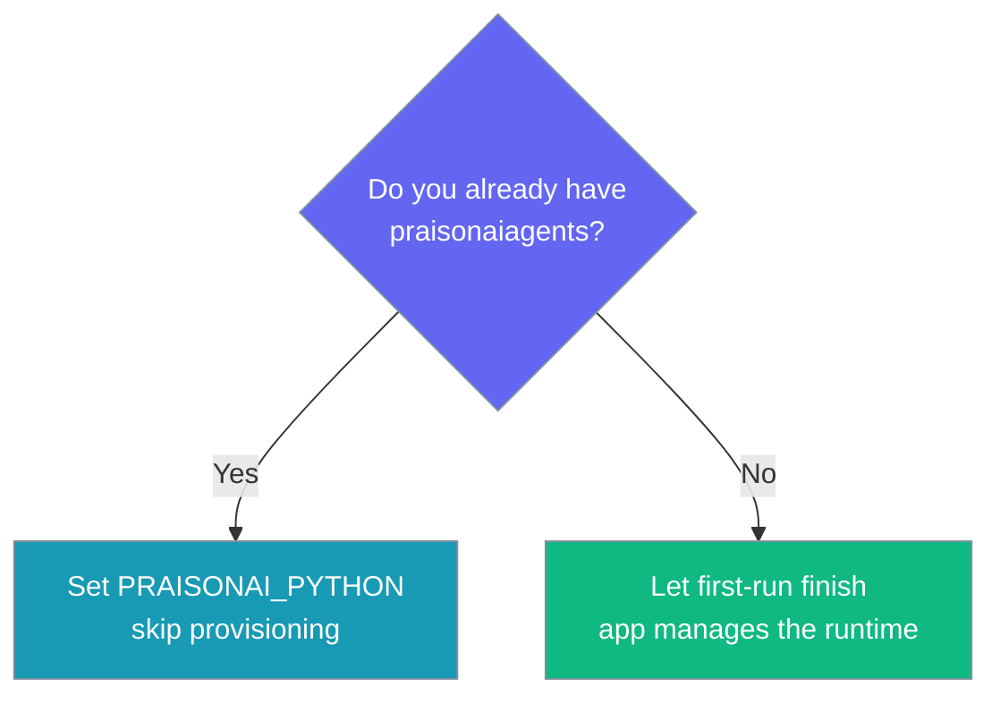

The first time you launch PraisonAI Desktop, it installs its own Python runtime and the `praisonaiagents` package into your user data folder — no terminal, no `pip`.

```python
from praisonaiagents import Agent

agent = Agent(
    name="Assistant",
    instructions="You are a helpful assistant.",
)
# The Desktop app provisions the environment that runs this agent for you.
agent.start("Hello")
```



## Quick Start

<Steps>
<Step title="Launch the app">
On a clean machine the app opens straight onto the first-run screen instead of the chat.
</Step>

<Step title="Watch the four stages">
Each stage flips from pending to running to done as the runtime is built.
</Step>

<Step title="Start chatting">
When the last stage completes, the window switches to chat — the environment is ready.
</Step>
</Steps>

---

## How It Works

The app locates or fetches `uv`, has it install a pinned CPython, creates a venv in your data directory, then installs the engine's dependencies into it.



The runtime is pinned, not "latest": the app installs **Python 3.12** and a floor of **`praisonaiagents>=1.7.2`** so a first run cannot land on a bad interpreter or a broken release.

---

## Event Stream

The first-run screen renders `provision` events from the `provision_engine` command. Each event carries an `id`, a `label`, a `state`, and an optional `detail`.

| Stage `id` | Label |
|------------|-------|
| `uv` | Fetching the installer |
| `python` | Installing Python |
| `venv` | Creating the environment |
| `deps` | Installing PraisonAI |

Each stage moves through four states:

| `state` | Meaning |
|---------|---------|
| `pending` | Not started yet |
| `running` | In progress |
| `done` | Finished successfully |
| `error` | Failed — the **Retry** button re-invokes `provision_engine` |

<Note>
The dependencies stage installs the whole set in **one** `uv pip install` invocation, so `uv` resolves the packages together rather than one at a time.
</Note>

---

## Where Things Go

The environment is built inside your user data folder, never inside the read-only app bundle.

| Path | Contents |
|------|----------|
| `~/Library/Application Support/PraisonAI/venv/` | The provisioned Python environment |
| `~/Library/Application Support/PraisonAI/venv/bin/python3` | The interpreter the engine runs from |

Override the data directory with `PRAISONAI_DESKTOP_HOME` if you want the venv somewhere else.

---

## Bring Your Own Runtime

If you already have `praisonaiagents`, you can skip provisioning entirely.



```bash
# Point the engine at your own interpreter and skip the managed venv.
export PRAISONAI_PYTHON=/absolute/path/to/venv/bin/python3
```

---

## Best Practices

<AccordionGroup>
<Accordion title="Let the first run finish uninterrupted">
Provisioning downloads an interpreter and resolves packages. Leave the window open until all four stages are done — quitting mid-run leaves a partial venv.
</Accordion>

<Accordion title="Retry from where it stopped">
If a stage errors (usually a network drop while fetching `uv` or Python), the **Retry** button re-runs `provision_engine` from the current stage rather than starting over.
</Accordion>

<Accordion title="Own the runtime for reproducible installs">
Set `PRAISONAI_PYTHON` to a venv you control when you need a pinned, reproducible environment. The app then runs the engine against your interpreter and never provisions its own.
</Accordion>
</AccordionGroup>

---

## Related

<CardGroup cols={2}>
<Card title="Window & Lifecycle" icon="window-restore" href="/features/desktop/window-and-lifecycle">
Tray, single-instance, and orphan reclamation
</Card>
<Card title="Troubleshooting" icon="stethoscope" href="/features/desktop/troubleshooting">
Read the engine log and fix startup failures
</Card>
</CardGroup>
