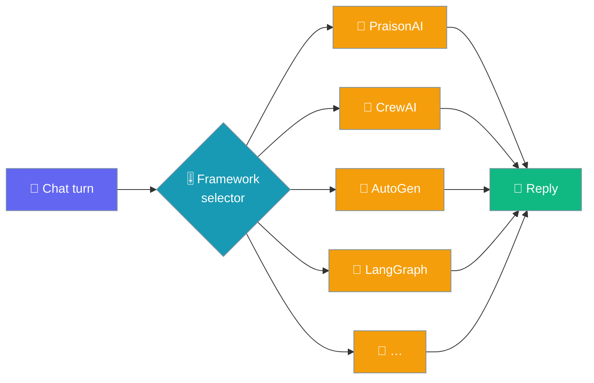

Pick which framework runs a chat turn — PraisonAI is built in, and installing `praisonai-frameworks` adds CrewAI, AutoGen, LangGraph, Agno, Google ADK, OpenAI Agents SDK and Pydantic AI.

```python
from praisonaiagents import Agent

agent = Agent(
    name="Assistant",
    instructions="You are a helpful assistant.",
)
# The desktop app is a thin shell around this agent. Selecting a non-default
# framework in Settings routes the same turn through that framework instead.
agent.start("Summarize this file")
```



The default `framework = "praisonai"` runs the built-in agent. Any other name routes the turn through that framework's adapter, discovered by the `praisonai-frameworks` extras package.

## Quick Start

<Steps>
<Step title="Keep the default">
Do nothing. `framework` defaults to `"praisonai"`, so every turn runs the built-in agent with no extra install.
</Step>

<Step title="Install the extras">
Add the framework you want as an extra of `praisonai-frameworks`:

```bash
pip install "praisonai-frameworks[crewai]"
```

The other extras are `autogen`, `langgraph`, `agno`, `google-adk`, `openai-agents`, and `pydantic-ai`.
</Step>

<Step title="Set the setting">
Open **Settings → Models → Agent framework**, type the framework name (for example `crewai`), and restart the app. The field is marked **Requires restart**, so the engine picks it up on the next launch.
</Step>
</Steps>

---

## How It Works


A non-default framework routes through `praisonai.agents_generator.AgentsGenerator` with a generated one-agent YAML — the chat turn is expressed as a single agent, single task config. Because that path returns the finished result rather than a token stream, **streaming is not available for these frameworks**: the reply arrives whole. The exact contract lives in `run_with_framework` and `_framework_yaml` in the engine's `server.py`.

---

## Availability & Install Hints

`GET /frameworks` reports this same list at runtime — `available` names what this install can run, and `hints` gives the install command for the rest.

| Framework | Install hint |
|-----------|--------------|
| `praisonai` | *(built in — always available)* |
| `crewai` | `pip install "praisonai-frameworks[crewai]"` |
| `autogen` | `pip install "praisonai-frameworks[autogen]"` |
| `langgraph` | `pip install "praisonai-frameworks[langgraph]"` |
| `agno` | `pip install "praisonai-frameworks[agno]"` |
| `google-adk` | `pip install "praisonai-frameworks[google-adk]"` |
| `openai-agents` | `pip install "praisonai-frameworks[openai-agents]"` |
| `pydantic-ai` | `pip install "praisonai-frameworks[pydantic-ai]"` |

---

## Refusal Behaviour

<Warning>
A framework that is not installed is **refused with its install command**, not silently swapped for the built-in. Selecting `crewai` without the extra installed makes the turn raise a `RuntimeError` whose message names `praisonai-frameworks` and how to obtain it — the setting never quietly falls back to `praisonai`. A silent fallback is what makes a setting look effective while changing nothing, so the engine refuses instead.
</Warning>

---

## Best Practices

<AccordionGroup>
<Accordion title="Install one framework at a time">
The extras are heavy — each pulls its own dependency tree. Install only the framework you intend to use rather than every extra at once.
</Accordion>

<Accordion title="Restart after changing the framework">
The `framework` field is `requiresRestart: true`. Relaunch the app after changing it so the engine loads the selected adapter.
</Accordion>

<Accordion title="Streaming behaviour changes for non-default frameworks">
The reply arrives whole for any framework other than `praisonai`. The streaming toggle has no effect on those turns — expect the answer to appear at once rather than token by token.
</Accordion>
</AccordionGroup>

---

## Related

<CardGroup cols={2}>
<Card title="Settings Reference" icon="sliders" href="/features/desktop/settings">
The `framework` row and every other Models field
</Card>
<Card title="PraisonAI Agents" icon="robot" href="/framework/praisonaiagents">
What the built-in framework does
</Card>
<Card title="CrewAI" icon="users" href="/framework/crewai">
Role-based multi-agent crews
</Card>
<Card title="LangGraph" icon="diagram-project" href="/framework/langgraph">
Graph-structured agent workflows
</Card>
</CardGroup>
