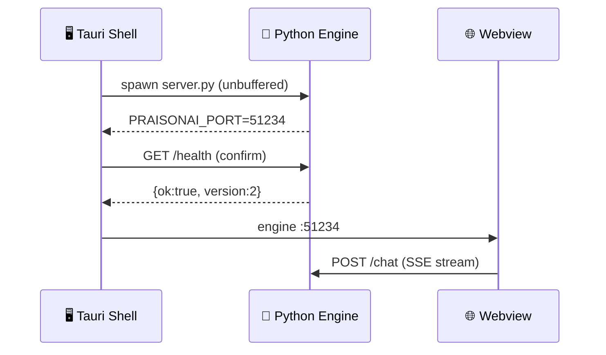
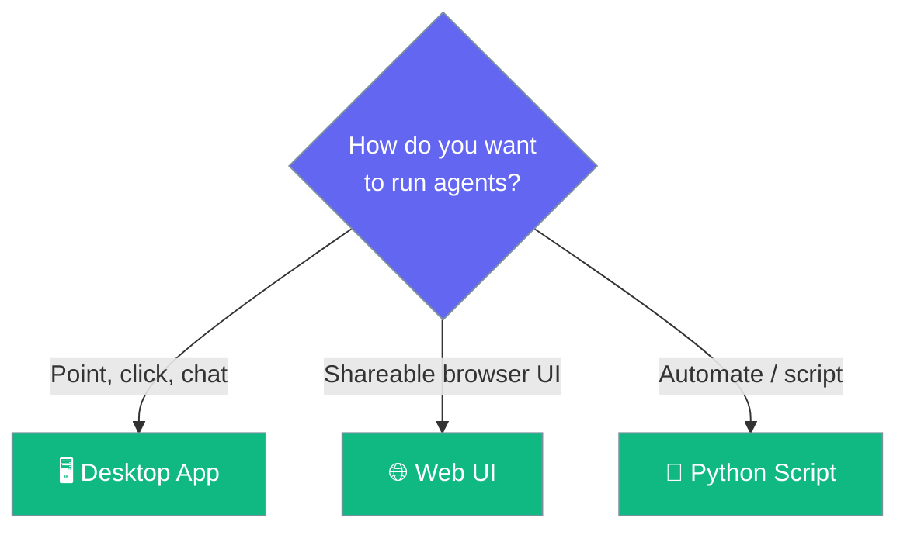

PraisonAI Desktop is a native macOS app that runs your PraisonAI agents locally with streaming chat, tool calls, approvals, MCP servers, and per-conversation memory — no browser required.

```python
from praisonaiagents import Agent

agent = Agent(
    name="Assistant",
    instructions="You are a helpful assistant.",
)
# Talk to this agent from the PraisonAI Desktop app —
# it picks up your local venv automatically.
agent.start("Summarize this file")
```


The app is a Tauri (Rust) shell that supervises a small Python engine on loopback. Chat text streams straight from that engine into the webview over `127.0.0.1` — nothing leaves your machine unless the model itself does.

## Quick Start

<Steps>
<Step title="Install a venv with praisonaiagents">
The app looks for a local virtual environment inside the checkout. Create one and install the SDK:

```bash
cd src/praisonai-agents
python3 -m venv .venv
.venv/bin/pip install praisonaiagents
```
</Step>

<Step title="Build the app from source">
The DMG target is defined in `src-tauri/tauri.conf.json` (`productName: "PraisonAI"`, identifier `ai.praison.desktop`, macOS 10.15+).

```bash
cd src/praisonai-desktop
cargo tauri build
```

<Note>
The PR ships no README — confirm the exact build command with the maintainer before publishing.
</Note>
</Step>

<Step title="Launch and watch the startup pill">
On first launch a status pill reports the engine's state:

| Pill | Meaning |
|------|---------|
| `starting engine` | The shell is spawning Python |
| `engine :PORT` | The engine is listening and healthy |
| `engine failed` | Startup failed — the tail of the log is shown |
</Step>
</Steps>

---

## How It Works

The Rust shell picks a Python interpreter, proves it owns its own `site-packages`, spawns the engine, then confirms the announced port with a `/health` probe before handing it to the webview.



Where the app looks for the venv, in order (`src-tauri/src/main.rs`):

| Order | Path (relative to checkout) |
|-------|------------------------------|
| 1 | `src/praisonai-agents/.venv` |
| 2 | `src/praisonai-agents/venv` |
| 3 | `venv` |

The first interpreter whose venv owns its own `site-packages` wins. A system Python or a mismatched venv is refused rather than guessed at.

---

## When To Use It



| Choose | When |
|--------|------|
| **Desktop App** | You want a local, native chat window with approvals and per-conversation history |
| **Web UI** | You need a shareable browser experience |
| **Python script** | You are automating agents or embedding them in code |

---

## Best Practices

<AccordionGroup>
<Accordion title="Keep the venv beside the checkout">
The shell resolves the interpreter from fixed paths inside the checkout. Put your `.venv` at `src/praisonai-agents/.venv` so the app finds it without configuration.
</Accordion>

<Accordion title="Install praisonaiagents into that venv">
A missing dependency surfaces as `engine failed: missing dependency`. Install `praisonaiagents` into the same venv the app resolves.
</Accordion>

<Accordion title="Read the pill, not the exit code">
Every failure attaches the tail of the engine's own output. Read the pill and the log viewer instead of guessing from a bare exit code.
</Accordion>
</AccordionGroup>

---

## Related

<CardGroup cols={2}>
<Card title="Chat & Streaming" icon="comments" href="/features/desktop/chat">
Messages, streaming events, tool cards, and keyboard shortcuts
</Card>
<Card title="Approvals & Safety" icon="shield-check" href="/features/desktop/approvals">
`ask` / `smart` / `never` modes and the per-call approval flow
</Card>
<Card title="Settings Reference" icon="sliders" href="/features/desktop/settings">
Every field in the settings registry
</Card>
<Card title="Engine & Diagnostics" icon="stethoscope" href="/features/desktop/troubleshooting">
Startup states, the log viewer, and common failure modes
</Card>
</CardGroup>
