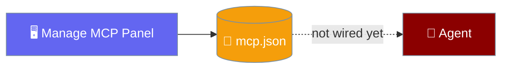
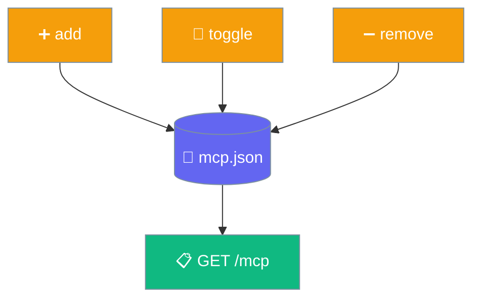

The Desktop app's MCP panel stores server entries for a future release. The engine does not launch them yet, so the model cannot use them.

<Warning>
**Stored for a future release.** The engine does not launch these servers yet, so the model cannot use them. For MCP that reaches the agent today, use the SDK path in [MCP Overview](/features/mcp).
</Warning>

## Quick Start

<Steps>
<Step title="Open the Manage MCP panel">
Find the Manage MCP panel in the app.
</Step>

<Step title="Store a server entry">
Enter a **name**, **command**, and **args**, then save. This writes the entry to `mcp.json` — it does not launch anything.
</Step>

<Step title="Enable, disable, or remove a stored entry">
The toggle only flips the `enabled` flag in storage. Removing deletes the entry. Nothing else changes today — the agent still uses only built-in tools.
</Step>
</Steps>

---

## How It Works

The app stores servers through a single endpoint (`POST /mcp`) with an `action` of `add`, `remove`, or `toggle`, and lists them with `GET /mcp`. Storage is the only thing that happens — no process is launched.

These fields are recorded so a future release can pick them up:

| Field | Type | Notes |
|-------|------|-------|
| `name` | `string` | Required; adding an existing name replaces it |
| `command` | `string` | The executable a future release will launch |
| `args` | `array` | Arguments a future release will pass to the command |
| `enabled` | `bool` | Defaults to `true` on add; only flips the stored flag today |

<Note>
Adding a server with a name that already exists replaces the previous entry rather than duplicating it.
</Note>

---

## Today vs Future

The panel stores data now; a future release wires it to the agent.

| Today | Future release |
|-------|----------------|
| Store an entry (name / command / args / enabled) | Same storage picked up by the engine |
| Entries survive restarts | Enabled entries launched over stdio |
| The agent uses only built-in tools | The agent sees tools from enabled servers |

---

## Best Practices

<AccordionGroup>
<Accordion title="Use the SDK for MCP that works today">
The Desktop panel is storage-only. To give an agent real MCP tools now, use the SDK path in [MCP Overview](/features/mcp).
</Accordion>

<Accordion title="Name servers clearly">
The name is the key. A clear, unique name prevents an accidental replace when you add a new entry.
</Accordion>

<Accordion title="Toggle instead of removing">
Disable a stored entry you may want back rather than removing it — the entry and its args are preserved for the future release.
</Accordion>
</AccordionGroup>

---

## Related

<CardGroup cols={2}>
<Card title="MCP Overview" icon="plug" href="/features/mcp">
The only path that gives MCP tools to the agent today
</Card>
<Card title="Settings Reference" icon="sliders" href="/features/desktop/settings">
Other Desktop app configuration
</Card>
</CardGroup>
