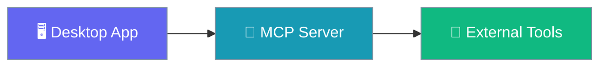
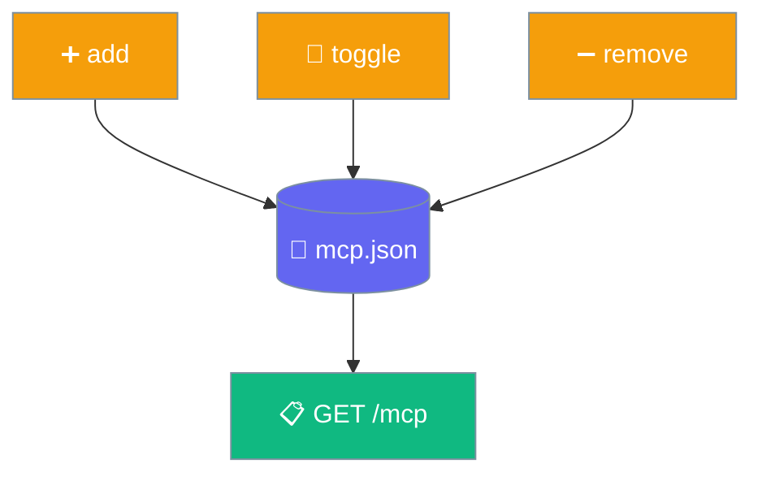

Connect external tools to your agent by adding MCP servers directly in the app — name, command, args, and an on/off toggle.

```python
from praisonaiagents import Agent
from praisonaiagents.mcp import MCP

agent = Agent(
    name="Assistant",
    instructions="You are a helpful assistant.",
    tools=MCP("npx -y @modelcontextprotocol/server-filesystem /tmp"),
)
agent.start("List the files you can reach")
```



## Quick Start

<Steps>
<Step title="Open the MCP panel">
Find the MCP servers panel in the app.

{/* Screenshot placeholder: MCP panel */}
</Step>

<Step title="Add a server">
Enter a **name**, **command**, and **args**, then save. The app stores it and marks it enabled.
</Step>

<Step title="Toggle or remove">
Flip a server on or off, or remove it — all from the same panel.
</Step>
</Steps>

---

## How It Works

The app manages servers through a single endpoint (`POST /mcp`) with an `action` of `add`, `remove`, or `toggle`, and lists them with `GET /mcp`.



Each server stores exactly these fields:

| Field | Type | Notes |
|-------|------|-------|
| `name` | `string` | Required; adding an existing name replaces it |
| `command` | `string` | The executable to launch |
| `args` | `array` | Arguments passed to the command |
| `enabled` | `bool` | Defaults to `true` on add |

<Note>
Adding a server with a name that already exists replaces the previous entry rather than duplicating it.
</Note>

---

## Best Practices

<AccordionGroup>
<Accordion title="Name servers clearly">
The name is the key. A clear, unique name makes toggling and removing obvious, and prevents an accidental replace.
</Accordion>

<Accordion title="Toggle instead of removing">
Disable a server you may want back rather than removing it — the entry and its args are preserved.
</Accordion>

<Accordion title="Test the command outside the app first">
`command` and `args` launch a process. Confirm they run in a terminal before adding them, so a failure is obvious.
</Accordion>
</AccordionGroup>

---

## Related

<CardGroup cols={2}>
<Card title="MCP Overview" icon="plug" href="/features/mcp">
Author and understand MCP servers themselves
</Card>
<Card title="Settings Reference" icon="sliders" href="/features/desktop/settings">
Other Desktop app configuration
</Card>
</CardGroup>
