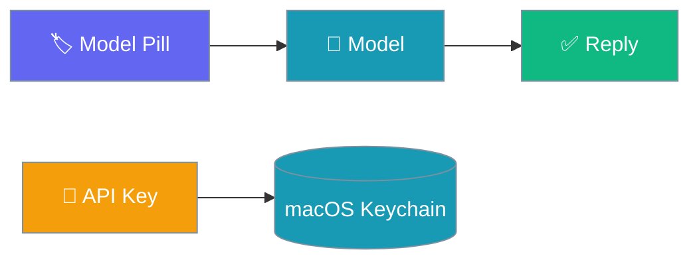
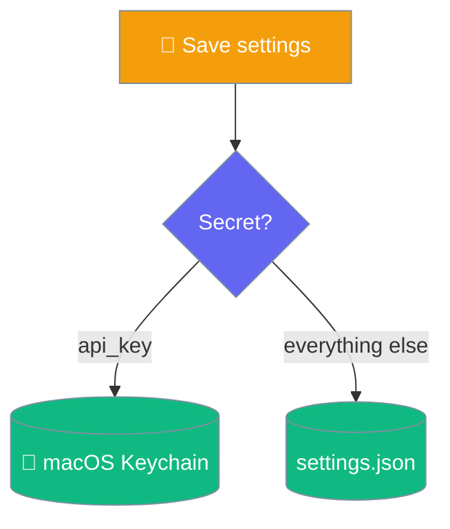
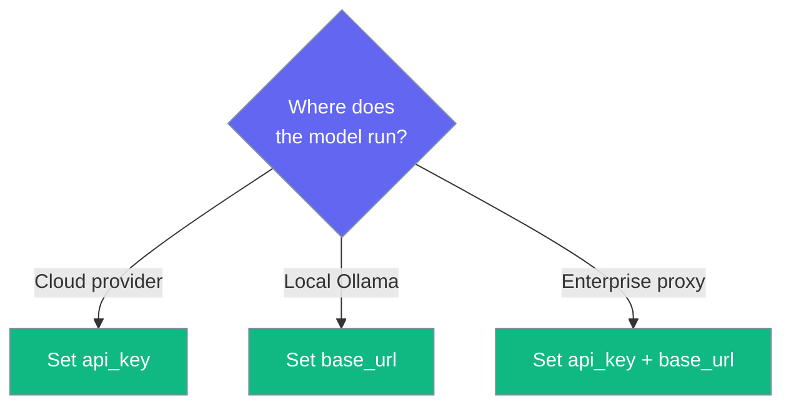

Swap models from the title bar, tune sampling, and keep your API key in the macOS keychain — never in a file.

```python
from praisonaiagents import Agent

agent = Agent(
    name="Assistant",
    instructions="You are a helpful assistant.",
    llm="gpt-4o-mini",
)
# The model you pick in the app is passed to the agent as llm=...
agent.start("Say hello")
```



## Quick Start

<Steps>
<Step title="Open the model combobox">
Click the model pill in the title bar. It suggests common models and accepts any string.
</Step>

<Step title="Set your API key">
In **Settings → Models → API key**, paste your key. It is stored in the macOS keychain.
</Step>

<Step title="Tune sampling (optional)">
Adjust `temperature`, `max_tokens`, or `top_p` in the Models section.
</Step>
</Steps>

---

## Suggested Models

The combobox suggests these and accepts any other string:

| Model | Notes |
|-------|-------|
| `gpt-4o-mini` | Default |
| `gpt-4o` | |
| `claude-sonnet-4-20250514` | |
| `claude-opus-4-20250514` | |
| `gemini-2.0-flash` | |
| `ollama/llama3.2` | Local via Ollama |

---

## Sampling & Endpoint

| Field | Default | Effect |
|-------|---------|--------|
| `temperature` | `0.7` | Higher is more varied; `0` is near-deterministic |
| `max_tokens` | `0` | `0` lets the model decide |
| `top_p` | `1` | Nucleus sampling |
| `base_url` | `""` | Override for a proxy, Azure, or a local server |

<Note>
Sampling values are forwarded only when you change them from their defaults, so a provider default you set elsewhere is never overridden unasked.
</Note>

---

## Where Keys Live

The `api_key` is stored in the macOS keychain (service `ai.praison.desktop`) and stripped before `settings.json` is written.



<Warning>
Your `api_key` never touches `settings.json` — it lives only in the keychain. Clearing it removes the credential from the environment on the next turn.
</Warning>

---

## Choosing a Setup



| Setup | Set |
|-------|-----|
| Cloud model (OpenAI, Anthropic, Gemini) | `api_key` |
| Local Ollama | `base_url` |
| Enterprise proxy / Azure | `api_key` and `base_url` |

---

## Best Practices

<AccordionGroup>
<Accordion title="Leave api_key blank to use the environment">
If you already export `OPENAI_API_KEY`, leave the field blank and the engine uses the environment key.
</Accordion>

<Accordion title="Restart after changing key or base_url">
Both are marked "requires restart". Relaunch so the engine routes to the new credential or endpoint.
</Accordion>

<Accordion title="Use base_url for local models">
Point `base_url` at your local server (for example Ollama or LM Studio) to run entirely on-device.
</Accordion>
</AccordionGroup>

---

## Related

<CardGroup cols={2}>
<Card title="Settings Reference" icon="sliders" href="/features/desktop/settings">
Every Models field and its default
</Card>
<Card title="Data & Privacy" icon="lock" href="/features/desktop/data">
How secrets are kept off disk
</Card>
</CardGroup>
