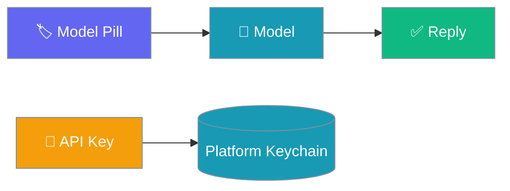
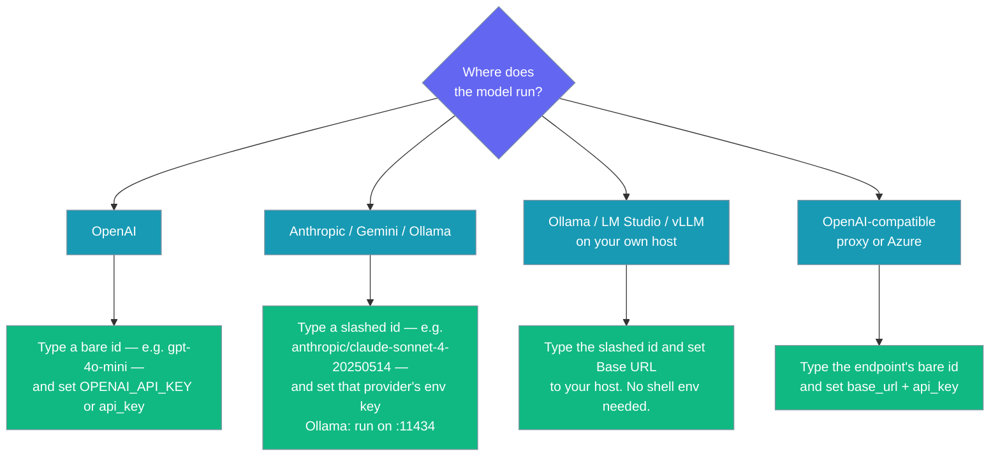

Swap models from the title bar, tune sampling, and keep your API key in the platform keychain — never in a file.

```python
from praisonaiagents import Agent

agent = Agent(
    name="Assistant",
    instructions="You are a helpful assistant.",
    llm="gpt-4o-mini",
)
# The model you pick in the app is passed to the agent as llm=...
agent.start("Say hello")
```

The same string the desktop combobox passes into `llm=` can also be a provider-prefixed id, routed through litellm:

```python
from praisonaiagents import Agent

agent = Agent(
    name="Assistant",
    instructions="You are a helpful assistant.",
    llm="anthropic/claude-sonnet-4-20250514",  # routed through litellm
)
agent.start("Say hello")
```



## Quick Start

<Steps>
<Step title="Open the model combobox">
Click the model pill in the title bar. It suggests common models and accepts any string.
</Step>

<Step title="Set your API key">
In **Settings → Models → API key**, paste your key. It is stored in the platform keychain.
</Step>

<Step title="Tune sampling (optional)">
Adjust `temperature`, `max_tokens`, or `top_p` in the Models section.
</Step>
</Steps>

---

## Suggested Models

The combobox suggests eleven ids. Four use the OpenAI API and your `api_key`; the rest are provider-prefixed and route through litellm to a different provider, which needs that provider's credentials — in the environment, in the app's `api_key` field, or reached by a Base URL. It stays free-text, so you can type any id.

| Model | Routing | What it needs |
|-------|---------|---------------|
| `gpt-4o-mini` *(default)* | OpenAI | `OPENAI_API_KEY`, or the app's `api_key` field |
| `gpt-4o` | OpenAI | as above |
| `gpt-4.1-mini` | OpenAI | as above |
| `o4-mini` | OpenAI | as above |
| `anthropic/claude-sonnet-4-20250514` | litellm → Anthropic | `ANTHROPIC_API_KEY` in the environment |
| `gemini/gemini-2.0-flash` | litellm → Google Gemini | `GEMINI_API_KEY` in the environment |
| `ollama/llama3.2` | litellm → Ollama | Ollama on `:11434` (no key) — **or** set Base URL to a remote Ollama host |
| `lm_studio/qwen2.5-7b-instruct` | litellm → LM Studio | Base URL to the LM Studio server (default `http://localhost:1234/v1`) + API key if LM Studio requires one |
| `hosted_vllm/meta-llama/Llama-3.1-8B-Instruct` | litellm → vLLM | Base URL to the vLLM `/v1` endpoint + API key |
| `huggingface/meta-llama/Llama-3.1-8B-Instruct` | litellm → HuggingFace | `HUGGINGFACE_API_KEY` (or the picker's `api_key` field) |
| `openrouter/qwen/qwen-2.5-72b-instruct` | litellm → OpenRouter | `OPENROUTER_API_KEY` (or the picker's `api_key` field) |

### Using another provider (Anthropic, Google, Ollama, …)

Three paths reach these providers. The shipped desktop venv now carries litellm — it is a core dependency of the `praisonai` wrapper package pinned by `ENGINE_PACKAGES` (see [PraisonAI#4721](https://github.com/MervinPraison/PraisonAI/pull/4721)) — so slashed ids run fine out of the box, and [PraisonAI#4778](https://github.com/MervinPraison/PraisonAI/pull/4778) restores them in the picker.

The **Base URL** field is now sent to the variable the **selected provider** reads — `OLLAMA_API_BASE` for `ollama/…`, `LM_STUDIO_API_BASE` for `lm_studio/…`, `HOSTED_VLLM_API_BASE` for `hosted_vllm/…`, and `<PROVIDER>_API_BASE` for anything else litellm knows. The **API key** field follows the same rule (`<PROVIDER>_API_KEY`), with the OpenAI pair kept in step so switching back to a bare id still works. Pointing the desktop at a remote Ollama, LM Studio, or vLLM host is a two-field task: pick the slashed id, set Base URL. No shell exports needed.

**Path 1 — Provider-prefixed id (recommended for Anthropic, Gemini, Ollama):** Pick a slashed id from the combobox and set that provider's key in the environment (or run Ollama locally). No Base URL needed.

| Provider | Model id | Environment variable |
|----------|----------|----------------------|
| Anthropic | `anthropic/claude-sonnet-4-20250514` | `ANTHROPIC_API_KEY` |
| Google (Gemini) | `gemini/gemini-2.0-flash` | `GEMINI_API_KEY` |
| Ollama (local) | `ollama/llama3.2` | *none — run Ollama on `:11434`* |

**Path 2 — Bare id + Base URL (for any OpenAI-compatible endpoint):** Set a **Base URL** to that endpoint and type its **bare** model id.

| Endpoint | Base URL | Example bare id |
|----------|----------|-----------------|
| Anthropic (OpenAI-compat) | `https://api.anthropic.com/v1/` | `claude-sonnet-4-20250514` |
| Google Gemini (OpenAI-compat) | `https://generativelanguage.googleapis.com/v1beta/openai/` | `gemini-2.0-flash` |
| Ollama (local) | `http://localhost:11434/v1` | `llama3.2` |
| Any OpenAI-compatible endpoint | that endpoint's URL | its own bare id |

**Path 3 — Slashed id + provider Base URL (recommended for Ollama / LM Studio / vLLM on your own host):** Pick the slashed id and set Base URL to your host. The app routes it to the variable that provider reads.

| Provider | Model id (picker) | Base URL to set | API key |
|----------|-------------------|-----------------|---------|
| Ollama (remote) | `ollama/llama3.2` | `http://192.168.1.50:11434` | *(blank — Ollama has no key)* |
| LM Studio | `lm_studio/qwen2.5-7b-instruct` | `http://localhost:1234/v1` | *(blank or the LM Studio key)* |
| vLLM | `hosted_vllm/meta-llama/Llama-3.1-8B-Instruct` | `http://localhost:8000/v1` | *(server key if required)* |
| HuggingFace | `huggingface/meta-llama/Llama-3.1-8B-Instruct` | *(blank — HF Inference default)* | `HUGGINGFACE_API_KEY` (or `api_key` field) |
| OpenRouter | `openrouter/qwen/qwen-2.5-72b-instruct` | *(blank — OpenRouter default)* | `OPENROUTER_API_KEY` (or `api_key` field) |

Both `base_url` and `api_key` are marked **Requires restart** — relaunch the app after changing either. See the Setup table below for the exact fields.

> Behaviour introduced in [PraisonAI #4921](https://github.com/MervinPraison/PraisonAI/pull/4921) — Base URL and API key are now routed to the environment variable the selected provider actually reads.

---

## Sampling & Endpoint

| Field | Default | Effect |
|-------|---------|--------|
| `temperature` | `0.7` | Higher is more varied; `0` is near-deterministic |
| `max_tokens` | `0` | `0` lets the model decide |
| `top_p` | `1` | Nucleus sampling |
| `reasoning_effort` | `"off"` | How hard the model thinks before answering. Off leaves the provider default; minimal / low / medium / high map to each backend's native knob. |
| `base_url` | `""` | Override for a proxy, Azure, or a local server |

<Note>
Sampling values — including `reasoning_effort` — are forwarded only when you change them from their defaults, so a provider default you set elsewhere is never overridden unasked. `reasoning_effort="off"` is the default and is never sent, leaving each backend's own reasoning behaviour untouched.
</Note>

These values are forwarded into `agent.start(..., max_tokens=..., top_p=...)`. Since [MervinPraison/PraisonAI#4725](https://github.com/MervinPraison/PraisonAI/pull/4725) they also take effect on **streaming** chats — previously the streaming path ignored them. See [Streaming → Sampling knobs](/features/streaming#sampling-knobs-on-the-streaming-path).

### Reasoning effort

`reasoning_effort` grades how hard the model thinks before answering. `Off` leaves the provider default in place; `minimal` / `low` / `medium` / `high` map to each backend's native control (OpenAI/xAI `reasoning_effort`, Anthropic/Gemini extended-thinking budget). The chosen level is forwarded on every turn — streaming and non-streaming alike (since [MervinPraison/PraisonAI#4780](https://github.com/MervinPraison/PraisonAI/pull/4780) the streaming path honours it too). See [Reasoning Effort](/features/reasoning-effort) for what each level means and which model families it affects.

---

## Where Keys Live

The `api_key` is stored in the platform secret store (service `ai.praison.desktop`, overridable with `PRAISONAI_KEYCHAIN_SERVICE`) and stripped before `settings.json` is written — it is the only key in `SECRET_KEYS`, so it never reaches the file.

The store is durable: an unreadable secret **raises** rather than returning empty, so a transient failure never overwrites a good key, and deleting a key clears both the keychain and the plaintext fallback. See [Data & Privacy](/features/desktop/data#secrets) for the full guarantees.


<Warning>
Your `api_key` never touches `settings.json` — it lives only in the platform secret store. Clearing it removes the credential from the environment on the next turn.
</Warning>

The store is durable: an unreadable store raises rather than silently returning empty (so a transient error can't overwrite a good key), clearing a key wipes **both** the keychain and the fallback file, and the fallback file is written `0o600`. Override the service name with `PRAISONAI_KEYCHAIN_SERVICE` (default `ai.praison.desktop`) to isolate keys. See [Data & Privacy](/features/desktop/data#secret-store-guarantees) for the full guarantees.

---

## Choosing a Setup



| Setup | Set |
|-------|-----|
| OpenAI model | Bare id + `OPENAI_API_KEY` or `api_key` |
| Cloud model (Anthropic, Gemini) | Slashed id + that provider's env key, **or** bare id + `base_url` + `api_key` |
| Local Ollama | Slashed id `ollama/…` (Ollama on `:11434`), **or** bare id + `base_url` |
| Ollama / LM Studio / vLLM on your own host | Slashed id + `base_url` to your host — the app routes it to that provider's variable |
| Enterprise proxy / Azure | Bare id + `api_key` and `base_url` |

---

## Best Practices

<AccordionGroup>
<Accordion title="Leave api_key blank to use the environment">
If you already export `OPENAI_API_KEY`, leave the field blank and the engine uses the environment key.
</Accordion>

<Accordion title="Restart after changing key or base_url">
Both are marked "requires restart". Relaunch so the engine routes to the new credential or endpoint. If you edit `api_key` or `base_url` while the engine is still restarting from a previous change, the write can be rejected — as of PraisonAI [#4520](https://github.com/MervinPraison/PraisonAI/pull/4520) the row shows a `Could not save that setting.` toast and keeps the previous value on screen instead of applying a value the engine did not store. See [Troubleshooting](/features/desktop/troubleshooting#common-failures).
</Accordion>

<Accordion title="Base URL targets the provider your model names">
Base URL no longer always means OpenAI. It is sent to the variable the **selected provider** reads — `OLLAMA_API_BASE` for an `ollama/…` id, `LM_STUDIO_API_BASE` for `lm_studio/…`, `HOSTED_VLLM_API_BASE` for `hosted_vllm/…`, and `<PROVIDER>_API_BASE` for any other slashed id. A bare id still targets `OPENAI_API_BASE`. So to run Ollama, LM Studio, or vLLM on your own host, pick the slashed id and point Base URL at it.
</Accordion>
</AccordionGroup>

---

## Related

<CardGroup cols={2}>
<Card title="Settings Reference" icon="sliders" href="/features/desktop/settings">
Every Models field and its default
</Card>
<Card title="Data & Privacy" icon="lock" href="/features/desktop/data">
How secrets are kept off disk
</Card>
</CardGroup>
