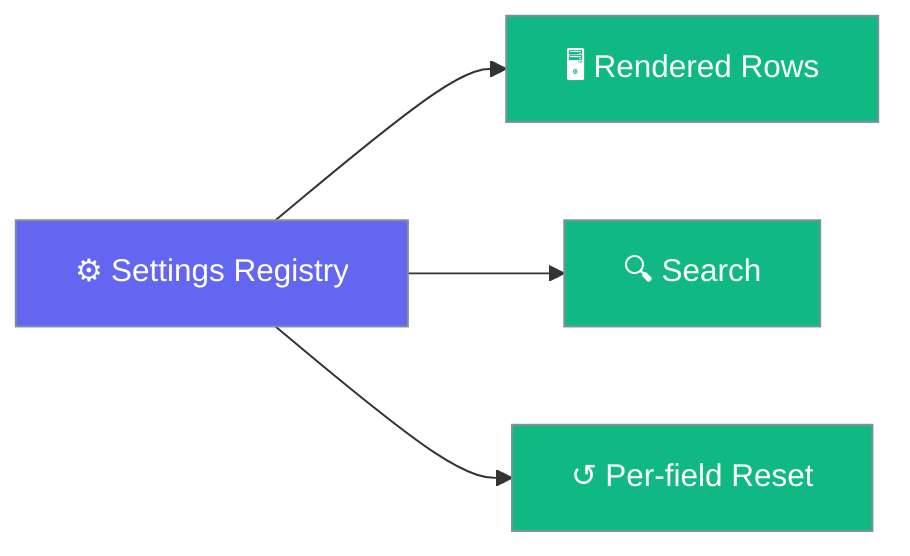
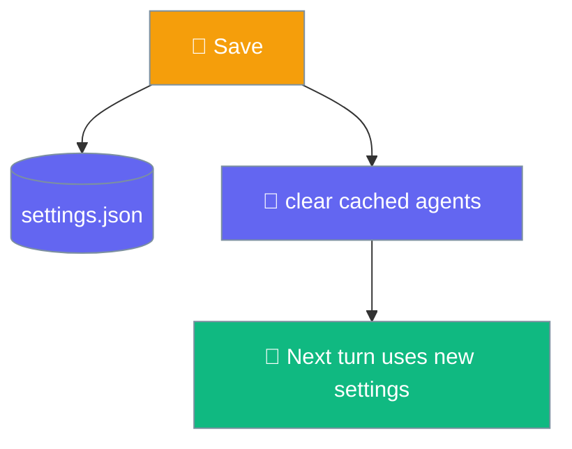

Every setting is one entry in a single registry, so rows, defaults, per-field reset, search, and restart notices all derive from the same list.

```python
from praisonaiagents import Agent

agent = Agent(
    name="PraisonAI",
    role="Assistant",
    goal="Answer the user clearly and concisely.",
)
# Settings you change in the app (model, temperature, system prompt)
# are applied to this agent on the next turn.
agent.start("Hello")
```



## Quick Start

<Steps>
<Step title="Open settings">
Press `⌘,` to open the settings window.
</Step>

<Step title="Search for a field">
Use the built-in search box — it matches labels, descriptions, and keywords, and never returns a row that is currently hidden.
</Step>

<Step title="Reset a single field">
Each row has a per-field reset back to its default.
</Step>
</Steps>

---

## How It Works

On save, the engine clears its cached agents, so the next turn picks up your new settings immediately.



<Note>
Secrets never reach `settings.json` and never leave the process in cleartext. The `api_key` is stored in the OS keychain and stripped before the file is written. Every settings response — `GET /settings` **and** `POST /settings` — returns the value masked as bullets, including a write that only changed an unrelated field like `theme`. An empty key comes back as `""`, not bullets, so the UI can tell "set" from "unset". Redaction is driven by an internal `SECRET_KEYS` list, so future secrets are covered automatically.
</Note>

<Note>
A rejected settings write shows a `Could not save that setting.` toast and does not mutate `CFG` or re-render the row, so the visible state always matches what the engine persisted — see [Troubleshooting](/features/desktop/troubleshooting#common-failures).
</Note>

<Warning>
The registry is generated. Don't hand-edit `frontend/src/settings-registry.js`; edit the source and run `tools/sync-registry.mjs`. This keeps the settings list in sync between the frontend and the engine.
</Warning>

---

## General

| Field | Type | Default | Notes |
|-------|------|---------|-------|
| `launch_at_login` | toggle | `false` | Requires restart; installed macOS `.app` only — the toggle snaps back to off on Windows, Linux, and dev builds with an inline reason. See [Launch at Login](/features/desktop/window-and-lifecycle#launch-at-login). |
| `check_updates` | toggle | `true` | Check for updates automatically |

## Models

| Field | Type | Default | Notes |
|-------|------|---------|-------|
| `model` | combobox | `"gpt-4o-mini"` | Any OpenAI-compatible model id |
| `temperature` | slider `0`–`2` | `0.7` | Higher is more varied |
| `max_tokens` | number `0`–`128000` | `0` | `0` lets the model decide |
| `top_p` | slider `0`–`1` | `1` | |
| `base_url` | text | `""` | Requires restart; blank uses provider default |
| `api_key` | text (secret) | `""` | Requires restart; must be ≥ 20 characters; stored in the macOS keychain |

<Warning>
The `api_key` validator requires at least **20 characters** before it will save. A shorter value looks like a typo — the engine refuses to export anything shorter, so without this the field would store the typo, echo it back masked as if set, and every turn would fail as though no key existed. Leave it blank to use the environment.
</Warning>

## Chat

| Field | Type | Default | Notes |
|-------|------|---------|-------|
| `system_prompt` | text (multiline) | `""` | Prepended to every conversation |
| `auto_title` | toggle | `true` | Names chats from the first message |
| `show_reasoning` | toggle | `true` | Display the model's thinking |
| `collapse_reasoning` | toggle | `false` | Visible only when `show_reasoning` is on |
| `show_stats` | toggle | `true` | Chars, duration, time to first token |
| `condense_paste` | select | `4000` | Off / 2,000 / 4,000 / 8,000 characters |

## Appearance

| Field | Type | Default | Notes |
|-------|------|---------|-------|
| `theme` | segmented | `"system"` | System / Light / Dark |
| `font_size` | select | `15` | 13 / 14 / 15 / 16 / 18 / 20 px — scales the whole interface |
| `code_font_size` | number `10`–`20` | `12` | Scales with the UI (rem-based) |
| `reduce_motion` | segmented | `"system"` | System / On / Off |

<Note>
`font_size` drives a `--ui-scale` CSS variable, and every fixed dimension is `rem`, so changing it scales the **whole** interface — messages, sidebar, settings, and composer — not just the chat.
</Note>

## Safety

| Field | Type | Default | Notes |
|-------|------|---------|-------|
| `approval_mode` | select | `"ask"` | `ask` / `smart` / `never`; confirms when set to `never` |
| `approval_timeout` | number `10`–`3600` | `300` | Seconds; visible unless mode is `never` |
| `confirm_delete` | toggle | `true` | Confirm before deleting a chat |

See [Approvals & Safety](/features/desktop/approvals) for behaviour.

## Data

Action rows, not stored values:

| Action | Effect |
|--------|--------|
| Export all | Exports every transcript as JSON |
| Show data folder | Opens the data directory |
| Delete all | Removes stored conversations (confirmed) |

<Note>
Action rows now surface failures via a `That did not run: …` toast instead of failing silently, so a down engine can no longer let Export fake a backup — see [Troubleshooting](/features/desktop/troubleshooting#common-failures).
</Note>

See [Data & Privacy](/features/desktop/data) for where data lives.

## Integrations

| Row | Effect |
|-----|--------|
| MCP servers | Store MCP server entries for a future release. Not launched yet — see [MCP Servers](/features/desktop/mcp). |

<Warning>
Stored MCP entries in the Desktop app do not yet reach the agent. The engine does not launch them, so the model cannot use them. For MCP tools that work today, use the SDK path in [MCP Overview](/features/mcp).
</Warning>

See [MCP Servers](/features/desktop/mcp) for what the panel stores.

## About

| Item | Shows |
|------|-------|
| Version | The app version |
| Engine | The engine state (the Python process this window talks to) |
| Engine log | Recent engine activity |
| Check for updates now | Asks PyPI whether a newer `praisonaiagents` exists |

See [Troubleshooting](/features/desktop/troubleshooting) for the update check behaviour.

---

## Gating Behaviour

Some rows appear only when another setting has the right value:

| Field | Visible when |
|-------|--------------|
| `collapse_reasoning` | `show_reasoning` is `true` |
| `approval_timeout` | `approval_mode` is not `never` |

Fields marked **Requires restart** (`base_url`, `api_key`, `launch_at_login`) say so on the row itself.

---

## Tray & Shortcuts

The tray menu shows keyboard accelerators only where the modifier exists.

| Chord | macOS | Windows / Linux |
|-------|-------|-----------------|
| Settings | `Cmd+,` shown | No accelerator advertised |
| Quit | `Cmd+Q` shown | No accelerator advertised |

Off macOS, Tauri maps `Cmd` to the Super key, which would render as `Windows+,` and `Windows+Q` — and `Windows+Q` is reserved by the OS. So on Windows and Linux the tray still exists, but no accelerators are shown. The template menubar glyph is macOS-only, and on Linux the menu opens on left click regardless.

---

## Best Practices

<AccordionGroup>
<Accordion title="Use search instead of scrolling">
The search box derives from the registry and respects visibility rules, so it never surfaces a hidden row. Type a keyword like "proxy" or "secret" to jump straight to a field.
</Accordion>

<Accordion title="Reset one field at a time">
Per-field reset restores a single setting to its default without touching the rest — safer than a full reset.
</Accordion>

<Accordion title="Restart after changing model credentials">
`base_url` and `api_key` are marked "requires restart". Relaunch the app after changing them so the engine picks up the new endpoint or key. If the engine is mid-restart when you change one of these rows, the write can be rejected — you'll see `Could not save that setting.` and the previous value stays on screen, so try again once the pill reads `engine :PORT`. See [Troubleshooting](/features/desktop/troubleshooting#common-failures).
</Accordion>
</AccordionGroup>

---

## Related

<CardGroup cols={2}>
<Card title="Models & API Keys" icon="key" href="/features/desktop/models">
Model pill, sampling, and keychain storage
</Card>
<Card title="Data & Privacy" icon="lock" href="/features/desktop/data">
Where settings and secrets live
</Card>
</CardGroup>
