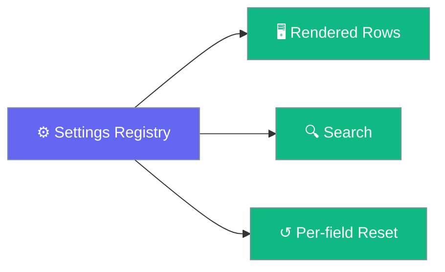
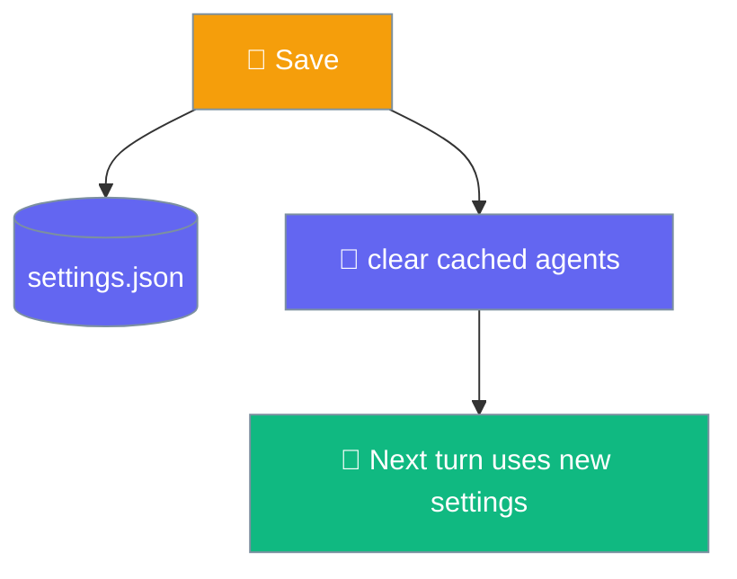

Every setting is one entry in a single registry, so rows, defaults, per-field reset, search, and restart notices all derive from the same list.

```python
from praisonaiagents import Agent

agent = Agent(
    name="PraisonAI",
    role="Assistant",
    goal="Answer the user clearly and concisely.",
)
# Settings you change in the app (model, temperature, system prompt)
# are applied to this agent on the next turn.
agent.start("Hello")
```



## Quick Start

<Steps>
<Step title="Open settings">
Press `⌘,` to open the settings window.
</Step>

<Step title="Search for a field">
Use the built-in search box — it matches labels, descriptions, and keywords, and never returns a row that is currently hidden.
</Step>

<Step title="Reset a single field">
Each row has a per-field reset back to its default.
</Step>
</Steps>

---

## How It Works

On save, the engine clears its cached agents, so the next turn picks up your new settings immediately.



<Note>
Secrets never reach `settings.json`. The `api_key` is stored in the macOS keychain and stripped before the file is written.
</Note>

---

## General

| Field | Type | Default | Notes |
|-------|------|---------|-------|
| `launch_at_login` | toggle | `false` | Requires restart |
| `check_updates` | toggle | `true` | Check for updates automatically |

## Models

| Field | Type | Default | Notes |
|-------|------|---------|-------|
| `model` | combobox | `"gpt-4o-mini"` | Any OpenAI-compatible model id |
| `temperature` | slider `0`–`2` | `0.7` | Higher is more varied |
| `max_tokens` | number `0`–`128000` | `0` | `0` lets the model decide |
| `top_p` | slider `0`–`1` | `1` | |
| `base_url` | text | `""` | Requires restart; blank uses provider default |
| `api_key` | text (secret) | `""` | Requires restart; stored in the macOS keychain |

## Chat

| Field | Type | Default | Notes |
|-------|------|---------|-------|
| `system_prompt` | text (multiline) | `""` | Prepended to every conversation |
| `auto_title` | toggle | `true` | Names chats from the first message |
| `show_reasoning` | toggle | `true` | Display the model's thinking |
| `collapse_reasoning` | toggle | `false` | Visible only when `show_reasoning` is on |
| `show_stats` | toggle | `true` | Chars, duration, time to first token |
| `condense_paste` | select | `4000` | Off / 2,000 / 4,000 / 8,000 characters |

## Appearance

| Field | Type | Default | Notes |
|-------|------|---------|-------|
| `theme` | segmented | `"system"` | System / Light / Dark |
| `font_size` | select | `15` | 14 / 15 / 16 / 18 px |
| `code_font_size` | number `10`–`20` | `12` | |
| `reduce_motion` | segmented | `"system"` | System / On / Off |

## Safety

| Field | Type | Default | Notes |
|-------|------|---------|-------|
| `approval_mode` | select | `"ask"` | `ask` / `smart` / `never`; confirms when set to `never` |
| `approval_timeout` | number `10`–`3600` | `300` | Seconds; visible unless mode is `never` |
| `confirm_delete` | toggle | `true` | Confirm before deleting a chat |

See [Approvals & Safety](/features/desktop/approvals) for behaviour.

## Data

Actions, not stored values:

| Action | Effect |
|--------|--------|
| Export all | Copies data to the clipboard |
| Reveal in Finder | Opens the data directory |
| Delete all | Removes stored conversations |

See [Data & Privacy](/features/desktop/data) for where data lives.

## About

| Item | Shows |
|------|-------|
| Version | The app version |
| Engine status | The current engine state |
| Engine log | Recent engine activity |
| Check for updates | Reports the current version |

---

## Gating Behaviour

Some rows appear only when another setting has the right value:

| Field | Visible when |
|-------|--------------|
| `collapse_reasoning` | `show_reasoning` is `true` |
| `approval_timeout` | `approval_mode` is not `never` |

Fields marked **Requires restart** (`base_url`, `api_key`, `launch_at_login`) say so on the row itself.

---

## Best Practices

<AccordionGroup>
<Accordion title="Use search instead of scrolling">
The search box derives from the registry and respects visibility rules, so it never surfaces a hidden row. Type a keyword like "proxy" or "secret" to jump straight to a field.
</Accordion>

<Accordion title="Reset one field at a time">
Per-field reset restores a single setting to its default without touching the rest — safer than a full reset.
</Accordion>

<Accordion title="Restart after changing model credentials">
`base_url` and `api_key` are marked "requires restart". Relaunch the app after changing them so the engine picks up the new endpoint or key.
</Accordion>
</AccordionGroup>

---

## Related

<CardGroup cols={2}>
<Card title="Models & API Keys" icon="key" href="/features/desktop/models">
Model pill, sampling, and keychain storage
</Card>
<Card title="Data & Privacy" icon="lock" href="/features/desktop/data">
Where settings and secrets live
</Card>
</CardGroup>
