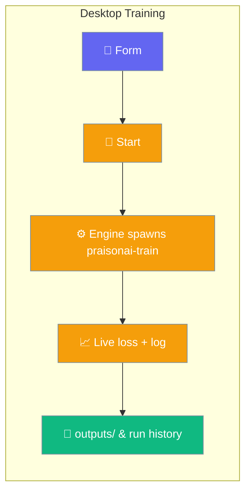
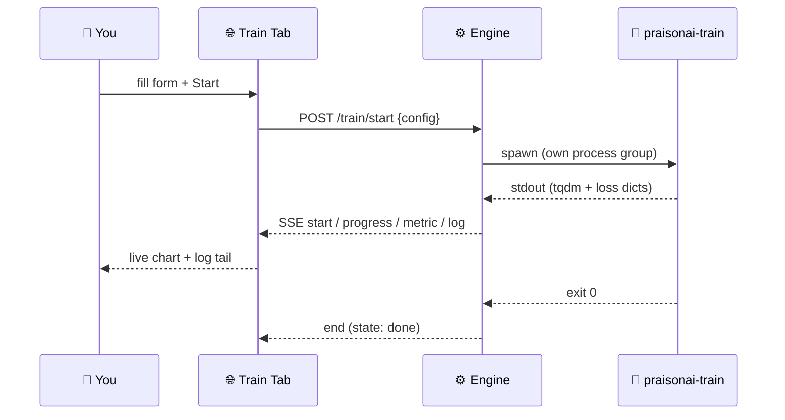
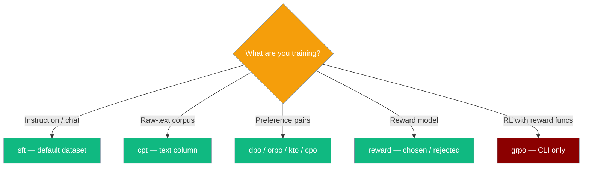

The Train tab turns a `praisonai-train` fine-tune into a form, a live loss chart, and a run history — all against your local engine.

```python
from praisonaiagents import Agent

# After a Train-tab run finishes, point an Agent at the saved model
agent = Agent(
    name="Assistant",
    instructions="You are a helpful assistant.",
    llm="ollama/yourname/my-finetune",
)
agent.start("Test my fine-tuned model")
```



The Train tab is a desktop wrapper around the [`praisonai-train llm`](/train) CLI. The engine writes a `config.yaml`, spawns `python -m praisonai_train llm --config <run_dir>/config.yaml` as its own process group, and reports on it live.

## Quick Start

<Steps>
<Step title="Open the Train tab">
Click **Train** in the sidebar. The app remembers your last-picked view, so it reopens where you left off.
</Step>

<Step title="Pick a model and dataset">
Defaults are `unsloth/Meta-Llama-3.1-8B-Instruct-bnb-4bit` on `yahma/alpaca-cleaned` — leave them to try a first run.
</Step>

<Step title="Click Start training">
The button becomes **Training…**. A live loss chart appears and the log auto-follows.
</Step>

<Step title="Close the lid — come back">
Reopen the app; the Train tab reattaches to the running job and repopulates step, loss, elapsed, and log.
</Step>
</Steps>

---

## How It Works

The engine runs **one job at a time** and keeps its progress in a replayable ring buffer, so closing the window never loses a run.



The engine parses two line shapes from the trainer's output: a `step / total` tqdm bar and the `{'loss': ..., 'learning_rate': ..., 'epoch': ...}` dict trl prints each logging step. Everything else is shown verbatim in the log pane.

| Design constraint | Why |
|---|---|
| **One run at a time** | Two fine-tunes on one GPU OOM. A second `POST /train/start` returns `409` naming the live run. |
| **Ring buffer, not a stream** | Reconnecting reads from a cursor. If history was evicted, the engine emits `resync` and the UI notes the drop. |
| **Adopt-in-flight** | A fresh window reattaches to a run from a previous session. |
| **Stop kills the group** | `SIGTERM` to the child's process group (POSIX) or `taskkill /T` (Windows) — dataloader workers and torchrun ranks die with it. |

<Note>
The full log is persisted to `<PRAISONAI_DESKTOP_HOME>/runs/<run_id>/train.log` (UTF-8, `errors="replace"`), and the config is written next to it as `config.yaml` (JSON if PyYAML is missing). See [Data & Privacy](/features/desktop/data) for where `PRAISONAI_DESKTOP_HOME` points.
</Note>

### Reconnect & resync

Opening the tab after a gap replays from your cursor; a long run that overflowed the ring buffer tells you so rather than silently skipping output.

```mermaid
sequenceDiagram
    participant App as 🌐 Train Tab
    participant Engine as ⚙️ Engine

    App->>Engine: GET /train/progress?run=<id>&cursor=N
    alt N still in ring buffer
        Engine-->>App: replay events from N, then follow
    else N evicted
        Engine-->>App: event: resync
        App->>App: "… earlier output dropped; full log in run dir"
        Engine-->>App: deliver oldest held events, cursor reset
    end
```

---

## Choosing a method

`method` picks the trainer. `sft` works with the default dataset; the rest need differently-shaped data, named in the per-method hint under the dropdown.



| `method` | Per-method hint (shown in the UI) | CLI reference |
|---|---|---|
| `sft` | Trains on completions. Works with the default dataset. | [Train → method](/train#training-method-method) |
| `cpt` | Raw-text corpus; needs a `text` column. Embeddings get their own rate. | [Continued Pretraining](/features/praisonai-train-cpt) |
| `dpo` | Needs `prompt`, `chosen`, `rejected` columns. | [Preference Tuning](/features/praisonai-train-preference-tuning) |
| `orpo` | Needs `prompt`, `chosen`, `rejected`; no reference model. | [Preference Tuning](/features/praisonai-train-preference-tuning) |
| `kto` | Needs `prompt`, `completion`, `label` columns. | [Preference Tuning](/features/praisonai-train-preference-tuning) |
| `cpo` | Needs `prompt`, `chosen`, `rejected`; no reference model. | [Preference Tuning](/features/praisonai-train-preference-tuning) |
| `reward` | Needs `chosen`, `rejected`. Trains a reward model, not a chat model. | [Train (CLI)](/train) |
| `grpo` | Needs reward functions the form cannot supply — use the CLI. | [Train (CLI)](/train) |

<Warning>
`grpo` is rejected before any download with a `400` — it needs `reward_funcs` this form does not collect. Run it from the command line instead.
</Warning>

---

## Configuration

The form posts a `config` object to `/train/start`. Basic fields are always visible; LoRA and quantization live in the **Advanced** panel.

| Field | Type | Default | Notes |
|---|---|---|---|
| `model_name` | `str` | `unsloth/Meta-Llama-3.1-8B-Instruct-bnb-4bit` | Required. |
| `method` | `enum` | `sft` | `sft`, `cpt`, `dpo`, `orpo`, `kto`, `grpo`, `reward`, `cpo`. |
| `dataset` | `list` | `[{name: "yahma/alpaca-cleaned", split_type: "train"}]` | Required. Sent as a list even when you pick one name. |
| `split_type` | `str` | `train` | Folded into `dataset[0].split_type` before posting. |
| `num_train_epochs` | `float` | `1` | |
| `max_steps` | `int` | `0` | **Omitted from the payload when `0`** — 0 means "no cap". |
| `learning_rate` | `float` | `2e-4` | |

<AccordionGroup>
<Accordion title="Advanced — LoRA & quantization">
| Field | Type | Default | Notes |
|---|---|---|---|
| `lora_r` | `int` | `16` | LoRA rank. |
| `lora_alpha` | `int` | `16` | LoRA alpha. |
| `max_seq_length` | `int` | `2048` | |
| `per_device_train_batch_size` | `int` | `2` | |
| `gradient_accumulation_steps` | `int` | `2` | |
| `load_in_4bit` | `bool` | `true` | |
| `output_dir` | `str` | `outputs` | Where the trainer writes the model. |
</Accordion>

<Accordion title="Fixed by the engine">
Before writing `config.yaml`, the engine pins these so a desktop run stays local:

```yaml
train: true
ollama_save: false
huggingface_save: false
```

Publishing is opt-in from the CLI — see [Train → Publishing](/train#publishing).
</Accordion>
</AccordionGroup>

### Environment variables

| Variable | Purpose |
|---|---|
| `PRAISONAI_TRAIN_CMD` | Overrides the trainer launcher. Default when unset: `<python> -m praisonai_train llm`. `--config <path>` is always appended, so the override picks the interpreter, not the contract. Use it to point at a separate CUDA-matched environment. |
| `PRAISONAI_DESKTOP_HOME` | Runs live under `<home>/runs/<run_id>/{config.yaml, train.log}`. See [Data & Privacy](/features/desktop/data). |

<Tip>
Point the app at a matched CUDA/torch environment without touching the engine's venv:

```bash
export PRAISONAI_TRAIN_CMD="/opt/cuda-venv/bin/python -m praisonai_train llm"
```

Launch the app after exporting it, and the engine spawns the trainer from that venv.
</Tip>

---

## Common Patterns

**First fine-tune.** Open Train, keep the defaults, click Start. Watch the loss drop as the log follows; the model saves to `outputs/`.

**Interrupted run.** Close the lid mid-training. Hours later, reopen the app — the Train tab reattaches, the loss chart repopulates from history, and the run finishes.

**Second start while one is running.** Forget a run is going and click Start again — the UI surfaces the engine's `409` message and re-enables the button. The live run is not disturbed.

**Stop.** Click Stop; the run and all its dataloader workers die together. The status pill turns `cancelled` and the log tail is preserved.

---

## Reference

Every route lives on the local engine (`127.0.0.1`, no auth — the app's existing design for every route).

| Method | Path | Purpose | Status codes |
|---|---|---|---|
| `POST` | `/train/start` | Start a run. Body `{config, run_id?}`. | `200` summary; `400` missing `model_name`/`dataset` or bad `run_id`; `409` a run is live |
| `POST` | `/train/stop` | Stop the live run. | `200` stopped; `404` nothing running |
| `POST` | `/train/stop/<run_id>` | Stop a specific run. | `409` if `run_id` is not the live run |
| `GET` | `/train/status` | Current run + last 500 metric samples. | `200` `{run, metrics}` |
| `GET` | `/train/runs` | Last 50 run summaries. | `200` `{runs}` |
| `GET` | `/train/progress?run=<id>&cursor=<n>` | SSE stream: replay from cursor, then follow. Keepalive comment ~every 5s. | `404` unknown run; `400` non-integer cursor |

**SSE event kinds:** `start`, `state`, `log`, `progress`, `metric`, `end`, plus `resync` when history was evicted past your cursor.

**Run summary shape:** `{id, state, step, total, started, ended, error, elapsed, last_loss}`. `state` is one of `running`, `done`, `failed`, `cancelled`, `stopping`.

---

## Best Practices

<AccordionGroup>
<Accordion title="Keep max_steps small for a first run">
`max_steps` is omitted when `0` ("no cap"). Set a small value like `10` for a fast smoke test, then raise or remove it once the pipeline is green.
</Accordion>

<Accordion title="One GPU runs one job">
The engine refuses a second run rather than queueing. Stop the live run (or let it finish) before starting another — a `409` names the blocking run id.
</Accordion>

<Accordion title="Read the method hint before switching">
Preference methods (`dpo`, `orpo`, `kto`, `cpo`) and `reward` need differently-shaped datasets. The hint under the dropdown names the required columns; the [CLI pages](/features/praisonai-train-preference-tuning) have the full shape.
</Accordion>

<Accordion title="Use a separate CUDA env for the trainer">
`praisonai-train` pulls torch and unsloth. Keep those in a matched CUDA venv and point the engine at it with `PRAISONAI_TRAIN_CMD` — the desktop engine itself stays stdlib-only.
</Accordion>
</AccordionGroup>

---

## Related

<CardGroup cols={2}>
<Card title="Chat & Streaming" icon="comments" href="/features/desktop/chat">
Messages, streaming events, and tool cards in the Desktop app
</Card>
<Card title="Data & Privacy" icon="lock" href="/features/desktop/data">
Where runs live and what `PRAISONAI_DESKTOP_HOME` controls
</Card>
<Card title="Train (CLI)" icon="terminal" href="/train">
The `praisonai-train llm` command this tab wraps
</Card>
<Card title="Preference Tuning" icon="scale-balanced" href="/features/praisonai-train-preference-tuning">
DPO, ORPO, and KTO dataset shapes and options
</Card>
</CardGroup>
