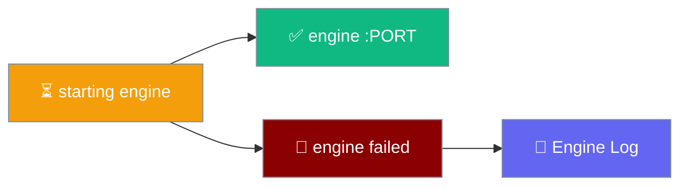
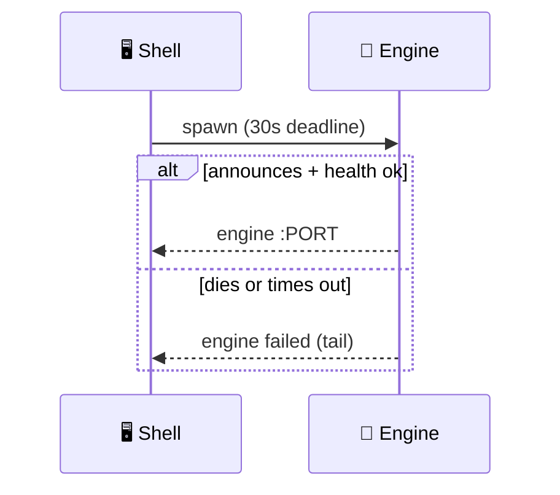
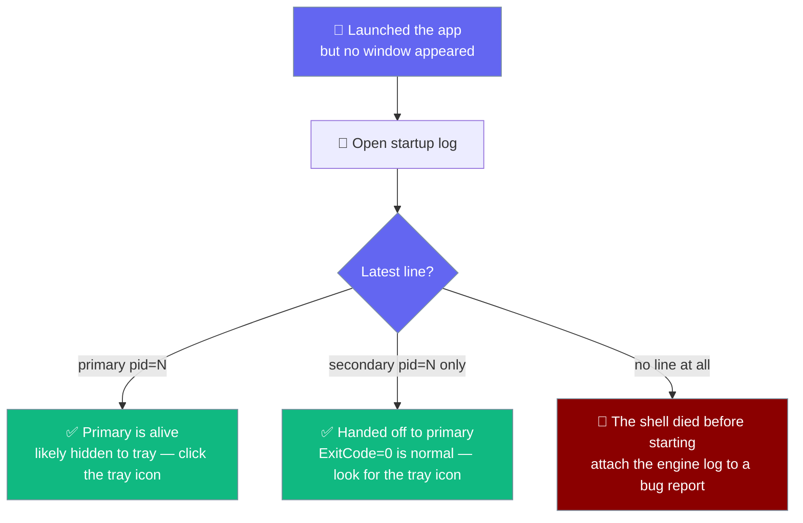

The startup pill and engine log tell you exactly what the local engine is doing, and every failure attaches the engine's own output.

```python
from praisonaiagents import Agent

agent = Agent(
    name="Assistant",
    instructions="You are a helpful assistant.",
)
# If this agent's engine can't start, the pill shows why.
agent.start("Are you there?")
```



## Quick Start

<Steps>
<Step title="Read the startup pill">
The pill shows `starting engine`, then `engine :PORT` on success or `engine failed` with a tail on failure.
</Step>

<Step title="Open the engine log">
The log viewer shows the engine's recent activity — a bounded 400-line ring buffer — without leaving the app.
</Step>

<Step title="Reset the engine if it's stuck">
Close the app, delete the lockfile in the data directory, and relaunch.
</Step>
</Steps>

---

## Startup States

| Pill | Meaning |
|------|---------|
| `starting engine` | The shell is spawning Python |
| `engine :PORT` | The engine is listening and passed the `/health` probe |
| `engine failed` | Startup failed — the last lines of the engine's output are shown |

On failure, the tail comes from the supervisor's 12-line buffer, so you see the actual error rather than a bare exit code.



---

## Startup Log (Breadcrumb)

Every launch writes one line to a small log file in the OS temp directory before the window is built, so a launch is always traceable even when no window appears.

### Where the file lives

| Platform | Path |
|----------|------|
| Windows | `%TEMP%\PraisonAI-startup.log` |
| macOS | `$TMPDIR/PraisonAI-startup.log` |
| Linux | `/tmp/PraisonAI-startup.log` |

The temp directory is chosen on purpose: it exists before `%APPDATA%\PraisonAI` is created, so the log is available even on a first launch where the data directory has not yet been provisioned.

### Line format

Each launch appends one tab-separated line:

```
<unix_seconds>	<platform>	<primary|secondary>	pid=<pid>
```

A real primary launch writes two lines with the same pid — `secondary` first (before the process knows it is first), then `primary`:

```
1700000000	windows	secondary	pid=4242
1700000000	windows	primary	pid=4242
```

| Field | Meaning |
|-------|---------|
| `unix_seconds` | Wall-clock timestamp of the launch — lines sort chronologically |
| `platform` | One of `windows`, `macos`, `linux` |
| `primary` / `secondary` | Whether this launch became the primary shell or was handed off to an existing one |
| `pid=<pid>` | Process id of the launch itself |

### Reading the log to diagnose a silent launch

Open the file and read the latest line for the launch you just started.



A launch that was handed off to an existing primary writes only its own `secondary` line and exits with code `0` — that is expected behaviour, not a crash.

<Note>
The log is best-effort. If the temp directory cannot be written, the app still starts — a shell must never fail to start because it could not write a log. If the file is missing after a launch, the write itself failed; treat that as a permission or disk issue on the temp directory.
</Note>

---

## Common Failures

<AccordionGroup>
<Accordion title="The tools ran, but no answer came back">
Kind `no_answer`. The tools succeeded and their results are shown above the banner, but the model produced no follow-up answer for them.

From `praisonaiagents 1.7.2` onward the library raises loudly instead of ending the stream silently, so this banner is the only user-visible sign. Retry the turn — the tool result is already in the agent's history, so the retry often answers in plain text.

Requires `praisonaiagents>=1.7.2` in the engine venv. If you see `"the engine produced no output"` for a turn whose tools all ran, your install is still on 1.7.1 and needs upgrading.
</Accordion>

<Accordion title="engine failed: missing dependency">
The venv has no `praisonaiagents` (or a native wheel is broken). The engine reports `ModuleNotFoundError` / `ImportError`. Install the SDK into the venv the app resolves — the desktop pins a floor of `praisonaiagents>=1.7.2`:

```bash
cd src/praisonai-agents
.venv/bin/pip install "praisonaiagents>=1.7.2"
```
</Accordion>

<Accordion title="Point the engine at a local praisonai-agents checkout">
Set `PRAISONAI_AGENTS_SOURCE` to your checkout before launching:

```bash
export PRAISONAI_AGENTS_SOURCE=/absolute/path/to/praisonai-agents
```

Without the override, the engine walks up from its own file looking for `praisonai-agents/` or `src/praisonai-agents/`. Earlier builds used a fixed path that resolved to a nonexistent directory from the bundled copy, so any local fix appeared to have no effect — that is now fixed.
</Accordion>

<Accordion title="engine failed: address in use">
Another PraisonAI process holds the port (`Address already in use`). Quit the other process, or reset the engine and relaunch.
</Accordion>

<Accordion title="engine failed: crashed">
An unhandled exception reached the top of the stack. The tail is shown — open the **Engine Log** for the full 400-line buffer.
</Accordion>

<Accordion title="No virtual environment found">
The app checks `src/praisonai-agents/.venv`, `src/praisonai-agents/venv`, then `venv`. Create one of these and install `praisonaiagents` into it.
</Accordion>

<Accordion title="Launched, but ExitCode=0 and no window (Windows)">
The single-instance guard exits a secondary launch with code `0` after raising the existing window into the tray, so a bare `Start-Process -PassThru` reads that as a crash. Open `%TEMP%\PraisonAI-startup.log`: a `secondary` line for that pid confirms the launch was handed off cleanly and the primary is still running — check the system tray. If no line was written at all, the shell died before it could even trace itself; attach the missing log path to a bug report.
</Accordion>
</AccordionGroup>

<Note>
The fallback "No output" banner now suppresses itself when the engine has already reported a specific error kind (`no_answer`, `auth`, `rate_limit`, `internal`) and after **Stop** — one turn produces at most one banner.
</Note>

---

## Updates

The update check currently reports **"Update checks are not configured yet."** — an auto-update feed isn't wired in yet, and the app says so rather than falsely reporting "up to date".

<Note>
`check_updates` can be on, but until a release feed is configured the check will honestly report that it is not set up.
</Note>

---

## Reset Recipe

<Steps>
<Step title="Quit the app">
Fully close the window so the engine process exits.
</Step>

<Step title="Delete the lockfile">
Remove the lockfile in `~/Library/Application Support/PraisonAI`.
</Step>

<Step title="Relaunch">
Reopen the app — the shell spawns a fresh engine and the pill returns to `starting engine`.
</Step>
</Steps>

---

## Best Practices

<AccordionGroup>
<Accordion title="Check the log before filing a ticket">
The engine log is a 400-line ring buffer of recent activity. It usually names the failure directly.
</Accordion>

<Accordion title="Keep one PraisonAI process at a time">
"Address in use" comes from a second process on the port. Close extras before relaunching.
</Accordion>

<Accordion title="Match the interpreter to its venv">
The shell refuses an interpreter whose site-packages live outside its own venv. Use a clean `.venv` inside the checkout to avoid mismatches.
</Accordion>
</AccordionGroup>

---

## Related

<CardGroup cols={2}>
<Card title="Overview" icon="display" href="/features/desktop/index">
Install, launch, and how the engine starts
</Card>
<Card title="Data & Privacy" icon="lock" href="/features/desktop/data">
Where the data directory and lockfile live
</Card>
</CardGroup>
