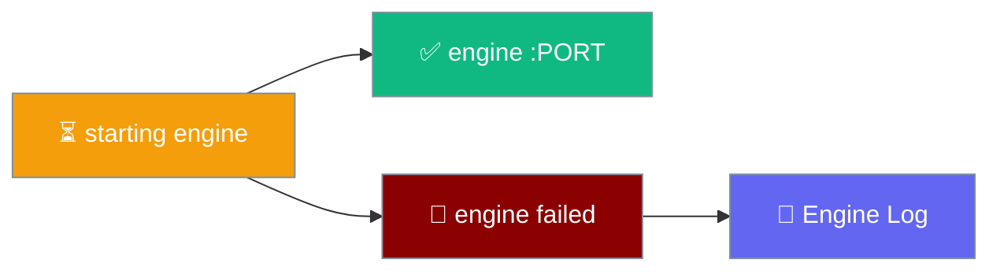
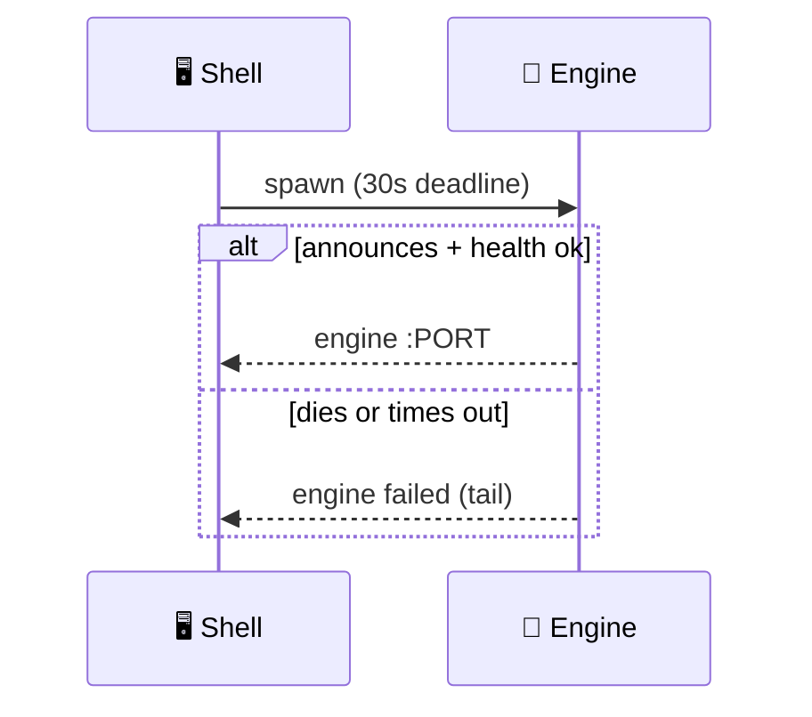
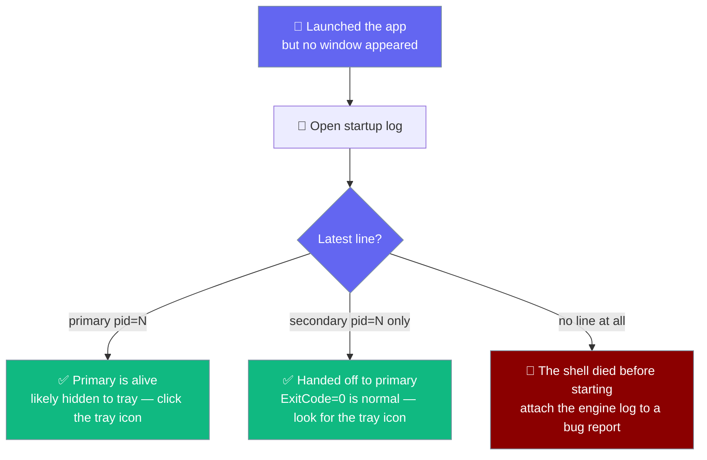
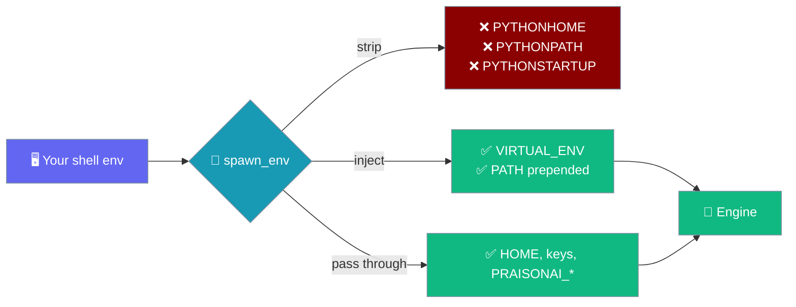
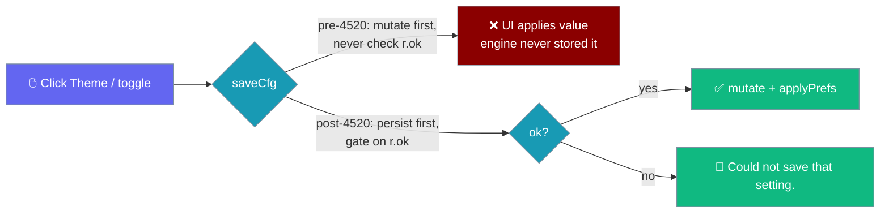
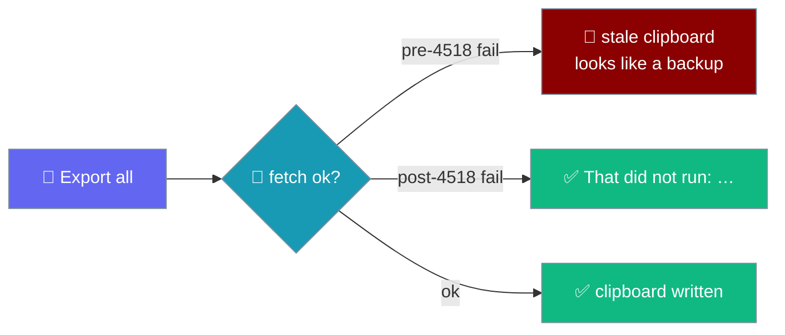

The startup pill and engine log tell you exactly what the local engine is doing, and every failure attaches the engine's own output.

```python
from praisonaiagents import Agent

agent = Agent(
    name="Assistant",
    instructions="You are a helpful assistant.",
)
# If this agent's engine can't start, the pill shows why.
agent.start("Are you there?")
```



## Quick Start

<Steps>
<Step title="Read the startup pill">
The pill shows `starting engine`, then `engine :PORT` on success or `engine failed` with a tail on failure.
</Step>

<Step title="Open the engine log">
The log viewer shows the engine's recent activity — a bounded 400-line ring buffer — without leaving the app.
</Step>

<Step title="Reset the engine if it's stuck">
Close the app, delete the lockfile in the data directory, and relaunch.
</Step>
</Steps>

---

## Startup States

| Pill | Meaning |
|------|---------|
| `starting engine` | The shell is spawning Python |
| `engine :PORT` | The engine is listening and passed the `/health` probe |
| `engine failed` | Startup failed — the last lines of the engine's output are shown |

On failure, the tail comes from the supervisor's 12-line buffer, so you see the actual error rather than a bare exit code.



---

## Startup Log (Breadcrumb)

Every launch writes one line to a small log file in the OS temp directory before the window is built, so a launch is always traceable even when no window appears.

### Where the file lives

| Platform | Path |
|----------|------|
| Windows | `%TEMP%\PraisonAI-startup.log` |
| macOS | `$TMPDIR/PraisonAI-startup.log` |
| Linux | `/tmp/PraisonAI-startup.log` |

The temp directory is chosen on purpose: it exists before `%APPDATA%\PraisonAI` is created, so the log is available even on a first launch where the data directory has not yet been created. Creation and provisioning are distinct moments now: the breadcrumb is written in `main()`, before `setup()` creates the folder, so the temp log is always the earlier signal.

### Line format

Each launch appends one tab-separated line:

```
<unix_seconds>	<platform>	<primary|secondary>	pid=<pid>
```

A real primary launch writes two lines with the same pid — `secondary` first (before the process knows it is first), then `primary`:

```
1700000000	windows	secondary	pid=4242
1700000000	windows	primary	pid=4242
```

| Field | Meaning |
|-------|---------|
| `unix_seconds` | Wall-clock timestamp of the launch — lines sort chronologically |
| `platform` | One of `windows`, `macos`, `linux` |
| `primary` / `secondary` | Whether this launch became the primary shell or was handed off to an existing one |
| `pid=<pid>` | Process id of the launch itself |

### Reading the log to diagnose a silent launch

Open the file and read the latest line for the launch you just started.



A launch that was handed off to an existing primary writes only its own `secondary` line and exits with code `0` — that is expected behaviour, not a crash.

The data folder is a second signal alongside the log line. It is created as soon as the primary reaches `setup()`, so a `primary` line with **no** data folder points at a permissions or disk problem on the folder's parent — the app prints `[praisonai] could not create <path>: <error>` to stderr and keeps going. A missing folder after a `secondary`-only launch is normal: a handed-off launch creates nothing.

<Note>
The log is best-effort. If the temp directory cannot be written, the app still starts — a shell must never fail to start because it could not write a log. If the file is missing after a launch, the write itself failed; treat that as a permission or disk issue on the temp directory.
</Note>

---

## Common Failures

<AccordionGroup>
<Accordion title="Setup wizard was invisible behind a restored Train view on first run (pre-4471)">
On a first launch where the saved view was **Train**, the desktop shell restored that view synchronously before the async engine health check finished. When the health check then resolved to `setup needed` or `engine failed`, the setup wizard and the failure banner rendered into `#thread` — which the Train view had already hidden behind `body.training #thread { display: none }`. The title bar read `setup needed`, the Train form filled the screen, and there was **no visible way to start setup**. This was the reported Windows dead end in [PraisonAI #4441](https://github.com/MervinPraison/PraisonAI/issues/4441).

Fixed in PraisonAI [#4471](https://github.com/MervinPraison/PraisonAI/pull/4471). `showView(name, {persist=true}={})` grew a `persist` option; a new `showEngineGate()` calls `showView('chat', {persist: false})`; `boot()` runs the gate before both the setup-needed and failed branches. The forced Chat switch is not persisted, so the user's deliberate Train choice returns once the engine is up. If you saw the wizard vanish behind Train after upgrading or on a clean install, upgrade to this release.

```mermaid
graph LR
    Restore[💾 Restore Train view] --> ThreadHidden[❌ #thread hidden by body.training]
    Boot[⏳ Async engine check] --> NeedsSetup{setup needed?}
    NeedsSetup -->|pre-4471| Buried[🛑 firstRun() renders into hidden #thread]
    NeedsSetup -->|post-4471| Gate[🔧 showEngineGate → Chat, not persisted]
    Gate --> Visible[✅ Wizard visible; Train returns after boot]

    classDef in fill:#6366F1,stroke:#7C90A0,color:#fff
    classDef mid fill:#189AB4,stroke:#7C90A0,color:#fff
    classDef bad fill:#8B0000,stroke:#7C90A0,color:#fff
    classDef ok fill:#10B981,stroke:#7C90A0,color:#fff

    class Restore,Boot in
    class NeedsSetup,Gate mid
    class ThreadHidden,Buried bad
    class Visible ok
```
</Accordion>

<Accordion title="The app opened but the data folder does not exist">
The data folder is created as soon as the app opens, so a missing folder after a launch means the shell never got that far. Check the [startup log](#startup-log-breadcrumb): a `primary` line with no data folder points at a permissions or disk problem on the folder's parent (the app prints `[praisonai] could not create <path>: <error>` to stderr and keeps going, so the window still opens). Only a `secondary` line means this launch handed off to an already-running app, which does not create anything.
</Accordion>

<Accordion title="Right-click or an error dialog doesn't appear (older builds)">
On earlier builds of the Desktop app, the underlying WKWebView shipped with no JS dialog panel, so `window.prompt()` returned `null` and `window.alert()` did nothing. This made three actions look broken:

- Right-click on a conversation → **Move to project** issued no request.
- Adding an MCP server with a blank name silently did nothing.
- An engine rejection when adding an MCP server showed no error.

If you see any of these on an old build, upgrade to a build that includes PraisonAI [#4521](https://github.com/MervinPraison/PraisonAI/pull/4521). Current builds use in-app dialogs that render regardless of what the WebView's native dialog panel supports. See the [Move to project](/features/desktop/conversations) flow and the MCP [Add errors](/features/desktop/mcp#add-errors) behaviour for what the fixed dialogs look like.
</Accordion>

<Accordion title="The tools ran, but no answer came back">
Kind `no_answer`. The tools succeeded and their results are shown above the banner, but the model produced no follow-up answer for them.

From `praisonaiagents 1.7.2` onward the library raises loudly instead of ending the stream silently, so this banner is the only user-visible sign. Retry the turn — the tool result is already in the agent's history, so the retry often answers in plain text.

Requires `praisonaiagents>=1.7.2` in the engine venv. If you see `"the engine produced no output"` for a turn whose tools all ran, your install is still on 1.7.1 and needs upgrading.
</Accordion>

<Accordion title="engine failed: missing dependency">
A killed dependency install leaves a complete-but-empty venv, so the engine dies with `ModuleNotFoundError` / `ImportError`. The app now treats these as a **setup problem**, not a dead end: the failure banner offers **Set up the environment** and **Copy details**.

Click **Set up the environment** to repair the venv in place. If it still fails, **Copy details** puts the full error on the clipboard for a bug report — and you can always install the SDK by hand into the venv the app resolves:

```bash
cd src/praisonai-agents
.venv/bin/pip install "praisonaiagents>=1.7.2"
```
</Accordion>

<Accordion title="First-run setup was interrupted">
Closing the app mid-setup — or a killed `uv`/`pip` — leaves the venv half-built. On the next launch the startup banner shows two buttons:

| Button | Click it when |
|--------|---------------|
| **Set up the environment** | You want the app to finish the interrupted install for you |
| **Copy details** | The repair failed and you want the exact error for a bug report |

The banner appears on *any* startup failure now, so a half-installed environment is recoverable in place rather than being an unfixable failure screen.
</Accordion>

<Accordion title="Engine started against the wrong Python (pre-4519, PYTHONHOME/PYTHONPATH exported)">
A shell that exports `PYTHONHOME`, `PYTHONPATH`, or `PYTHONSTARTUP` — common with conda, distro tooling, or a systemd user session — used to have those variables passed straight through to the engine. That redirected the engine's stdlib or `site-packages` away from the venv the shell had just proved. The engine either failed to start with `ModuleNotFoundError` for something clearly present in `.venv/`, or worse, started against another environment's `praisonaiagents` and behaved inconsistently.

Fixed in PraisonAI [#4519](https://github.com/MervinPraison/PraisonAI/pull/4519) (closes [#4500](https://github.com/MervinPraison/PraisonAI/issues/4500)). The shell now clears the process environment before spawning the engine and rebuilds it from the resolved venv layout: `PYTHONHOME`, `PYTHONPATH`, and `PYTHONSTARTUP` are stripped; `VIRTUAL_ENV` is set to the venv root; the venv's `bin`/`Scripts` directory is prepended to `PATH`. Every other variable — `HOME`, provider keys, `PRAISONAI_*` — passes through unchanged.

If you saw the engine importing from the wrong environment or refusing to start while `PYTHONHOME`/`PYTHONPATH` was exported, upgrade to this release. To point the engine at a local `praisonaiagents` checkout, use `PRAISONAI_AGENTS_SOURCE` — see the [Environment Variables](/features/desktop/environment-variables) page.


</Accordion>

<Accordion title="Theme was a dead button and toggles disagreed with the engine when a settings write was rejected (pre-4520)">
Clicking a Settings row when the engine rejected the write left the UI in one of three misleading states:

- **Theme** did nothing — no `data-theme`, no highlight, no error, no toast. The button read as broken.
- **Toggles** (`confirm_delete`, `auto_title`, `show_reasoning`, …) moved in memory but not on screen, so the switch and the persisted value disagreed and the next click flipped the wrong one back.
- **Text size** toasted `Text size 16 px` while every write silently failed, and two rapid `⌘+` presses collapsed to a single step.

This was easiest to hit when changing `base_url` or `api_key`, since those rows explicitly restart the engine — the very restart the docs already tell you to expect. The dead Theme button was the most dangerous, because "the button does nothing at all" reads as "the app is broken" rather than "the engine rejected the write".

In `src/praisonai-desktop/ui/index.html`, `saveCfg` mutated `CFG`/`cfg` and called `applyPrefs(CFG)` **before** `await fetch(POST /settings)`, with no `r.ok` check and no `catch`. `apply` awaited it and unconditionally ran `applyTheme(nv)`/`renderSettings()`; `b.onclick = () => set(o.value)` discarded the promise; `setTextSize` did not even await. `stepTextSize` also read from `CFG.font_size` between writes, so consecutive presses started from the same stale value.

Fixed in PraisonAI [#4520](https://github.com/MervinPraison/PraisonAI/pull/4520) (closes [#4497](https://github.com/MervinPraison/PraisonAI/issues/4497)). `saveCfg` now persists first, checks `r.ok`, surfaces `Could not save that setting.` on failure, and returns a boolean. `apply` gates `applyTheme`/`modelName.textContent`/`renderSettings` on that boolean. `setTextSize` awaits and only toasts the size that actually stuck. Writes are serialised through a `saveQueue` promise chain so a burst of clicks resolves in order, and `stepTextSize` reads from a `pendingTextSize` target so `13 → 14 → 15` walks correctly. Success paths are unchanged.

Any Settings write against an unreachable or restarting engine now shows a `Could not save that setting.` toast and leaves the row exactly where it was — Theme keeps the previous highlight, toggles keep their previous position, and `⌘+`/`⌘-` do nothing visible past the size that actually persisted. If you were on an earlier release and saw a dead Theme button after changing `base_url` or `api_key`, upgrade to this release; the button was never dead, the engine was mid-restart.


</Accordion>

<Accordion title="Export silently faked a backup when the engine was unreachable (pre-4518)">
Opening Settings and clicking **Export all** while the engine was down — most often right after a Settings-triggered restart — gave no error and no toast. The clipboard still held whatever it had from earlier in the session, so pasting it into a `.json` file could look like a valid backup and be treated as one. **Show data folder**, **Delete all**, and every other Settings action row failed just as silently under the same condition; Export was the dangerous one because the paste target was a file you meant to keep.

In `src/praisonai-desktop/ui/index.html`, every `runAction` branch was a bare `await fetch(...)` and `b.onclick = () => runAction(def)` discarded the returned promise. When `fetch` rejected (engine unreachable) or returned a non-`ok` HTTP status — a `500` does not reject on its own — execution never reached `navigator.clipboard.writeText`, and nothing surfaced the failure either.

Fixed in PraisonAI [#4518](https://github.com/MervinPraison/PraisonAI/pull/4518) (closes [#4502](https://github.com/MervinPraison/PraisonAI/issues/4502)). `runAction` is now an outer wrapper that `try/catch`-es its work and surfaces failures via `toast('That did not run: …')`. Export's fetches inside `runActionInner` also check `if(!r.ok) throw` before touching the clipboard, so a failed export can no longer overwrite the clipboard with an incomplete payload. Success paths are unchanged.

Any Settings action against an unreachable engine now shows a toast prefixed `That did not run:` with the underlying reason. If you relied on Export as a backup path on an earlier release, re-verify any Export you took while the pill read `engine failed` or `starting engine` — that file may not be a real backup.


</Accordion>

<Accordion title="Engine timed out at startup (non-English Windows / Japanese locale)">
On a `cp932` or `cp1252` locale the engine's reader thread used to die on the first undecodable byte, the port announcement was lost, and startup blamed the 30-second timeout instead of the real cause.

The shell now exports `PYTHONUTF8=1` and `PYTHONIOENCODING=utf-8` to the engine, and the line reader is lossy, so this is fixed. Setting `PYTHONUTF8=1` yourself is redundant — the shell already does it.
</Accordion>

<Accordion title="No tray icon on Linux (Wayland / GNOME)">
The tray needs an appindicator library, which a bare Wayland/GNOME session may not provide. Tray init failure is now **logged, not fatal** — the app launches normally without a tray icon. On Debian/Ubuntu, install `libayatana-appindicator3-1` (or `libappindicator3-1`) to get the icon back.
</Accordion>

<Accordion title="Stop button did nothing on Windows (pre-4382)">
On Windows a training **Stop** used to report success while the run kept going and held the GPU: the signal it sent needed a console the trainer didn't have. This is fixed — Stop now kills the whole process tree with `taskkill /T /F`. If you observed it, upgrade to this release.
</Accordion>

<Accordion title="A fine-tune died on every relaunch on Windows (pre-4515)">
On Windows the shell compared the interpreter path in the lockfile (`sys.executable`, always backslashed) against the expected path (built with a forward slash), and a byte mismatch escalated to `taskkill /T /F`. That took the engine **and** its training subprocess with it on every relaunch, so a fine-tune could never survive closing the window.

This is fixed in PraisonAI [#4515](https://github.com/MervinPraison/PraisonAI/pull/4515) (closes [#4499](https://github.com/MervinPraison/PraisonAI/issues/4499)). The shell now folds separators and case on Windows before comparing, so a second launch adopts the running engine and any in-progress fine-tune keeps running. If you saw a fine-tune disappear every time you reopened the app, upgrade to this release.
</Accordion>

<Accordion title="A fine-tune vanished after an engine restart (pre-4510)">
The engine kept the live run and the history in memory only, so a crash, relaunch, or kill left `/train/runs` returning `[]` and `/train/stop` reporting "nothing was running" — while the run directory sat on disk and the trainer kept the GPU. Worse, `start` was willing to launch a **second** trainer beside the live one — the OOM that "one GPU runs one job" exists to refuse. Fixed in PraisonAI [#4510](https://github.com/MervinPraison/PraisonAI/pull/4510): the run's state and pid are persisted to `runs/<run-id>/run.json` at every transition, and the next engine boot rebuilds history from disk. A run whose pid is still alive is adopted (Stop reaches it, the single-GPU guard still refuses a second start); an interrupted run whose pid is gone reads as `failed`, not missing. If you saw a run disappear across a restart on an earlier release, upgrade.
</Accordion>

<Accordion title="Every training Start refused with 409 until an engine restart (pre-4509)">
The engine's reader thread opened `train.log` inside a `with` block and looped `proc.stdout` inside it. A single `OSError` on the log open, a per-line log write, or `log.close()` — a full disk, a revoked directory, a network home losing write access — escaped the loop and abandoned the pipe while the trainer was still writing. The child blocked on a full pipe, `proc.wait()` blocked on the child, `run.finish()` never ran, and the run's state stayed `running` forever. Because one GPU runs one job, `POST /train/start` then returned `409` for every subsequent run **until the engine was restarted**.

Fixed in PraisonAI [#4509](https://github.com/MervinPraison/PraisonAI/pull/4509) (closes [#4493](https://github.com/MervinPraison/PraisonAI/issues/4493)). The reader now always drains the pipe: a log-open failure emits `[log unavailable: <exc>]` and drops the log; a per-line write failure emits `[log stopped: <exc>]`, closes the log, and keeps consuming; `_consume` parse errors are caught per-line; and a `close()` that raises on flush is swallowed so `proc.wait()` and `finish()` always run. Every line is now `flush()`ed as well, so `train.log` is the live full record it is documented to be — pre-4509 it was block-buffered and 0 bytes on disk until the run exited.

If you saw a run pinned to `running` and every subsequent Start refused until you restarted the engine, upgrade to this release.
</Accordion>

<Accordion title="Quitting the app orphaned a running fine-tune (pre-4508, macOS/Linux)">
The desktop engine's exit handler was `lambda *_: sys.exit(0)`. The trainer is spawned in its own session (`start_new_session=True`), so a signal aimed at the engine's process group never reached it. On **Quit**, the engine exited, the fine-tune was reparented to `init` (`ppid 1`), kept the GPU, and became invisible to the app — `/train/runs` didn't list it, `/train/stop` had nothing to signal, and only `kill -9` from outside the app (or a reboot) could free the card.

Fixed in PraisonAI [#4508](https://github.com/MervinPraison/PraisonAI/pull/4508) (closes [#4491](https://github.com/MervinPraison/PraisonAI/issues/4491)). The engine's exit handler now calls `Trainer.stop()` before exiting, which sends `SIGTERM` to the trainer's own session/group — the same path an explicit **Stop** takes. One signal is well within the 2 s shutdown budget the Tauri shell allows before it escalates to `SIGKILL`. Windows was already correct (`taskkill /T`) and is unaffected.

If you saw the GPU stay pinned after quitting the app on macOS or Linux, upgrade to this release.
</Accordion>

<Accordion title="Point the engine at a local praisonai-agents checkout">
Set `PRAISONAI_AGENTS_SOURCE` to your checkout before launching:

```bash
export PRAISONAI_AGENTS_SOURCE=/absolute/path/to/praisonai-agents
```

Without the override, the engine walks up from its own file looking for `praisonai-agents/` or `src/praisonai-agents/`. Earlier builds used a fixed path that resolved to a nonexistent directory from the bundled copy, so any local fix appeared to have no effect — that is now fixed.
</Accordion>

<Accordion title="The sidebar looks broken after I dropped an exported backup into chats/">
**Symptom (before this fix):** the `/chats`, `/projects`, and `/search` endpoints dropped the connection with no status, so the front end blamed the engine for being down. Reproduced by placing a JSON **array** (for example, the app's own **Export** clipboard payload) into `chats/`.

**Fix:** upgrade to the release that includes PraisonAI [#4512](https://github.com/MervinPraison/PraisonAI/pull/4512). The engine now treats any non-object JSON file in `chats/` as `(unreadable)` and keeps serving the other conversations.

**What to do with the file:** the wrong-shape file appears as an `(unreadable)` row. To load those conversations properly, split the Export array into one JSON object per chat and drop each object into `chats/` as its own file (`<id>.json`).

```mermaid
graph LR
    Bad[📄 Wrong-shape file] --> List[🧠 list_chats]
    Bad --> Load[🧠 load_chat]
    List --> Row[✅ (unreadable) row]
    Load --> Row2[✅ (unreadable), not a dropped connection]

    classDef bad fill:#8B0000,stroke:#7C90A0,color:#fff
    classDef engine fill:#189AB4,stroke:#7C90A0,color:#fff
    classDef ok fill:#10B981,stroke:#7C90A0,color:#fff

    class Bad bad
    class List,Load engine
    class Row,Row2 ok
```
</Accordion>

<Accordion title="engine failed: address in use">
Another PraisonAI process holds the port (`Address already in use`). Quit the other process, or reset the engine and relaunch.
</Accordion>

<Accordion title="engine failed: crashed">
An unhandled exception reached the top of the stack. The tail is shown — open the **Engine Log** for the full 400-line buffer.
</Accordion>

<Accordion title="No virtual environment found">
The app checks `src/praisonai-agents/.venv`, `src/praisonai-agents/venv`, then `venv`. Create one of these and install `praisonaiagents` into it.
</Accordion>

<Accordion title="Launched, but ExitCode=0 and no window (Windows)">
The single-instance guard exits a secondary launch with code `0` after raising the existing window into the tray, so a bare `Start-Process -PassThru` reads that as a crash. Open `%TEMP%\PraisonAI-startup.log`: a `secondary` line for that pid confirms the launch was handed off cleanly and the primary is still running — check the system tray. If no line was written at all, the shell died before it could even trace itself; attach the missing log path to a bug report.
</Accordion>

<Accordion title='"Open at login" won&apos;t stay on'>
Turning on **Open at login** requires a macOS `.app` bundle so the engine can register a LaunchAgent. When the app runs from a checkout, or on Windows or Linux, the OS refuses the request. As of PraisonAI [#4507](https://github.com/MervinPraison/PraisonAI/pull/4507) the engine persists the honest result (`false`) instead of the request (`true`), the toggle snaps back to off, and the inline row message shows `Only available in the installed app.` If you're on macOS and want to test it from a checkout, set `PRAISONAI_APP_BUNDLE` to your built `.app` path before launching. On an earlier release, upgrading is the fix — pre-4507 the toggle would render on and survive restarts while no login item existed anywhere.
</Accordion>
</AccordionGroup>

<Note>
The fallback "No output" banner now suppresses itself when the engine has already reported a specific error kind (`no_answer`, `auth`, `rate_limit`, `internal`) and after **Stop** — one turn produces at most one banner.
</Note>

---

## Updates

The update check asks PyPI what the newest `praisonaiagents` is: `GET /update` hits `https://pypi.org/pypi/praisonaiagents/json` and reports whether a newer release exists.

| Result | Message |
|--------|---------|
| Newer release found | `praisonaiagents X is available.` |
| Already current | `You are on the latest version.` |
| Check turned off | `Update checks are off.` |
| PyPI unreachable | `Could not reach PyPI: …` (reported as `checked: false`) |

The `check_updates` toggle controls whether the app checks on startup and from **About → Check for updates now**. A check that did not happen reports `checked: false` rather than falsely reading as "up to date".

<Note>
This is a **version check only** — the app does not self-update. Install a newer `praisonaiagents` by re-running provisioning, or by upgrading your own pinned venv if you set `PRAISONAI_PYTHON`.
</Note>

---

## Reset Recipe

<Steps>
<Step title="Quit the app">
Fully close the window so the engine process exits.
</Step>

<Step title="Delete the lockfile">
Remove the lockfile in the data directory for your platform:

| Platform | Lockfile location |
|----------|-------------------|
| macOS | `~/Library/Application Support/PraisonAI` |
| Windows | `%APPDATA%\PraisonAI` |
| Linux | `~/.local/share/PraisonAI` (or `$XDG_DATA_HOME/PraisonAI`) |
</Step>

<Step title="Relaunch">
Reopen the app — the shell spawns a fresh engine and the pill returns to `starting engine`.
</Step>
</Steps>

---

## Best Practices

<AccordionGroup>
<Accordion title="Check the log before filing a ticket">
The engine log is a 400-line ring buffer of recent activity. It usually names the failure directly.
</Accordion>

<Accordion title="Keep one PraisonAI process at a time">
"Address in use" comes from a second process on the port. Close extras before relaunching.
</Accordion>

<Accordion title="Match the interpreter to its venv">
The shell refuses an interpreter whose site-packages live outside its own venv. Use a clean `.venv` inside the checkout to avoid mismatches.
</Accordion>
</AccordionGroup>

---

## Related

<CardGroup cols={2}>
<Card title="Overview" icon="display" href="/features/desktop/index">
Install, launch, and how the engine starts
</Card>
<Card title="Data & Privacy" icon="lock" href="/features/desktop/data">
Where the data directory and lockfile live
</Card>
</CardGroup>
