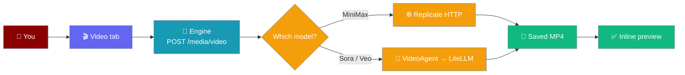
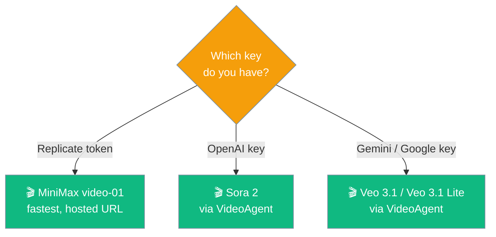
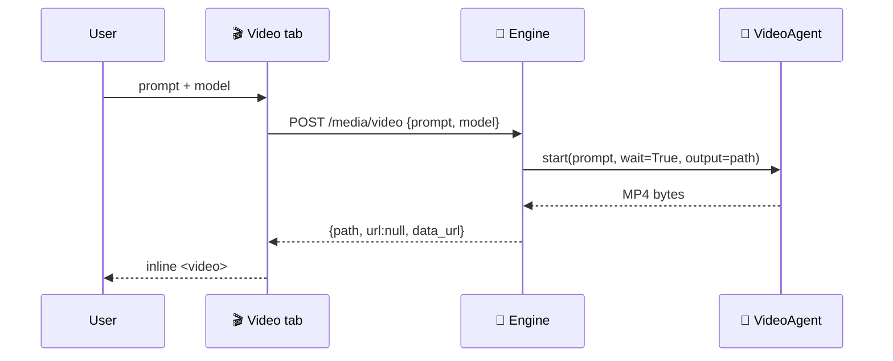
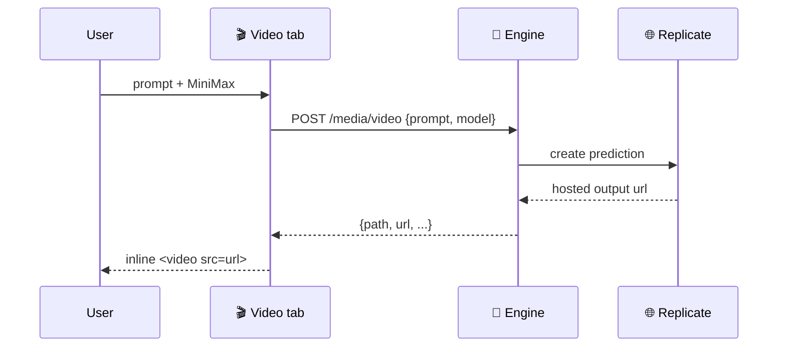

The Video tab turns a prompt into an MP4 using whichever provider's key you have.



The tab shows a model picker above the prompt. MiniMax `video-01` runs through Replicate; Sora 2 and Veo 3.1 route through the `VideoAgent` SDK. A model whose key is missing appears disabled with a `(key needed)` suffix.

## Quick Start

<Steps>
<Step title="Add a provider key">
Add one key to the `.env` file inside the app's data folder:

```bash
# ~/Library/Application Support/PraisonAI/.env  (macOS)
# %APPDATA%\PraisonAI\.env                       (Windows)
# ~/.local/share/PraisonAI/.env                  (Linux)
REPLICATE_API_TOKEN=r8_your_token
```
</Step>

<Step title="Pick a model and generate">
Open the **Video** tab, pick a model, type a prompt, click **Generate**. Only models with a configured key are selectable.
</Step>

<Step title="Watch the result">
The MP4 is saved under `media-output/videos/` in the data folder and plays inline in the app.
</Step>
</Steps>

---

## Which model to pick

Pick the model that matches the key you have.



| Have this key | Pick this model |
|---|---|
| Replicate token | MiniMax video-01 — fastest to try, returns a hosted URL |
| OpenAI key | Sora 2 — routed through `VideoAgent` |
| Gemini / Google key | Veo 3.1 or Veo 3.1 Lite |

---

## Model catalog

Four models ship in the picker. Each unlocks when one of its env keys is set.

| `id` | Display name | Provider | Env unlock |
|---|---|---|---|
| `replicate/minimax/video-01` | MiniMax video-01 (Replicate) | `replicate` | `REPLICATE_API_TOKEN` or `REPLICATE_API_KEY` |
| `openai/sora-2` | OpenAI Sora 2 | `openai` | `OPENAI_API_KEY` |
| `gemini/veo-3.1-lite-generate-preview` | Google Veo 3.1 Lite | `gemini` | `GEMINI_API_KEY` or `GOOGLE_API_KEY` |
| `gemini/veo-3.1-generate-preview` | Google Veo 3.1 | `gemini` | `GEMINI_API_KEY` or `GOOGLE_API_KEY` |

---

## How generation flows

The SDK path (Sora, Veo) returns MP4 bytes and previews them inline via a data URL.



The Replicate path returns a hosted `url` instead of a `data_url`.



---

## Where the file goes

Each generation writes one MP4 to `media-output/videos/vid_<epoch>_<8hex>.mp4` inside the [data folder](/features/desktop/environment-variables#data-directory-precedence) — for example `~/Library/Application Support/PraisonAI/media-output/videos/vid_1727000000_a1b2c3d4.mp4` on macOS. SDK providers return no hosted URL, so the saved file is the only artifact.

---

## API surface

The tab calls three engine routes on `127.0.0.1`. Full route reference: [Engine API](/features/desktop/api).

`GET /media/video/models` — the catalog with a per-model `configured` flag:

```json
{
  "ok": true,
  "models": [
    { "id": "replicate/minimax/video-01", "display_name": "MiniMax video-01 (Replicate)", "provider": "replicate", "configured": true },
    { "id": "openai/sora-2", "display_name": "OpenAI Sora 2", "provider": "openai", "configured": false }
  ]
}
```

`POST /media/video` — synchronous; returns the finished result. The `model` field defaults to `replicate/minimax/video-01`.

```json
// Request
{ "prompt": "A cat playing with yarn", "model": "openai/sora-2" }

// SDK response (Sora, Veo) — no hosted URL, previews via data_url
{ "id": "vid_1727000000_a1b2c3d4", "path": ".../media-output/videos/vid_1727000000_a1b2c3d4.mp4",
  "url": null, "data_url": "data:video/mp4;base64,…", "model": "openai/sora-2", "prompt": "A cat playing with yarn" }

// Replicate response (MiniMax) — hosted url instead of data_url
{ "id": "vid_1727000000_e5f6a7b8", "path": ".../media-output/videos/vid_1727000000_e5f6a7b8.mp4",
  "url": "https://replicate.delivery/…/output.mp4", "model": "replicate/minimax/video-01", "prompt": "…" }
```

`GET /media/capabilities` — includes the `video_models` list and a `video_hint`:

```json
{
  "ok": true,
  "video": true,
  "video_models": [ { "id": "replicate/minimax/video-01", "configured": true } ],
  "video_hint": "Set a provider key in ~/.praisonai/.env for video generation (REPLICATE_API_TOKEN for MiniMax, OPENAI_API_KEY for Sora, GEMINI_API_KEY for Veo)."
}
```

---

## Troubleshooting

<AccordionGroup>
<Accordion title="The dropdown says (key needed)">
The env var isn't reaching the engine. Add the model's key to the `.env` file in the data folder, then relaunch. See [Environment Variables](/features/desktop/environment-variables) for how the engine picks up keys.
</Accordion>

<Accordion title="praisonaiagents with litellm is required for this provider">
Sora and Veo route through `VideoAgent`, which needs the `llm` extra. This is the same lean-environment constraint that [Desktop App install](/install/desktop#which-models-work-in-the-desktop-app) describes for slashed chat model ids. Install the extra into the desktop venv:

```bash
pip install 'praisonaiagents[llm]'
```
</Accordion>

<Accordion title="Video generation did not complete (status: failed)">
The provider failed to finish the job. No file is written. Retry, or switch to another model.
</Accordion>
</AccordionGroup>

---

## Related

<CardGroup cols={2}>
<Card title="Video (SDK)" icon="video" href="/video/overview">
The `VideoAgent` and its `seconds` / `size` controls
</Card>
<Card title="Engine API" icon="plug" href="/features/desktop/api">
The `/media/*` routes in full
</Card>
</CardGroup>
