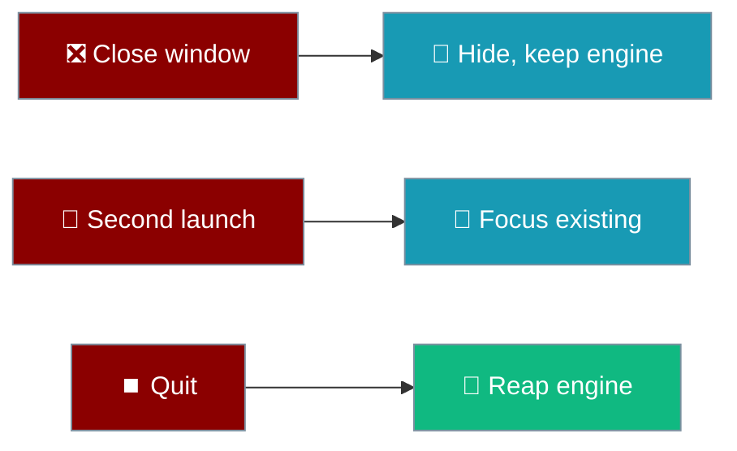
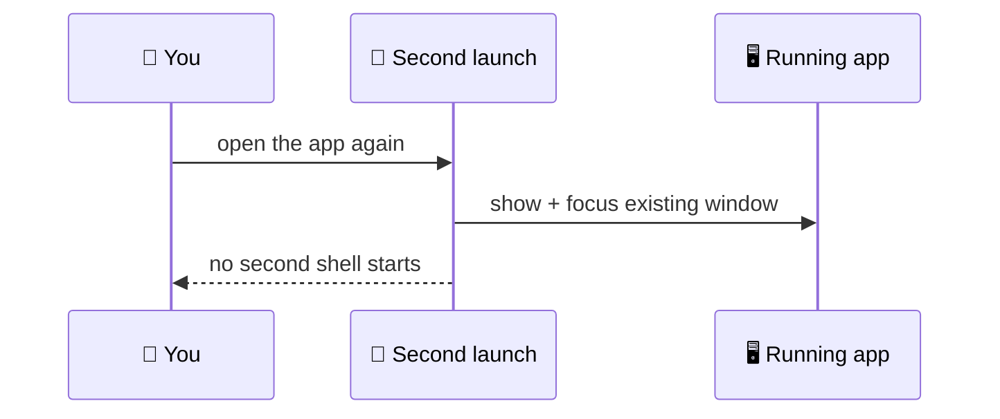
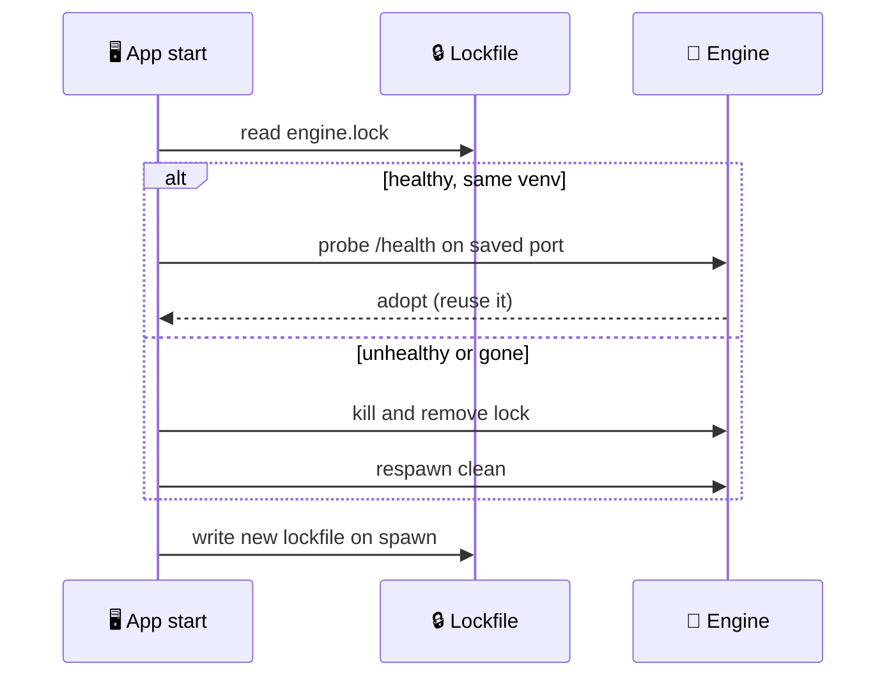

The window and the engine process behave like a proper Mac app: closing the window puts it away, a second launch focuses the first, and a leftover engine is adopted rather than duplicated.

```python
from praisonaiagents import Agent

agent = Agent(
    name="Assistant",
    instructions="You are a helpful assistant.",
)
# The app keeps this agent's engine alive in the background,
# even when you close the window.
agent.start("Still here?")
```



## Quick Start

<Steps>
<Step title="Close, don't quit">
Hit the red button — the window hides and the menubar item keeps the engine running.
</Step>

<Step title="Reopen from the tray">
Click the menubar glyph to bring the window back; the engine never restarted.
</Step>

<Step title="Quit for real">
Use **Quit PraisonAI** from the tray (or `⌘Q`) to stop the engine cleanly.
</Step>
</Steps>

---

## Menubar Tray

A menubar item hosts the app's status and controls, so closing the window means "put it away" rather than "quit".

| Item | Action |
|------|--------|
| Open PraisonAI | Bring the window forward |
| Engine: … | Live status label (`starting…`, then the running state) |
| Settings… | Open settings (`⌘,` on macOS) |
| Quit PraisonAI | Stop the engine and exit (`⌘Q` on macOS) |

<Note>
The tray glyph is a **template image** (`icons/tray.png`) drawn from its alpha channel alone. macOS discards the colour and tints the shape for the current menubar, so the mark is cut into the alpha rather than filled with pixels.
</Note>

---

## Single-Instance

Launching PraisonAI a second time focuses the existing window instead of opening a rival shell.



Registered via `tauri-plugin-single-instance`, and first — the guard runs before anything else touches the lockfile or the engine, so two shells never race over one engine.

---

## Draggable Titlebar

The header carries `data-tauri-drag-region`, and the `core:window:allow-start-dragging` permission is granted in `src-tauri/capabilities/default.json`.

<Warning>
Both pieces are required. WKWebView does not implement Chromium's `-webkit-app-region`, so without the ACL permission the drag region is inert and macOS cannot move the window.
</Warning>

---

## Window Geometry Persistence

Position and size are saved as the window moves, resizes, and closes, via `tauri-plugin-window-state`.

Saves are coalesced during a drag (one file write after a short pause), and geometry is also written on close and exit — because a hidden window never fires a real close, and a signal kill runs neither handler.

---

## Launch at Login

Turning on **Open at login** installs a LaunchAgent that opens the app when you sign in.

| State | Effect |
|-------|--------|
| On | Writes `~/Library/LaunchAgents/ai.praison.desktop.plist` (`RunAtLoad`) |
| Off | Removes the plist |

<Note>
This is installed-app only. In a `cargo run` dev build there is no `.app` bundle to open, so the toggle reports "Only available in the installed app" rather than silently succeeding. Contributors testing it set `PRAISONAI_APP_BUNDLE` to the `.app` path.
</Note>

---

## Orphan Reclamation

If a previous run left an engine alive — a crash or a signal kill skips the orderly quit — the app adopts it instead of starting a second one beside it.



The lockfile (`engine.lock`) is bumped to `LOCK_FORMAT_VERSION = 2` and distinguishes every outcome:

| Lock state | Decision |
|------------|----------|
| Absent | Spawn a fresh engine |
| Present, healthy, same venv | **Adopt** the running engine on its saved port |
| Present, unhealthy | **Kill and respawn**, then remove the stale lock |
| Corrupt / incompatible | Treated as nothing adoptable — spawn |

<Note>
Absent and corrupt are never collapsed into one answer: absent means spawn, corrupt means a process may still be holding the port and must be investigated. Collapsing them is how an orphan survives every interrupted write.
</Note>

---

## Best Practices

<AccordionGroup>
<Accordion title="Close to keep the engine warm">
The engine takes seconds to start. Closing the window hides it and keeps the process alive, so the next open is instant.
</Accordion>

<Accordion title="Quit from the tray to stop the engine">
The red button hides; **Quit PraisonAI** (or `⌘Q`) exits and reaps the engine. Verify with `pgrep -f server.py` after quitting.
</Accordion>

<Accordion title="Delete the lockfile only when the app is fully quit">
If the app is stuck, quit it, remove `engine.lock` from the data directory, and relaunch. Deleting it while the app runs invites a duplicate engine.
</Accordion>
</AccordionGroup>

---

## Related

<CardGroup cols={2}>
<Card title="First-Run Provisioning" icon="download" href="/features/desktop/first-run">
How the runtime is installed on first launch
</Card>
<Card title="Troubleshooting" icon="stethoscope" href="/features/desktop/troubleshooting">
Startup pill, engine log, and reset recipe
</Card>
</CardGroup>
