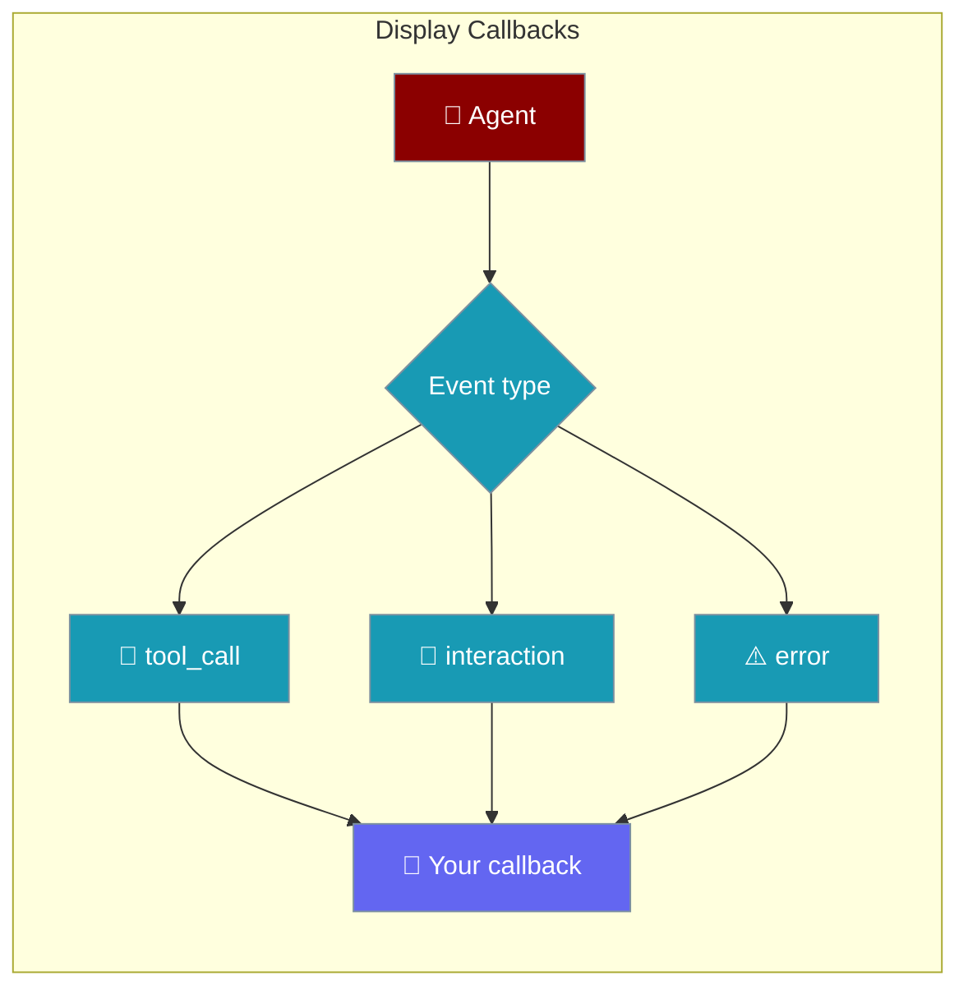

Display callbacks let you react to agent events — tool calls, LLM turns, errors — without changing agent logic.



## Quick Start

<Steps>
<Step title="Register a callback">
```python
from praisonaiagents import Agent, register_display_callback

def on_interaction(message=None, response=None, **kwargs):
    print(f"User: {message}")
    print(f"Agent: {response}")

register_display_callback("interaction", on_interaction)

agent = Agent(name="assistant", instructions="Be concise.")
agent.start("Say hello in one sentence.")
```
</Step>

<Step title="Log tool calls">
```python
from praisonaiagents import Agent, register_display_callback

def on_tool_call(tool_name=None, **kwargs):
    print(f"Tool: {tool_name}")

register_display_callback("tool_call", on_tool_call)

agent = Agent(
    name="researcher",
    instructions="Use tools when helpful.",
    tools=["web_search"],
)
agent.start("Latest Python release version?")
```
</Step>

<Step title="Async callback for dashboards">
```python
import asyncio
from praisonaiagents import Agent, register_display_callback

async def push_to_ui(message=None, response=None, **kwargs):
    await asyncio.sleep(0)  # replace with your WebSocket / HTTP call
    print({"message": message, "response": response})

register_display_callback("interaction", push_to_ui, is_async=True)

agent = Agent(name="assistant", instructions="Be helpful.")
agent.start("Summarise loop detection in one line.")
```
</Step>
</Steps>

## Callback Types

| Type | When it fires |
|------|----------------|
| `interaction` | User message and agent response |
| `tool_call` | Before or during a tool invocation |
| `error` | Agent or tool error |
| `llm_start` / `llm_end` | LLM request lifecycle |
| `llm_content` | Streaming token chunks |
| `autonomy_iteration` | Autonomous loop iteration |
| `autonomy_doom_loop` | Doom loop detected in autonomy mode |
| `retry` | Retry after transient failure |

Register with `register_display_callback(type, fn, is_async=False)`. Alias: `add_display_callback`.

## Configuration Options

| Option | Type | Default | Description |
|--------|------|---------|-------------|
| `display_type` | `str` | — | One of the supported callback types above |
| `callback_fn` | `callable` | — | Sync or async handler |
| `is_async` | `bool` | `False` | Store in the async registry when `True` |

Callbacks receive keyword arguments matching the event (for example `message`, `response`, `tool_name`, `agent_name`). Extra kwargs are filtered to the function signature automatically.

## Best Practices

<AccordionGroup>
<Accordion title="Keep handlers lightweight">
Display callbacks run on the hot path. Log or enqueue work — avoid heavy I/O in sync handlers.
</Accordion>

<Accordion title="Use async for network and UI">
Set `is_async=True` when writing to WebSockets, Slack, or dashboards so the agent loop stays responsive.
</Accordion>

<Accordion title="Wrap custom logic in try/except">
A failing callback should not crash the agent. Catch, log, and return.
</Accordion>

<Accordion title="Compose with hooks for fine control">
Use display callbacks for output formatting; use [hooks](/docs/features/hooks) when you need to allow, block, or mutate tool calls.
</Accordion>
</AccordionGroup>

## Related

<CardGroup cols={2}>
<Card title="Display System" icon="display" href="/docs/features/display-system">
  TaskOutput, terminal rendering, and global registries
</Card>
<Card title="Callbacks" icon="bell" href="/docs/features/callbacks">
  Broader callback patterns for agents and tasks
</Card>
</CardGroup>
