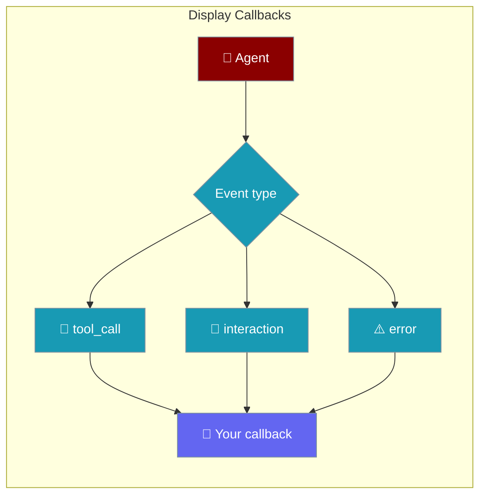
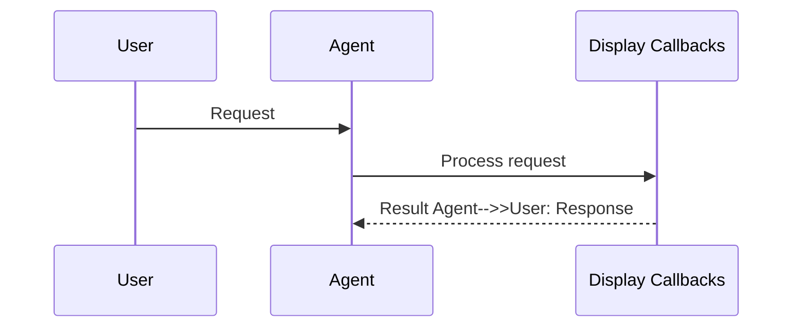
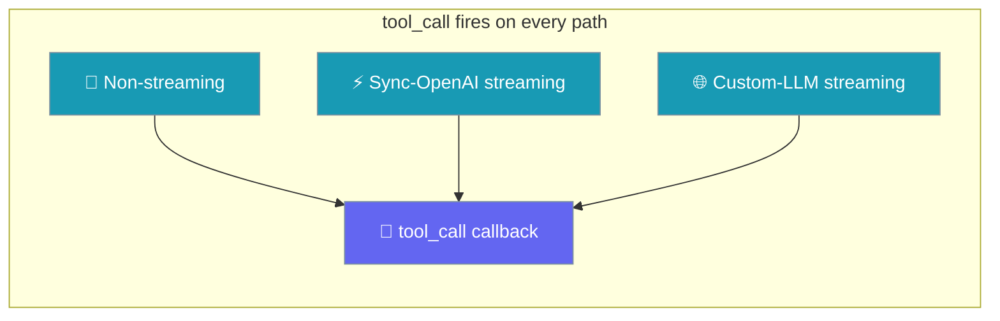

```python
from praisonaiagents import Agent

agent = Agent(name="assistant", instructions="Be helpful.", output=True)
agent.start("Summarise this log file.")
```
Display callbacks let you react to agent events — tool calls, LLM turns, errors — without changing agent logic.

The user runs the agent; display callbacks fire on tool calls, LLM turns, and errors for custom terminals or dashboards.



```mermaid
graph LR
    subgraph "Display Callbacks"
        Agent[🤖 Agent] --> Event{Event type}
        Event --> Tool[🔧 tool_call]
        Event --> LLM[💬 interaction]
        Event --> Err[⚠️ error]
        Tool --> CB[📡 Your callback]
        LLM --> CB
        Err --> CB
    end

    classDef agent fill:#8B0000,stroke:#7C90A0,color:#fff
    classDef process fill:#189AB4,stroke:#7C90A0,color:#fff
    classDef callback fill:#6366F1,stroke:#7C90A0,color:#fff

    class Agent agent
    class Event,Tool,LLM,Err process
    class CB callback

    classDef tool fill:#189AB4,color:#fff

    classDef agent fill:#8B0000,color:#fff
```

## How It Works


```mermaid
sequenceDiagram
    participant User
    participant Agent
    participant Feature as Display Callbacks

    User->>Agent: Request
    Agent->>Feature: Process request
    Feature-->>Agent: Result    Agent-->>User: Response
```


## Quick Start

<Steps>
<Step title="Register a callback">
```python
from praisonaiagents import Agent, register_display_callback

def on_interaction(message=None, response=None, **kwargs):
    print(f"User: {message}")
    print(f"Agent: {response}")

register_display_callback("interaction", on_interaction)

agent = Agent(name="assistant", instructions="Be concise.")
agent.start("Say hello in one sentence.")
```
</Step>

<Step title="Log tool calls">
```python
from praisonaiagents import Agent, register_display_callback

def on_tool_call(tool_name=None, tool_input=None, tool_output=None,
                 elapsed_time=None, success=None, **kwargs):
    status = "ok" if success else "failed"
    print(f"[{status}] {tool_name}({tool_input}) -> {tool_output}")

register_display_callback("tool_call", on_tool_call)

agent = Agent(
    name="researcher",
    instructions="Use tools when helpful.",
    tools=["web_search"],
)
agent.start("Latest Python release version?")
```

Fires on non-streaming **and** streaming turns since PR [#4735](https://github.com/MervinPraison/PraisonAI/pull/4735). See [Streaming coverage](#streaming-coverage).
</Step>

<Step title="Async callback for dashboards">
```python
import asyncio
from praisonaiagents import Agent, register_display_callback

async def push_to_ui(message=None, response=None, **kwargs):
    await asyncio.sleep(0)  # replace with your WebSocket / HTTP call
    print({"message": message, "response": response})

register_display_callback("interaction", push_to_ui, is_async=True)

agent = Agent(name="assistant", instructions="Be helpful.")
agent.start("Summarise loop detection in one line.")
```
</Step>
</Steps>

## Callback Types

| Type | When it fires |
|------|----------------|
| `interaction` | User message and agent response |
| `tool_call` | Before or during a tool invocation |
| `error` | Agent or tool error |
| `llm_start` / `llm_end` | LLM request lifecycle |
| `llm_content` | Streaming token chunks — the primary interactive TUI consumes this to render live intermediate narrative during tool-using turns |
| `autonomy_iteration` | Autonomous loop iteration |
| `autonomy_doom_loop` | Doom loop detected in autonomy mode |
| `retry` | Retry after transient failure |

Register with `register_display_callback(type, fn, is_async=False)`. Alias: `add_display_callback`.

## Streaming coverage

Since PR [#4735](https://github.com/MervinPraison/PraisonAI/pull/4735), `tool_call` fires on all three execution paths — not just non-streaming.


```mermaid
graph LR
    subgraph "tool_call fires on every path"
        NS[🔧 Non-streaming] --> CB[📡 tool_call callback]
        SS[⚡ Sync-OpenAI streaming] --> CB
        CS[🌐 Custom-LLM streaming] --> CB
    end

    classDef path fill:#189AB4,stroke:#7C90A0,color:#fff
    classDef callback fill:#6366F1,stroke:#7C90A0,color:#fff

    class NS,SS,CS path
    class CB callback
```

| Path | SDK entry point | `tool_call` fires |
|------|-----------------|-------------------|
| Non-streaming | `llm/openai_client.py` | ✅ Always |
| Sync-OpenAI streaming | `agent/chat_mixin.py::_start_stream_impl` | ✅ Since #4735 |
| Custom-LLM streaming | `llm/llm.py::get_response_stream` | ✅ Since #4735 |

Before #4735 the streaming paths ran tools silently — a streaming UI saw no tool activity even though a tool ran and its result reached the model. The callback now fires **once per tool** (parallel tools each get their own call), in both the success and failure branches.

<Note>
**Before PR #4735:** you built a desktop UI that listens for `tool_call` to render a "🔧 Running `search_web`..." indicator. It worked in `chat()` mode. You switched to `agent.start(prompt, stream=True)` for token streaming and the indicator stopped appearing — no error, no warning, silent regression.

**After PR #4735** (closes Issue [#4716](https://github.com/MervinPraison/PraisonAI/issues/4716)): the same callback fires on the streaming path with the same kwargs. Your indicator works uniformly.
</Note>

### `tool_call` kwargs

A `tool_call` handler receives these keyword arguments on every path. Accept `**kwargs` so future additions never break your handler.

| Kwarg | Type | Description |
|-------|------|-------------|
| `message` | `str` | Human-readable label, e.g. `"Calling function: search_web"` |
| `tool_name` | `str` | The function name |
| `tool_input` | `dict` | Parsed arguments passed to the tool |
| `tool_output` | `str` or `None` | `json.dumps(result)[:200]` (or `str(result)` if not JSON-serialisable, or `None`) |
| `elapsed_time` | `float` or `None` | `perf_counter` delta; `None` on the custom-LLM path when the batch has more than one tool |
| `success` | `bool` | `False` for a raising tool **and** for `{"error": ...}` results |

<Note>
**`elapsed_time` on the custom-LLM path** is populated only when the model calls a single tool in a batch. For parallel tool calls, per-tool timing is not available from the executor, so `elapsed_time` is `None`.
</Note>

<Note>
**`success=False` on error-shaped results.** A durable run converts a raising tool into `{"error": "..."}` instead of re-raising inline. The callback detects that shape and reports `success=False` — so a failed tool is never labelled successful, even though it didn't raise inline.
</Note>

### Streaming example

`tool_call` fires the same way whether you stream or not.

```python
from praisonaiagents import Agent, register_display_callback

def on_tool_call(tool_name=None, tool_input=None, tool_output=None,
                 elapsed_time=None, success=None, **kwargs):
    status = "ok" if success else "failed"
    secs = f"{elapsed_time:.3f}s" if elapsed_time is not None else "n/a"
    print(f"[{status}] {tool_name}({tool_input}) -> {tool_output} in {secs}")

register_display_callback("tool_call", on_tool_call)

def my_tool(query: str) -> str:
    """Look something up."""
    return f"Result for {query}"

agent = Agent(
    name="researcher",
    instructions="Use tools when helpful.",
    tools=[my_tool],
)

# Same callback now fires whether stream=True or not.
for chunk in agent.start("Look up the weather in Paris", stream=True):
    print(chunk, end="", flush=True)
```

<Note>
**Best-effort by design.** A raising `tool_call` handler is caught, logged at debug level, and swallowed — it can never break the stream. This is **not** the same as a tool failure: the real tool result (not your handler's error text) still reaches the model.
</Note>

## Configuration Options

| Option | Type | Default | Description |
|--------|------|---------|-------------|
| `display_type` | `str` | — | One of the supported callback types above |
| `callback_fn` | `callable` | — | Sync or async handler |
| `is_async` | `bool` | `False` | Store in the async registry when `True` |

Callbacks receive keyword arguments matching the event (for example `message`, `response`, `tool_name`, `agent_name`). Extra kwargs are filtered to the function signature automatically.

## Best Practices

<AccordionGroup>
<Accordion title="Keep handlers lightweight">
Display callbacks run on the hot path. Log or enqueue work — avoid heavy I/O in sync handlers. The streaming path fires `tool_call` **synchronously inline**, so a slow handler blocks token yielding until it returns.
</Accordion>

<Accordion title="Use async for network and UI">
Set `is_async=True` when writing to WebSockets, Slack, or dashboards so the agent loop stays responsive.
</Accordion>

<Accordion title="Wrap custom logic in try/except">
A failing callback should not crash the agent. Catch, log, and return.
</Accordion>

<Accordion title="Compose with hooks for fine control">
Use display callbacks for output formatting; use [hooks](/features/hooks) when you need to allow, block, or mutate tool calls.
</Accordion>
</AccordionGroup>

## Related

<CardGroup cols={2}>
<Card title="Display System" icon="display" href="/features/display-system">
  TaskOutput, terminal rendering, and global registries
</Card>
<Card title="Callbacks" icon="bell" href="/features/callbacks">
  Broader callback patterns for agents and tasks
</Card>
<Card title="Streaming" icon="bolt" href="/features/streaming#streaming-with-tools">
  `tool_call` fires on the streaming path too — tool telemetry for live UIs
</Card>
</CardGroup>
