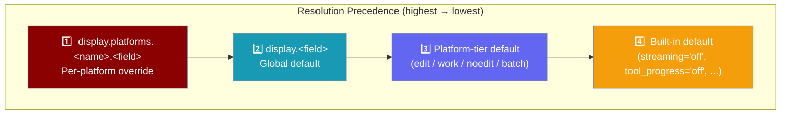
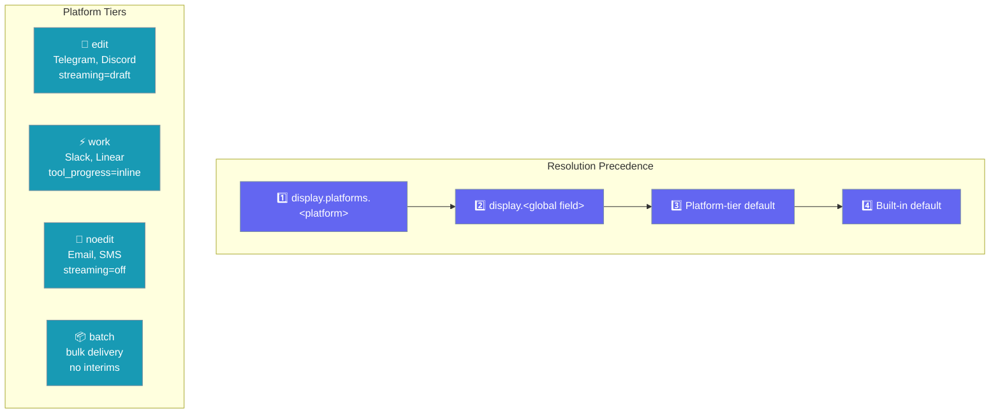
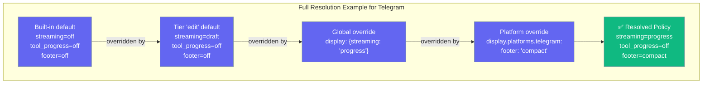
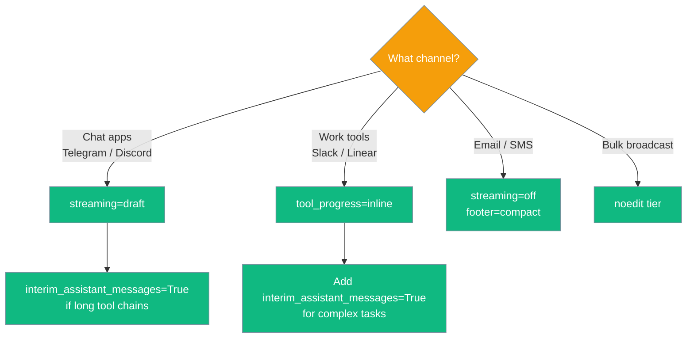

`DisplayPolicy` lets operators control how agent output is presented on each channel — streaming partial answers, showing tool progress, or sending a single final message — without touching adapter code.



## Quick Start

<Steps>
<Step title="Use Platform Defaults (No Config)">
Zero configuration: Telegram streams replies live, Slack posts discrete steps, Email sends one final message. Platform-tier defaults do the right thing automatically:

```python
from praisonaiagents import Agent
from praisonai.bots import TelegramBot

agent = Agent(
    name="Assistant",
    instructions="Answer questions helpfully.",
)

bot = TelegramBot(token="YOUR_TOKEN", agent=agent)
await bot.start()
```
</Step>

<Step title="Override One Field Globally">
Turn off streaming for all platforms:

```python
from praisonaiagents import Agent, DisplayPolicy
from praisonai.bots import TelegramBot, BotConfig

config = BotConfig(
    display={"streaming": "off"}
)

agent = Agent(name="Assistant", instructions="Answer questions.")
bot = TelegramBot(token="YOUR_TOKEN", agent=agent, config=config)
await bot.start()
```
</Step>

<Step title="Override Per Platform">
Enable a compact footer on Telegram only:

```python
from praisonai.bots import BotConfig

config = BotConfig(
    display={
        "platforms": {
            "telegram": {"footer": "compact"},
            "email": {"streaming": "off"},
        }
    }
)
```

Platform keys are **case-insensitive** — `"Telegram"`, `"TELEGRAM"`, and `"telegram"` all match.
</Step>

<Step title="Use the DisplayPolicy Dataclass">
```python
from praisonaiagents import DisplayPolicy
from praisonaiagents.bots import resolve_display_policy

policy = resolve_display_policy(
    "telegram",
    {"streaming": "draft", "platforms": {"telegram": {"footer": "compact"}}}
)

print(policy.streaming)        # "draft"
print(policy.footer)           # "compact"
print(policy.tool_progress)    # "off"
```
</Step>
</Steps>

---

## How It Works



The resolver applies this priority order for every field independently:

1. **Platform override** — `display.platforms.<platform>` (matched case-insensitively, so `{Telegram: ...}` works for `"telegram"`)
2. **Global field** — the top-level `DisplayPolicy` field
3. **Platform-tier default** — automatic default based on the channel's tier (`edit`, `work`, `noedit`, `batch`)
4. **Built-in default** — the hard-coded fallback

---

## Configuration Options

| Field | Type | Default | Description |
|-------|------|---------|-------------|
| `streaming` | `"off"` \| `"draft"` \| `"progress"` | `"off"` | How to stream partial replies: off, show draft updates, or show progress markers |
| `tool_progress` | `"off"` \| `"inline"` | `"off"` | Whether to print tool-call progress inline during execution |
| `interim_assistant_messages` | `bool` | `False` | Whether to send "thinking…" messages between tool calls |
| `footer` | `"off"` \| `"compact"` | `"off"` | Append a compact attribution/source footer to replies |
| `platforms` | `dict[str, DisplayPolicy]` | `{}` | Per-platform overrides; keys are matched case-insensitively |

### Platform Tiers

| Tier | Platforms | Default Behaviour |
|------|-----------|-------------------|
| `edit` | Telegram, Discord | `streaming="draft"` — edits the message as content arrives |
| `work` | Slack, Linear | `tool_progress="inline"` — shows tool steps without streaming |
| `noedit` | Email, SMS, AgentMail | `streaming="off"` — waits for completion, sends one message |
| `batch` | Bulk broadcast | `streaming="off"`, `interim_assistant_messages=False` |

<Note>
String booleans (`"false"`, `"0"`) are parsed correctly in YAML/JSON config files, so `interim_assistant_messages: "false"` works as expected.
</Note>

---

## Common Patterns

### Telegram with draft streaming

```python
from praisonaiagents import Agent
from praisonaiagents.bots import DisplayPolicy

agent = Agent(
    name="assistant",
    instructions="Be helpful",
    display=DisplayPolicy(streaming="draft", interim_assistant_messages=True),
)
```

### Email with a compact footer

```python
from praisonaiagents.bots import DisplayPolicy

display = DisplayPolicy(streaming="off", footer="compact")
```

### Different settings per channel

```python
from praisonaiagents.bots import DisplayPolicy

display = DisplayPolicy(
    streaming="off",          # global default: no streaming
    platforms={
        "telegram": DisplayPolicy(streaming="draft"),
        "discord":  DisplayPolicy(streaming="draft"),
        "slack":    DisplayPolicy(tool_progress="inline"),
    },
)

## Configuration Options

All four fields are set via the `display:` block in your bot config:

| Option | Type | Default | Description |
|--------|------|---------|-------------|
| `streaming` | `"off" \| "draft" \| "progress"` | `"off"` | When to surface partial assistant output: `"off"` (single final message), `"draft"` (edit in place), `"progress"` (compact status then final) |
| `tool_progress` | `"off" \| "inline"` | `"off"` | Whether to show tool-call progress markers: `"off"` (hidden) or `"inline"` (progress bubbles) |
| `interim_assistant_messages` | `bool` | `False` | Whether to send intermediate assistant messages before the final reply |
| `footer` | `"off" \| "compact"` | `"off"` | Runtime footer appended to replies: `"off"` or `"compact"` (e.g. `model · ctx% · cwd`) |

<Note>
`interim_assistant_messages` accepts string booleans from YAML/JSON/env: `"true"`, `"1"`, `"yes"`, `"on"` → `True`; `"false"`, `"0"`, `"no"`, `"off"` → `False`. Using `"off"` as a string evaluates to `False` (not `True`).
</Note>

---

## Platform Tiers and Built-in Defaults

Each platform maps to a tier that controls sensible defaults:

| Tier | Platforms | `streaming` | `tool_progress` | `footer` |
|------|-----------|-------------|----------------|---------|
| `edit` | Telegram, Discord | `"draft"` | `"off"` | `"off"` |
| `work` | Slack, Teams, Mattermost | `"off"` | `"inline"` | `"off"` |
| `noedit` | WhatsApp | `"off"` | `"off"` | `"off"` |
| `batch` | Email, SMS | `"off"` | `"off"` | `"off"` |

Platforms not listed above resolve to the built-in default (`streaming="off"`, all others `"off"` / `False`).

---

## Layered Resolution Diagram



---

## Which option to choose?



---

## Best Practices

<AccordionGroup>
<Accordion title="Trust the tier defaults — they're optimised per channel">
Telegram in `edit` tier streams drafts which looks great; Email in `batch` tier correctly sends one final message. Only override when your use case genuinely differs from the tier default.
</Accordion>

<Accordion title="Use 'draft' only on edit-capable channels">
`streaming="draft"` edits the original message in place. On channels without edit support (WhatsApp, Email) it falls through to the tier default — but explicitly setting `"draft"` on a `batch` channel is a misconfiguration.
</Accordion>

<Accordion title="Case-insensitive platform keys in config">
Config keys like `"Telegram"`, `"TELEGRAM"`, or `"telegram"` all resolve to the same platform. This makes YAML configs more natural.
</Accordion>

<Accordion title="Layer selectively — don't repeat defaults">
Only specify what you need to change. A global `display: { streaming: "progress" }` applies to all platforms, then per-platform overrides layer on top for specific exceptions.
</Accordion>
</AccordionGroup>

---

## Related

<CardGroup cols={2}>
<Card title="Messaging Bots" icon="robot" href="/docs/features/messaging-bots">
  Deploy agents across Telegram, Slack, Discord, WhatsApp, and more
</Card>
<Card title="Bot Streaming Replies" icon="zap" href="/docs/features/bot-streaming-replies">
  Configure streaming for individual bot sessions
</Card>
<Card title="Channel Capabilities" icon="settings" href="/docs/features/channel-capabilities">
  Platform capability flags and limits
</Card>
<Card title="Relay Transport" icon="network-wired" href="/docs/features/relay-transport">
  Route agent replies through an out-of-process connector
</Card>
</CardGroup>
