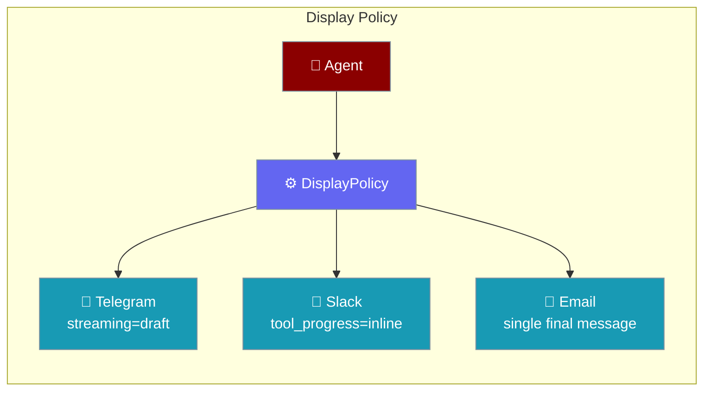
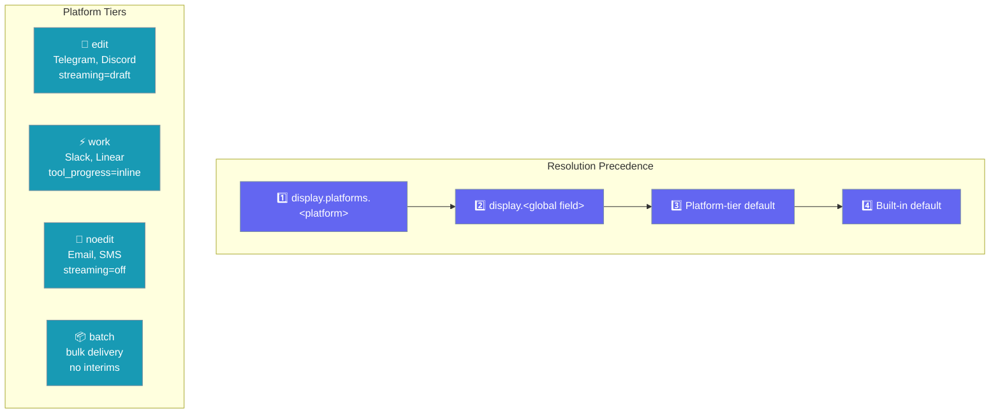
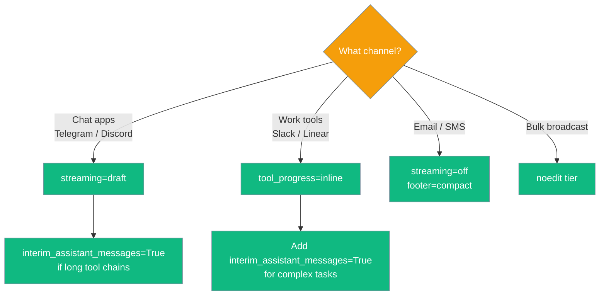

`DisplayPolicy` sets how an agent communicates on each channel: whether it streams partial replies, shows tool-progress inline, sends interim "thinking" messages, or appends a footer — all from one config that resolves correctly for each platform.



## Quick Start

<Steps>
<Step title="Add a display policy to your agent">

```python
from praisonaiagents import Agent
from praisonaiagents.bots import DisplayPolicy

agent = Agent(
    name="Support Assistant",
    instructions="Help users via chat",
    display=DisplayPolicy(streaming="draft", tool_progress="inline"),
)
agent.start("Summarise yesterday's tickets")
```

</Step>

<Step title="Use per-platform overrides">

```python
from praisonaiagents import Agent
from praisonaiagents.bots import DisplayPolicy

agent = Agent(
    name="Support Assistant",
    instructions="Help users via chat",
    display=DisplayPolicy(
        streaming="draft",
        platforms={
            "email": DisplayPolicy(streaming="off"),   # email gets single final message
            "slack": DisplayPolicy(tool_progress="inline"),
        },
    ),
)
agent.start("Send a status update")
```

</Step>

<Step title="Use a platform tier shorthand">

Tiers bundle common settings for platform families:

```python
from praisonaiagents.bots import DisplayPolicy

# "noedit" tier: no streaming, no interim messages — good for email/SMS
display = DisplayPolicy.from_tier("noedit")
```

</Step>
</Steps>

---

## How It Works



The resolver applies this priority order for every field independently:

1. **Platform override** — `display.platforms.<platform>` (matched case-insensitively, so `{Telegram: ...}` works for `"telegram"`)
2. **Global field** — the top-level `DisplayPolicy` field
3. **Platform-tier default** — automatic default based on the channel's tier (`edit`, `work`, `noedit`, `batch`)
4. **Built-in default** — the hard-coded fallback

---

## Configuration Options

| Field | Type | Default | Description |
|-------|------|---------|-------------|
| `streaming` | `"off"` \| `"draft"` \| `"progress"` | `"off"` | How to stream partial replies: off, show draft updates, or show progress markers |
| `tool_progress` | `"off"` \| `"inline"` | `"off"` | Whether to print tool-call progress inline during execution |
| `interim_assistant_messages` | `bool` | `False` | Whether to send "thinking…" messages between tool calls |
| `footer` | `"off"` \| `"compact"` | `"off"` | Append a compact attribution/source footer to replies |
| `platforms` | `dict[str, DisplayPolicy]` | `{}` | Per-platform overrides; keys are matched case-insensitively |

### Platform Tiers

| Tier | Platforms | Default Behaviour |
|------|-----------|-------------------|
| `edit` | Telegram, Discord | `streaming="draft"` — edits the message as content arrives |
| `work` | Slack, Linear | `tool_progress="inline"` — shows tool steps without streaming |
| `noedit` | Email, SMS, AgentMail | `streaming="off"` — waits for completion, sends one message |
| `batch` | Bulk broadcast | `streaming="off"`, `interim_assistant_messages=False` |

<Note>
String booleans (`"false"`, `"0"`) are parsed correctly in YAML/JSON config files, so `interim_assistant_messages: "false"` works as expected.
</Note>

---

## Common Patterns

### Telegram with draft streaming

```python
from praisonaiagents import Agent
from praisonaiagents.bots import DisplayPolicy

agent = Agent(
    name="assistant",
    instructions="Be helpful",
    display=DisplayPolicy(streaming="draft", interim_assistant_messages=True),
)
```

### Email with a compact footer

```python
from praisonaiagents.bots import DisplayPolicy

display = DisplayPolicy(streaming="off", footer="compact")
```

### Different settings per channel

```python
from praisonaiagents.bots import DisplayPolicy

display = DisplayPolicy(
    streaming="off",          # global default: no streaming
    platforms={
        "telegram": DisplayPolicy(streaming="draft"),
        "discord":  DisplayPolicy(streaming="draft"),
        "slack":    DisplayPolicy(tool_progress="inline"),
    },
)
```

---

## Which option to choose?



---

## Best Practices

<AccordionGroup>

<Accordion title="Start with the tier default">
The platform tier resolves the right defaults automatically. Only set explicit fields when the tier default doesn't fit your use case.
</Accordion>

<Accordion title="Keep email and SMS at streaming=off">
Email and SMS have no concept of message editing — the first message sent is final. Streaming on those channels splits a reply into dozens of partial sends.
</Accordion>

<Accordion title="Use interim_assistant_messages sparingly">
Interim "thinking…" messages feel natural in Telegram but are noisy in Slack threads. Limit to channels where users expect a conversational back-and-forth.
</Accordion>

<Accordion title="Platform keys are case-insensitive">
Both `"Telegram"` and `"telegram"` resolve to the same platform override. Use whichever matches your YAML config style.
</Accordion>

</AccordionGroup>

---

## Related

<CardGroup cols={2}>
<Card title="Messaging Bots" icon="robot" href="/docs/features/messaging-bots">
  Deploy agents across Telegram, Slack, Discord, WhatsApp, and more
</Card>
<Card title="Bot Streaming Replies" icon="zap" href="/docs/features/bot-streaming-replies">
  Configure streaming for individual bot sessions
</Card>
<Card title="Channel Capabilities" icon="settings" href="/docs/features/channel-capabilities">
  Platform capability flags and limits
</Card>
<Card title="Relay Transport" icon="network-wired" href="/docs/features/relay-transport">
  Route agent replies through an out-of-process connector
</Card>
</CardGroup>
