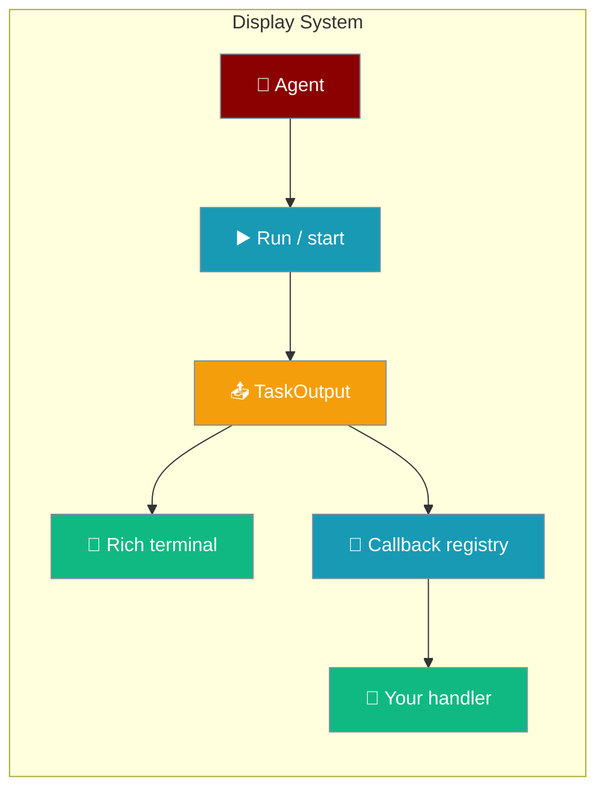

```python
from praisonaiagents import Agent

agent = Agent(name="assistant", instructions="Be helpful.", output=True)
agent.start("Explain loop detection in one paragraph.")
```
The display system formats agent output in the terminal and exposes hooks for custom rendering.

<Note>
This page covers **terminal** output only. For per-channel presentation (streaming, tool progress, footers), see [Display Policy](/docs/features/display-policy).
</Note>


The user runs the agent in a terminal; the display system renders Rich output and optional global callbacks.




## Quick Start

<Steps>
<Step title="Default terminal output">
```python
from praisonaiagents import Agent

agent = Agent(
    name="assistant",
    instructions="Be helpful.",
    output=True,
)
agent.start("Explain display callbacks in one sentence.")
```
</Step>

<Step title="Custom interaction handler">
```python
from praisonaiagents import Agent, register_display_callback

def compact(message=None, response=None, **kwargs):
    name = kwargs.get("agent_name", "agent")
    print(f"[{name}] {response}")

register_display_callback("interaction", compact)

agent = Agent(name="writer", instructions="Keep answers short.")
agent.start("One tip for readable logs.")
```
</Step>

<Step title="Inspect TaskOutput in a task callback">
```python
from praisonaiagents import Agent, Task, TaskOutput, PraisonAIAgents

def show_result(output: TaskOutput):
    print(output.raw)
    if output.metadata:
        print("meta:", output.metadata)

agent = Agent(name="analyst", instructions="Analyse briefly.")
task = Task(
    description="List three benefits of typed task output",
    expected_output="Bulleted list",
    agent=agent,
    callback=show_result,
)
PraisonAIAgents(agents=[agent], tasks=[task]).start()
```
</Step>
</Steps>

## Core Types

### TaskOutput

| Field | Type | Description |
|-------|------|-------------|
| `raw` | `str` | Text result from the task |
| `json_output` | `dict` | Parsed JSON when structured output is enabled |
| `pydantic_output` | `BaseModel` | Parsed model when a schema is set |
| `task_id` | `str` | Task identifier |
| `metadata` | `dict` | Execution metrics and context |

### ReflectionOutput

| Field | Type | Description |
|-------|------|-------------|
| `reflection` | `str` | Self-reflection content |
| `satisfactory` | `bool` | Whether reflection passed |
| `improvement_suggestions` | `list` | Suggested improvements |

Import both from the top level: `from praisonaiagents import TaskOutput, ReflectionOutput`.

## Global Registries

| Registry | Purpose |
|----------|---------|
| `sync_display_callbacks` | Sync handlers keyed by event type |
| `async_display_callbacks` | Async handlers keyed by event type |
| `register_display_callback` | Register into either registry |

Built-in display helpers (`display_interaction`, `display_tool_call`, `display_error`, and others) call registered callbacks even when verbose output is off.

## Best Practices

<AccordionGroup>
<Accordion title="Prefer register_display_callback over patching Rich">
Register handlers once at startup instead of monkey-patching internal display functions.
</Accordion>

<Accordion title="Use task callbacks for structured pipelines">
When you need the full `TaskOutput` object, attach a `callback` on `Task` rather than an interaction handler.
</Accordion>

<Accordion title="Turn off verbose for headless runs">
Set `output=False` in CI or server mode and rely on callbacks for structured logs.
</Accordion>

<Accordion title="See Display Callbacks for event catalogue">
Event names, autonomy callbacks, and async patterns are documented on the [Display Callbacks](/docs/features/display-callbacks) page.
</Accordion>
</AccordionGroup>

## Related

<CardGroup cols={2}>
<Card title="Display Callbacks" icon="display" href="/docs/features/display-callbacks">
  Event types and registration patterns
</Card>
<Card title="Output Config" icon="sliders" href="/docs/configuration/output-config">
  Verbose, stream, and markdown output settings
</Card>
</CardGroup>
