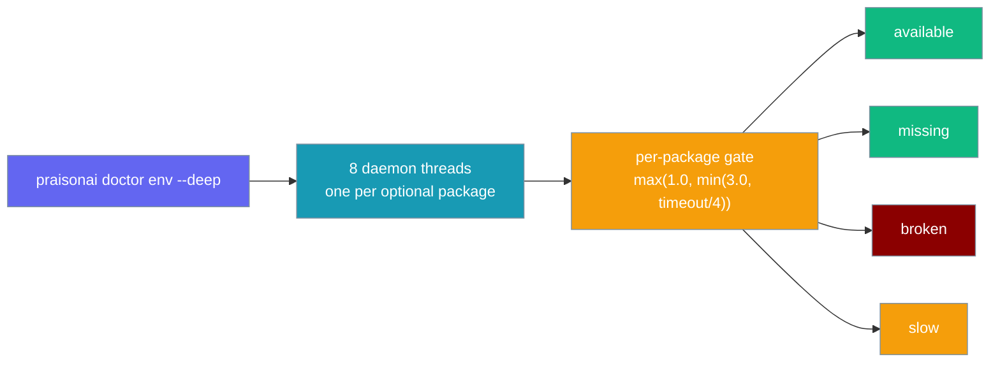

`praisonai doctor env --deep` probes eight optional packages in parallel and reports each as available, missing, broken, or slow — no single hanging import can stall the check.



## Quick Start

<Steps>
<Step title="Check before wiring up knowledge features">
An agent that uses `chromadb` for RAG will fail at runtime if the package is broken. Run the check first:

```python
from praisonaiagents import Agent

agent = Agent(
    name="Knowledge Assistant",
    instructions="Answer using indexed documents.",
    knowledge=["docs/manual.pdf"],   # requires chromadb
)
agent.start("How do I configure auth?")
```

```bash
# Confirm chromadb is present before wiring up knowledge features
praisonai doctor env --deep
```
</Step>

<Step title="CI/CD — capture the JSON report">
Export the structured result so CI can gate on specific buckets:

```bash
praisonai doctor env --deep --json > deps.json
```

The `metadata` object contains one list per bucket:

```json
{
  "id": "optional_deps",
  "status": "WARN",
  "message": "5 optional packages available, 2 not installed, 1 broken",
  "details": "Missing: gradio (Gradio UI), tavily (Tavily search); Broken install: chromadb (Knowledge/RAG features)",
  "remediation": "Reinstall the broken optional package(s): chromadb (Knowledge/RAG features)",
  "metadata": {
    "available": ["mem0ai", "litellm", "praisonaiui", "crawl4ai", "duckduckgo_search"],
    "missing":   ["gradio (Gradio UI)", "tavily (Tavily search)"],
    "broken":    ["chromadb (Knowledge/RAG features)"],
    "slow":      []
  }
}
```
</Step>
</Steps>

---

## The Four Outcome Buckets

Each optional package lands in exactly one bucket per run:

| Bucket | When | Status | Remediation |
|--------|------|--------|-------------|
| `available` | Import succeeded | `PASS` | — |
| `missing` | `ImportError` — package not installed | `PASS` | Install the package if you need that feature |
| `broken` | Import raised a non-`ImportError` (broken C extension, missing shared object) | **`WARN`** | *"Reinstall the broken optional package(s): {names}"* |
| `slow` | Import didn't finish inside per-package timeout | `PASS` | Retry with a higher `--timeout`; skip if it's a known-slow package |

<Note>
A `broken` result is distinct from `missing`: the package is installed but its import fails with a non-`ImportError` (e.g. a corrupted C extension). The check surfaces this as `WARN` rather than masking it as "not installed" — which would misleadingly tell users to install a package that is already there.
</Note>

---

## The Eight Optional Packages

| Package | Feature area |
|---------|--------------|
| `chromadb` | Knowledge/RAG features |
| `mem0ai` | Memory features |
| `litellm` | Multi-provider LLM support |
| `praisonaiui` | aiui (Chat/Dashboard UI) |
| `gradio` | Gradio UI |
| `crawl4ai` | Web crawling |
| `tavily` | Tavily search |
| `duckduckgo_search` | DuckDuckGo search |

---

## Per-Package Timeout

Each import runs on its own daemon thread with an individual deadline computed from the global `--timeout`:

```
per_package_timeout = max(1.0, min(3.0, config.timeout / 4))
```

With the default `--timeout 10`, each package gets **2.5 seconds**. The overall aggregate deadline is `max(per_package_timeout, config.timeout * 0.8)` — the check never exceeds 80% of the engine budget.


| `--timeout` | Per-package deadline | Aggregate cap |
|-------------|---------------------|---------------|
| 10 (default) | 2.5s | 8.0s |
| 20 | 3.0s | 16.0s |
| 4 | 1.0s | 3.2s |

---

## Why Daemon Threads

<Note>
Daemon threads (rather than a `ThreadPoolExecutor`) are used deliberately: a pool's worker threads are joined by its internal `atexit` handler at interpreter shutdown even after `shutdown(wait=False)`, so a truly hanging import would still stall CLI exit. Daemon threads are abandoned on exit, so a hanging import can never block the process from terminating.
</Note>

---

## CI/JSON Output

Gate CI on `metadata.broken` being empty. A `broken` install is actionable; a `missing` install often is not.

```jsonc
{
  "id": "optional_deps",
  "status": "WARN",
  "message": "5 optional packages available, 2 not installed, 1 broken",
  "details": "Missing: gradio (Gradio UI), tavily (Tavily search); Broken install: chromadb (Knowledge/RAG features)",
  "remediation": "Reinstall the broken optional package(s): chromadb (Knowledge/RAG features)",
  "metadata": {
    "available": ["mem0ai", "litellm", "praisonaiui", "crawl4ai", "duckduckgo_search"],
    "missing":   ["gradio (Gradio UI)", "tavily (Tavily search)"],
    "broken":    ["chromadb (Knowledge/RAG features)"],
    "slow":      []
  }
}
```

Check the `broken` list in a shell script:

```bash
praisonai doctor env --deep --json > deps.json
broken=$(python3 -c "import json,sys; d=json.load(open('deps.json')); print(len(d.get('results',[{}])[0].get('metadata',{}).get('broken',[])))" 2>/dev/null || echo "0")
if [ "$broken" -gt "0" ]; then
  echo "Broken optional packages detected — check deps.json for remediation"
  exit 1
fi
```

---

## Best Practices

<AccordionGroup>
<Accordion title="Gate CI on broken, not missing">
Gate CI on `metadata.broken` being empty — a broken install is actionable, a missing install often isn't.
</Accordion>

<Accordion title="Handle slow packages in short-timeout environments">
If a package repeatedly lands in `slow`, add it to `--skip optional_deps` in short-timeout environments rather than raising the global `--timeout`.
</Accordion>

<Accordion title="Reinstall a broken package">
Reinstall commands: `pip install --force-reinstall {package}` clears a broken C-extension cache.
</Accordion>
</AccordionGroup>

---

## Related

<CardGroup cols={2}>
<Card title="Doctor CLI" icon="stethoscope" href="/docs/cli/doctor">
  Full reference for praisonai doctor health checks and subcommands
</Card>
<Card title="Doctor CLI Reference" icon="terminal" href="/docs/cli/doctor-cli">
  CLI command reference for all doctor subcommands
</Card>
<Card title="Runtime Config Migration" icon="arrows-rotate" href="/docs/features/doctor-runtime-migration">
  Detect and migrate legacy cli_backend fields with praisonai doctor runtime
</Card>
<Card title="Vector Store" icon="database" href="/docs/features/vector-store">
  chromadb-backed vector storage for knowledge and RAG features
</Card>
</CardGroup>
