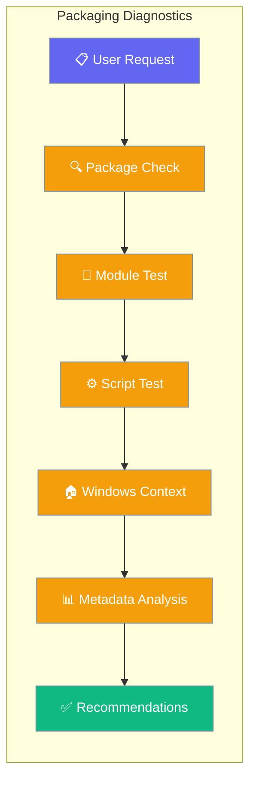
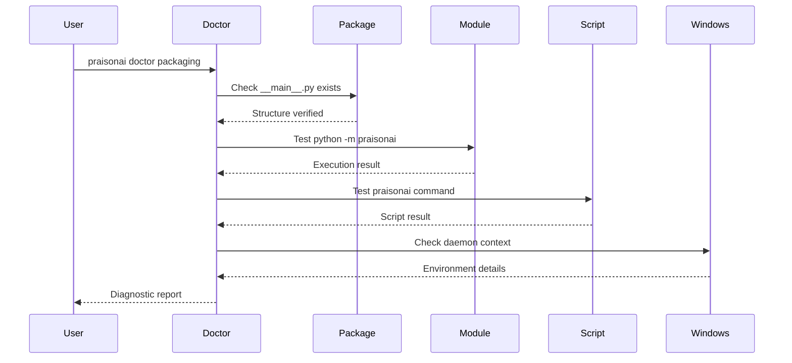

Diagnose packaging and entry-point issues so `python -m praisonai` and the `praisonai` console script behave consistently — especially on Windows daemons.



## Quick Start

<Steps>
<Step title="Simple Usage">
Run basic packaging diagnostics to verify both entry points work correctly:

```bash
praisonai doctor packaging
```
</Step>

<Step title="JSON for CI">
Generate structured output for CI pipelines or automated scripts:

```bash
praisonai doctor packaging --json
```
</Step>

<Step title="Windows Daemon Recipe">
For Windows scheduled tasks or services, copy the canonical daemon command from the output:

```bash
praisonai doctor packaging --deep
```

Look for `canonical_daemon_command` in the `windows_daemon_context` check results and use that absolute path in your scheduler.
</Step>
</Steps>

---

## How It Works



The packaging diagnostic runs five comprehensive checks to ensure PraisonAI works consistently across different invocation methods:

| Check ID | Title | Severity | What it does |
|----------|-------|----------|--------------|
| `praisonai_package_structure` | PraisonAI Package Structure | HIGH | Verifies `__main__.py` exists so `python -m praisonai` works; verifies `praisonai` console script is in PATH |
| `python_module_execution` | Python Module Execution | HIGH | Runs `python -m praisonai --version` as subprocess; reports exit code, stdout, stderr |
| `console_script_execution` | Console Script Execution | HIGH | Runs `praisonai --version` from the resolved console script path; reports exit code, stdout, stderr |
| `windows_daemon_context` | Windows Daemon Context | MEDIUM | Windows-only. Checks: virtual environment detection, `Scripts/praisonai.exe` presence, Microsoft Store Python detection, `PYTHONIOENCODING` env var, generates canonical absolute-path daemon command. Skipped on non-Windows. |
| `packaging_metadata` | Packaging Metadata | LOW | Inspects `importlib.metadata` for pip install info; detects editable installs (`.egg-link`, PEP 660 `__editable__*.pth`) |

---

## Common Patterns

### Pre-daemon Validation
Run packaging checks before scheduling a daemon to catch issues early:

```bash
# Validate before deployment
praisonai doctor packaging --json > packaging-report.json

# Check if windows daemon context passed
jq '.results[] | select(.id == "windows_daemon_context") | .status' packaging-report.json
```

### CI Gate
Use as a CI gate on Windows runners to ensure packaging works correctly:

```bash
name: Windows Packaging Check
runs-on: windows-latest
steps:
  - run: praisonai doctor packaging --json
    env:
      PYTHONIOENCODING: utf-8
```

### Microsoft Store Python Pitfall
Detect problematic Microsoft Store Python installations that can cause daemon issues:

```bash
praisonai doctor packaging --deep
# Look for "microsoft_store_python" warning in windows_daemon_context
```

---

## Best Practices

<AccordionGroup>
<Accordion title="Always use absolute paths in Windows scheduled tasks">
Windows services and scheduled tasks should use absolute paths for reliability. Use the `canonical_daemon_command` from the `windows_daemon_context` check:

```bash
# Get the canonical command
praisonai doctor packaging --deep --json | jq -r '.results[] | select(.id == "windows_daemon_context") | .metadata.canonical_daemon_command'
```
</Accordion>

<Accordion title="Set PYTHONIOENCODING=utf-8 for daemon encoding safety">
Windows daemons can have encoding issues. Always set this environment variable:

```bash
# In task scheduler or service configuration
PYTHONIOENCODING=utf-8
```
</Accordion>

<Accordion title="Prefer python.org or conda Python over Microsoft Store Python">
Microsoft Store Python has restrictions that can break daemon functionality. Install from python.org or use conda instead:

```bash
# Check if you're using Microsoft Store Python
praisonai doctor packaging --deep
# Look for microsoft_store_python detection
```
</Accordion>

<Accordion title="Run praisonai doctor packaging --json in CI on Windows runners">
Ensure packaging works correctly across all supported Windows environments:

```yaml
- name: Validate packaging
  run: praisonai doctor packaging --json
  if: runner.os == 'Windows'
```
</Accordion>
</AccordionGroup>

---

## Related

<CardGroup cols={2}>
<Card title="Doctor CLI" icon="stethoscope" href="/docs/cli/doctor">
  Main doctor command documentation
</Card>
<Card title="Doctor CLI Reference" icon="terminal" href="/docs/cli/doctor-cli">
  Complete CLI reference for all doctor subcommands
</Card>
</CardGroup>