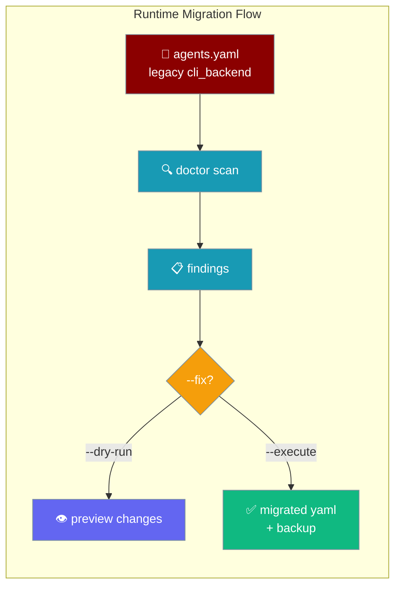
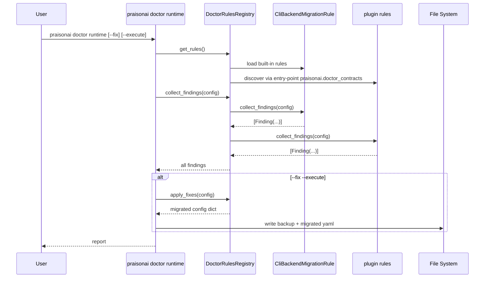

`praisonai doctor runtime` detects legacy `cli_backend` fields in your agent YAML and migrates them to the new `models.default.runtime` field.

<Tip>
The shortest command for this migration is now **`praisonai doctor fix --execute`** (added in PraisonAI 4.6.108+). It runs the same migration logic as `praisonai doctor runtime --fix --execute` but with a simpler flag shape. Both remain supported — see the [Doctor CLI setup auto-fix](/docs/cli/doctor#setup-auto-fix) section for the flag comparison.
</Tip>

```python
from praisonaiagents import Agent

# After migration, runtime lives under models.default in agents.yaml
agent = Agent(name="coder", instructions="Write code.")
# praisonai doctor fix --execute  (or: praisonai doctor runtime --fix --execute)
```



## Quick Start

<Steps>
<Step title="Scan only">
Run a scan to detect legacy configuration without making any changes:

```bash
praisonai doctor runtime
```

Output:
```
⚠ WARN: Found 2 legacy configuration(s) using cli_backend.
  Run `praisonai doctor runtime --fix` to preview changes.
```
</Step>

<Step title="Preview fix (dry-run)">
Preview what changes will be made before applying them:

```bash
praisonai doctor runtime --fix
```

Output:
```
--- agents.yaml (original)
+++ agents.yaml (migrated)
@@ -1,4 +1,6 @@
-cli_backend: claude-code
+models:
+  default:
+    runtime: claude-code
 roles:
   researcher:
-    cli_backend: openai-gpt
+    models:
+      default:
+        runtime: openai-gpt

Run with --fix --execute to apply changes.
```
</Step>

<Step title="Apply fix with backup">
Apply the migration and create a timestamped backup:

```bash
praisonai doctor runtime --fix --execute
```

A backup is created at `agents.backup.20240115_143022.yaml` alongside your original file.
</Step>

<Step title="Shorter equivalent: doctor fix">
The `doctor fix` subcommand runs the same migration with a simpler flag shape:

```bash
# Apply with a .bak backup (different format from runtime --fix)
praisonai doctor fix --execute

# Skip backup creation
praisonai doctor fix --execute --no-backup
```

<Note>
The backup file format differs between the two commands:
- `doctor fix` creates `agents.yaml.bak`
- `doctor runtime --fix --execute` creates `agents.backup.<YYYYMMDD_HHMMSS>.yaml`
</Note>
</Step>

<Step title="Target a specific file">
```bash
praisonai doctor runtime --fix --execute --file my-agents.yaml
# or equivalently:
praisonai doctor fix --execute --file my-agents.yaml
```
</Step>
</Steps>

---

## What Gets Migrated

The `cli_backend` field at the top level and inside `roles.<role_name>` is migrated to `models.default.runtime`.

<Tabs>
<Tab title="Before">
```yaml
cli_backend: claude-code
roles:
  researcher:
    cli_backend: openai-gpt
    role: Research specialist
    goal: Find information
    backstory: Expert researcher
    tasks:
      research:
        description: Research the topic
        expected_output: Summary
```
</Tab>
<Tab title="After">
```yaml
models:
  default:
    runtime: claude-code
roles:
  researcher:
    models:
      default:
        runtime: openai-gpt
    role: Research specialist
    goal: Find information
    backstory: Expert researcher
    tasks:
      research:
        description: Research the topic
        expected_output: Summary
```
</Tab>
</Tabs>

Known backend ID mapping:

| Legacy `cli_backend` value | Migrated `runtime` value |
|---------------------------|--------------------------|
| `claude-code` | `claude-code` |
| `openai-gpt` | `openai-gpt` |
| `anthropic` | `anthropic` |
| `gemini` | `gemini` |
| any other value | preserved as-is |

---

## How It Works



---

## Flags Reference

**`doctor fix` flag equivalents** — use either command; they share the same migration logic:

| `doctor fix` flag | `doctor runtime` equivalent | Purpose |
|---|---|---|
| _(no flag)_ | — | Dry-run preview (default) |
| `--execute` | `--fix --execute` | Apply changes |
| `--dry-run` | `--fix` | Explicit dry-run |
| `--no-backup` | _(not available)_ | Skip backup file creation |
| `--file, -f` | `--file, -f` | Target config file |
| `--quiet, -q` | _(not available)_ | Minimal output |

**`doctor runtime` flags:**

| Flag | Default | Purpose |
|------|---------|---------|
| `--file, -f TEXT` | auto-detect `agents.yaml`/`agents.yml`/`config.yaml`/`config.yml` in cwd | Config file to check |
| `--fix` | `False` | Enable migration mode |
| `--dry-run / --execute` | `--dry-run` | Preview changes vs apply changes |
| `--team TEXT` | — | Team YAML file to validate |
| `--workflow TEXT` | — | Workflow YAML file to validate |
| `--json` | `False` | JSON output |
| `--deep` | `False` | Enable deeper probes |

**Behavior summary:**

- Without `--fix`: Reports `WARN` with count of legacy configs found.
- With `--fix` (dry-run): Shows a preview diff; suggests `--fix --execute`.
- With `--fix --execute`: Writes migrated YAML and leaves a `<stem>.backup.<YYYYMMDD_HHMMSS>.yaml` backup.
- If `--file` is specified but file does not exist: `ERROR`, severity HIGH.
- If no config file is found: `SKIP`.

---

## Writing a Custom Rule

Implement `DoctorContractProtocol` to add your own migration rules:

```python
from praisonaiagents.runtime import DoctorContractProtocol, Finding, register_rule

class MyRule:
    @property
    def rule_id(self) -> str:
        return "my_org.deprecate_foo"

    def collect_findings(self, config):
        if "foo" in config:
            return [Finding(
                rule_id=self.rule_id,
                severity="warning",
                message="`foo` is deprecated, use `bar` instead",
                fix_description="Rename foo → bar"
            )]
        return []

    def apply_fix(self, config):
        if "foo" in config:
            config["bar"] = config.pop("foo")
        return config

register_rule(MyRule())
```

### Plugin Registration via Entry Point

For distribution as a package, register via the `praisonai.doctor_contracts` entry-point group:

```toml
[project.entry-points."praisonai.doctor_contracts"]
my_org_foo = "my_pkg.rules:MyRule"
```

Plugins registered this way are auto-discovered when `get_rules()` is called — no manual `register_rule()` needed.

### `Finding` Dataclass

```python
from praisonaiagents.runtime import Finding

Finding(
    rule_id="my_org.rule",
    severity="warning",          # "warning" | "error" | "info"
    message="Description of the issue",
    fix_description="What the fix will do",  # optional
    context={"key": "value"},                # optional metadata
)
```

---

## Programmatic API

```python
import yaml
from praisonaiagents.runtime import collect_findings, apply_fixes

with open("agents.yaml") as f:
    config = yaml.safe_load(f)

# Inspect findings
findings = collect_findings(config)
for finding in findings:
    print(f"[{finding.severity}] {finding.rule_id}: {finding.message}")

# Apply all fixes
migrated = apply_fixes(config)

with open("agents.yaml", "w") as f:
    yaml.dump(migrated, f)
```

---

## Best Practices

<AccordionGroup>
<Accordion title="Always preview with --dry-run first">
Run `praisonai doctor runtime --fix` (default dry-run) before `--execute`. Verify the diff is what you expect — especially for complex YAML with deeply nested roles.
</Accordion>

<Accordion title="Commit your YAML before running --execute">
Even though `--execute` creates a backup, commit or stage your `agents.yaml` in version control before migrating. This gives you a clean diff to review in your VCS history.
</Accordion>

<Accordion title="Keep the backup files until you've verified">
The `.backup.<timestamp>.yaml` file is left next to the migrated file. Delete it once you've confirmed the migrated config works as expected.
</Accordion>

<Accordion title="Prefer entry-point registration for reusable rules">
Use `pyproject.toml` entry-points rather than `register_rule()` in application code. Entry-point rules are discoverable by any consumer of the `praisonaiagents.runtime` package without requiring code changes.
</Accordion>
</AccordionGroup>

---

## Related

<CardGroup cols={2}>
<Card title="Doctor CLI" icon="stethoscope" href="/docs/cli/doctor">
  Full reference for praisonai doctor health checks and subcommands
</Card>
<Card title="CLI Backend Protocol" icon="plug" href="/docs/features/cli-backend-protocol">
  The cli_backend field and CLI backend registration system
</Card>
</CardGroup>
