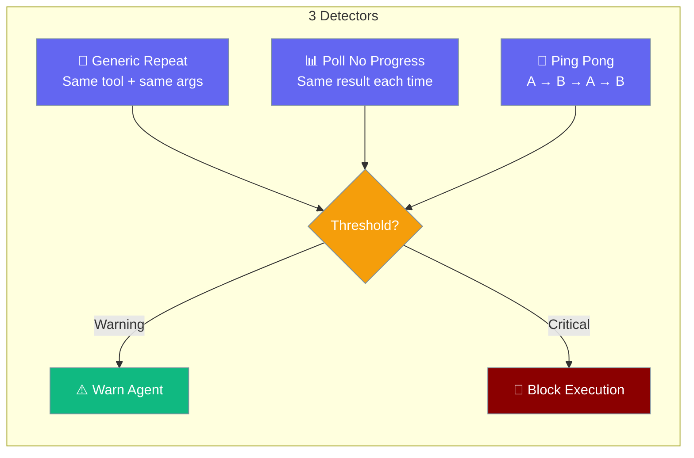
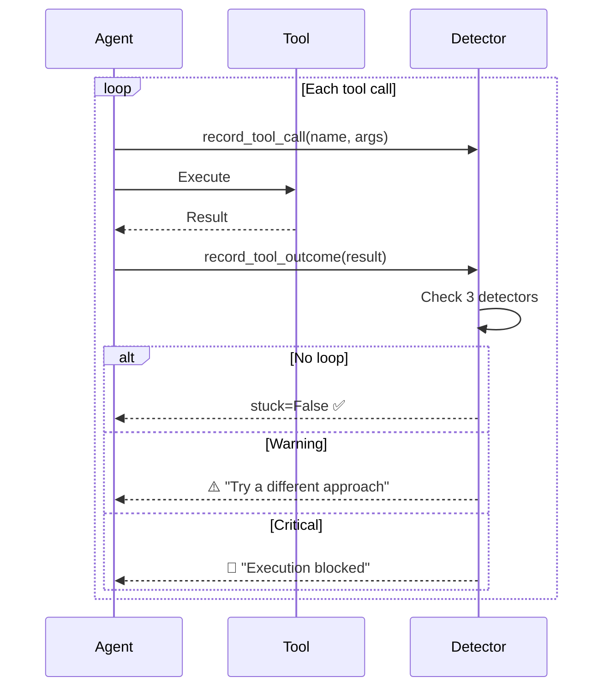

Loop detection prevents agents from calling the same tool repeatedly with no progress.

```python
from praisonaiagents import Agent

agent = Agent(
    name="assistant",
    instructions="Stop repeating the same failing tool pattern",
)

agent.start("Fix the deployment issue")
```

The user watches the agent work; doom-loop detection escalates when cycles repeat.



## Quick Start

<Steps>
<Step title="Enable the plugin">
Import the plugin once — it registers a global `BEFORE_TOOL` hook.

```python
import praisonaiagents.plugins.loop_detection_plugin  # noqa: F401
from praisonaiagents import Agent

agent = Agent(instructions="You are a helpful assistant.")
agent.start("Read config.yaml and summarise it.")
```
</Step>

<Step title="Custom thresholds before import">
```python
from praisonaiagents.agent.loop_detection import LoopDetectionConfig
import praisonaiagents.plugins.loop_detection_plugin as ldp

ldp.DEFAULT_CONFIG = LoopDetectionConfig(
    enabled=True,
    warn_threshold=5,
    critical_threshold=10,
)

from praisonaiagents import Agent

agent = Agent(instructions="Poll a job status endpoint.")
agent.start("Check whether job-42 finished.")
```
</Step>
</Steps>

---

## How It Works



---

## Detectors

| Detector | What It Detects | Example |
|----------|----------------|---------|
| `generic_repeat` | Same tool + identical args N times | `read_file("config.py")` called 10 times |
| `poll_no_progress` | Same args AND same result (no progress) | `check_status("job-1")` returns identical "pending" 10 times |
| `ping_pong` | Alternating A → B → A → B pattern | Two tools oscillating back and forth |

<Note>
`poll_no_progress` uses heuristic tool name matching — tools with "status", "poll", "check", "wait", "ping", or "health" in their name are classified as polling tools.
</Note>

---

## Configuration Options

| Option | Type | Default | Description |
|--------|------|---------|-------------|
| `enabled` | `bool` | `False` | Opt-in on `LoopDetectionConfig`; plugin sets `True` when imported |
| `history_size` | `int` | `30` | Sliding window of recent tool calls |
| `warn_threshold` | `int` | `10` | Identical calls before warning |
| `critical_threshold` | `int` | `20` | Identical calls before blocking (auto-corrected to > warn) |
| `detectors` | `dict` | all three `True` | Enable or disable individual detectors |

---

## Common Patterns

### Disable a Specific Detector

```python
from praisonaiagents.agent.loop_detection import LoopDetectionConfig
import praisonaiagents.plugins.loop_detection_plugin as ldp

ldp.DEFAULT_CONFIG = LoopDetectionConfig(
    enabled=True,
    detectors={"generic_repeat": True, "poll_no_progress": False, "ping_pong": True},
)

from praisonaiagents import Agent

agent = Agent(instructions="Monitor server health")
agent.start("Is the API healthy?")
```

### Aggressive Detection

```python
from praisonaiagents.agent.loop_detection import LoopDetectionConfig
import praisonaiagents.plugins.loop_detection_plugin as ldp

ldp.DEFAULT_CONFIG = LoopDetectionConfig(
    enabled=True,
    warn_threshold=3,
    critical_threshold=5,
)

from praisonaiagents import Agent

agent = Agent(instructions="Quick task agent")
agent.start("Fetch the homepage title.")
```

---

## Related to Loop Guard

Loop Detection is opt-in (import the plugin) and catches identical-argument / no-progress patterns. **Loop Guard** ([docs](/docs/features/loop-guard)) is always-on and counts per-turn tool calls with idempotent-vs-mutating thresholds. Use both for autonomous agents — Loop Guard as the safety net, Loop Detection for deeper pattern matching.

---

## Best Practices

<AccordionGroup>
<Accordion title="Import the plugin for autonomous agents">
Long-running agents with many tool calls benefit most from loop detection — add the import at process startup.
</Accordion>

<Accordion title="Adjust thresholds for polling tools">
If your agent legitimately polls a status endpoint, increase thresholds or disable `poll_no_progress`.
</Accordion>

<Accordion title="Zero overhead when not imported">
The detector uses stdlib only (`hashlib`, `json`). Without importing the plugin, no hook is registered.
</Accordion>

<Accordion title="Do not confuse with autonomy doom loops">
Autonomy mode has separate [doom loop detection](/docs/features/autonomy-loop) for repeated actions during self-directed runs.
</Accordion>
</AccordionGroup>

---

## Related

<CardGroup cols={2}>
<Card title="Loop Guard" icon="shield-halved" href="/docs/features/loop-guard">
  Always-on per-turn tool-call guardrails
</Card>
<Card title="Autonomy Loop" icon="robot" href="/docs/features/autonomy-loop">
  Self-directed execution and doom loop thresholds
</Card>
</CardGroup>
