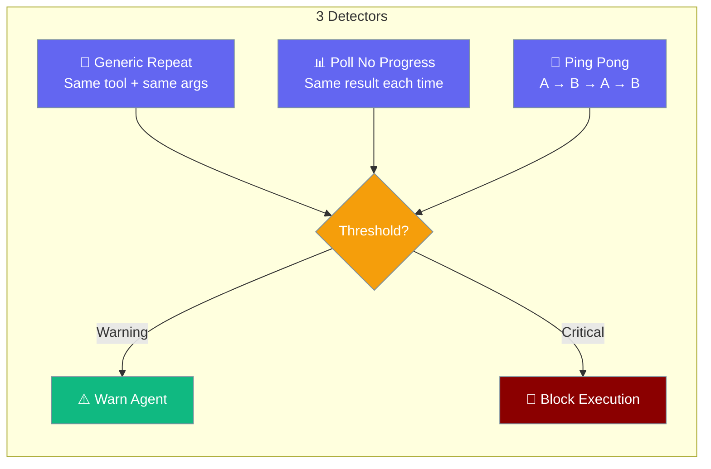
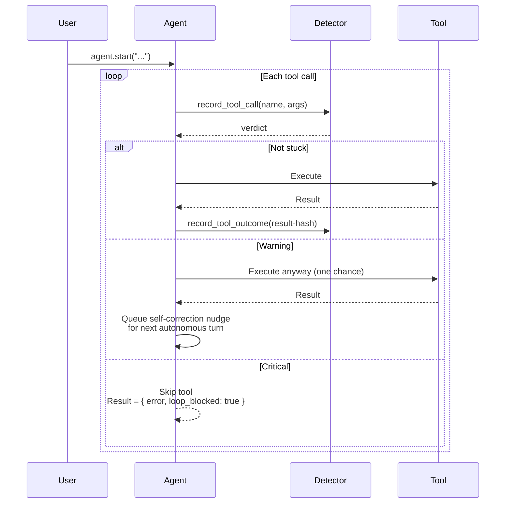
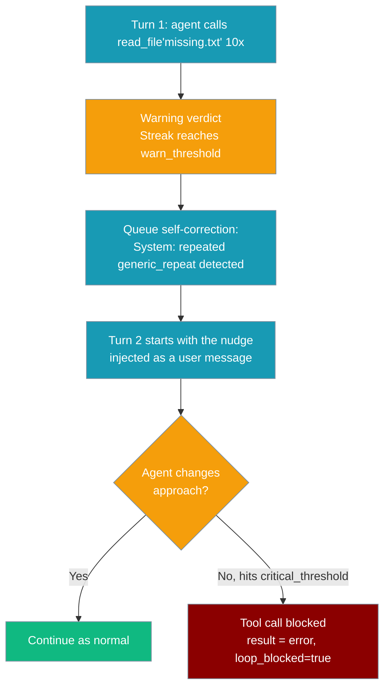

Loop detection prevents agents from calling the same tool repeatedly with no progress.

```python
from praisonaiagents import Agent

agent = Agent(
    name="assistant",
    instructions="Stop repeating the same failing tool pattern",
)

agent.start("Fix the deployment issue")
```

Every `Agent` you create has this protection on by default — no import, no flag. Polling a status endpoint that actually changes state is **not** flagged; a genuine stall or `A -> B -> A -> B` oscillation is.



<Note>
Result-aware tool-loop detection is wired into every `Agent` as of [PR #3005](https://github.com/MervinPraison/PraisonAI/pull/3005) (release after 2026-07-14). Earlier releases required `import praisonaiagents.plugins.loop_detection_plugin` to activate the `BEFORE_TOOL` hook — that plugin still works but is no longer necessary. Upgrade to pick up the built-in detection plus the fixed doom-loop consecutive-failure signal.
</Note>

## Quick Start

<Steps>
<Step title="It's already on">
Result-aware tool-loop detection runs on every `Agent`. No import, no configuration.

```python
from praisonaiagents import Agent

agent = Agent(
    name="assistant",
    instructions="You are a helpful assistant.",
)

# Result-aware tool-loop detection is enabled on every Agent.
# No import, no configuration - just run the agent.
agent.start("Read config.yaml and summarise it.")
```
</Step>

<Step title="Tune the thresholds">
Override the per-agent config before the first tool call.

```python
from praisonaiagents import Agent
from praisonaiagents.agent.loop_detection import LoopDetectionConfig

agent = Agent(instructions="Poll a job status endpoint.")

agent._loop_detector_config = LoopDetectionConfig(
    enabled=True,
    warn_threshold=5,
    critical_threshold=10,
)

agent.start("Check whether job-42 finished.")
```
</Step>

<Step title="Turn it off">
Disable detection for deterministic replay agents that repeat identical calls on purpose.

```python
from praisonaiagents import Agent
from praisonaiagents.agent.loop_detection import LoopDetectionConfig

agent = Agent(instructions="Deterministic replay agent")
agent._loop_detector_config = LoopDetectionConfig(enabled=False)
```

<Warning>
Disabling loop detection removes the safety net for tools that get stuck in identical-argument loops.
</Warning>
</Step>
</Steps>

---

## How It Works

The detector records each tool call before execution, checks three detectors, then back-fills the result hash after execution so progress breaks the streak.



A warning fires once per autonomous turn — the next iteration's prompt is prefixed with `[System: repeated <detector> detected. Try a different approach. …]`, giving the model one chance to change course before a critical verdict blocks execution entirely.

---

## Detectors

| Detector | What It Detects | Example |
|----------|----------------|---------|
| `generic_repeat` | Same tool + identical args N times | `read_file("config.py")` called 10 times |
| `poll_no_progress` | Same args AND same result (no progress) | `check_status("job-1")` returns identical "pending" 10 times |
| `ping_pong` | Alternating A → B → A → B pattern | Two tools oscillating back and forth |

<Note>
`poll_no_progress` uses heuristic tool name matching — tools with "status", "poll", "check", "wait", "ping", or "health" in their name are classified as polling tools.
</Note>

---

## Configuration Options

| Option | Type | Default | Description |
|--------|------|---------|-------------|
| `enabled` | `bool` | `True` (per-`Agent`) / `False` (bare `LoopDetectionConfig()`) | `Agent._ensure_loop_detector()` constructs a config with `enabled=True`. Constructing `LoopDetectionConfig()` directly still defaults to `False`, matching the module docstring. |
| `history_size` | `int` | `30` | Sliding window of recent tool calls |
| `warn_threshold` | `int` | `10` | Identical calls before warning |
| `critical_threshold` | `int` | `20` | Identical calls before blocking (auto-corrected to `critical > warn`) |
| `detectors` | `dict[str, bool]` | `{generic_repeat: True, poll_no_progress: True, ping_pong: True}` | Enable / disable individual detectors |

<Note>
Per-`Agent` detection is created lazily on the first tool call, so `Agent(...)` init has zero overhead. Set `agent._loop_detector_config = LoopDetectionConfig(...)` before the first tool call to override defaults.
</Note>

---

## Common Patterns

### Polling a status endpoint

Raise thresholds and keep detection on.

```python
from praisonaiagents import Agent
from praisonaiagents.agent.loop_detection import LoopDetectionConfig

agent = Agent(instructions="Poll deployment status every second.")
agent._loop_detector_config = LoopDetectionConfig(
    enabled=True,
    warn_threshold=30,
    critical_threshold=60,
)
agent.start("Wait for deployment-42 to finish.")
```

### Aggressive detection for short-lived agents

```python
from praisonaiagents import Agent
from praisonaiagents.agent.loop_detection import LoopDetectionConfig

agent = Agent(instructions="Quick web scraper")
agent._loop_detector_config = LoopDetectionConfig(
    enabled=True,
    warn_threshold=3,
    critical_threshold=5,
)
agent.start("Fetch the homepage title.")
```

### Disable a specific detector

Turn off `ping_pong` when two tools legitimately alternate.

```python
from praisonaiagents import Agent
from praisonaiagents.agent.loop_detection import LoopDetectionConfig

agent = Agent(instructions="Two-tool workflow")
agent._loop_detector_config = LoopDetectionConfig(
    enabled=True,
    detectors={"generic_repeat": True, "poll_no_progress": True, "ping_pong": False},
)
```

---

## User Interaction Flow

Here's what a user sees when the detector fires during an autonomous run.



- After the warning fires, the next autonomous turn's prompt is prefixed with `[System: repeated <detector> detected. Try a different approach. <message>]`.
- If the agent still cannot break out of the pattern and hits `critical_threshold` on the same `(tool, args)` fingerprint, the offending call is skipped and the tool result becomes `{"error": "...", "loop_blocked": True}` — the model sees this on its next observation and typically self-corrects.
- The whole path is a soft-block, not an exception — trace spans, stream events, and `AFTER_TOOL` hooks all still fire, so telemetry stays consistent.

---

## Relationship to Loop Guard

Loop Detection is now always-on alongside **Loop Guard** ([docs](/docs/features/loop-guard)). Loop Detection catches identical-argument / no-progress / ping-pong fingerprints at any frequency and back-fills result hashes so polling with progress is not flagged. Loop Guard counts per-turn tool calls with idempotent-vs-mutating thresholds. Both fire through the same `blocked_result` path, so trace spans, stream events, and `AFTER_TOOL` hooks stay consistent regardless of which one triggers.

---

## Best Practices

<AccordionGroup>
<Accordion title="Trust the defaults">
Every `Agent` already has result-aware detection with reasonable thresholds. Only tune when a legitimate use case (long polling, deterministic replay) requires it.
</Accordion>

<Accordion title="Tune thresholds, not the on/off switch">
Set `agent._loop_detector_config = LoopDetectionConfig(enabled=True, warn_threshold=...)` before the first tool call. Disabling entirely removes the safety net.
</Accordion>

<Accordion title="Polling != loop">
The detector uses **name + args + result-hash**, so a poll that returns changing output does not increment the streak. If your polling tool returns *identical* output while it waits, disable the `poll_no_progress` detector for that agent.
</Accordion>

<Accordion title="Zero overhead">
The detector is stdlib-only (`hashlib`, `json`) and lazy-constructed on the first tool call. `Agent(...)` init is unaffected.
</Accordion>

<Accordion title="Legacy plugin (advanced)">
The `praisonaiagents.plugins.loop_detection_plugin` module still exists as an advanced hook-based override — most users no longer need it. Use it only to override thresholds globally via the `BEFORE_TOOL` hook without per-agent code.
</Accordion>
</AccordionGroup>

---

## Related

<CardGroup cols={2}>
<Card title="Loop Guard" icon="shield-halved" href="/docs/features/loop-guard">
  Always-on per-turn tool-call guardrails
</Card>
<Card title="Autonomy Loop" icon="robot" href="/docs/features/autonomy-loop">
  Self-directed execution and doom loop thresholds
</Card>
</CardGroup>
