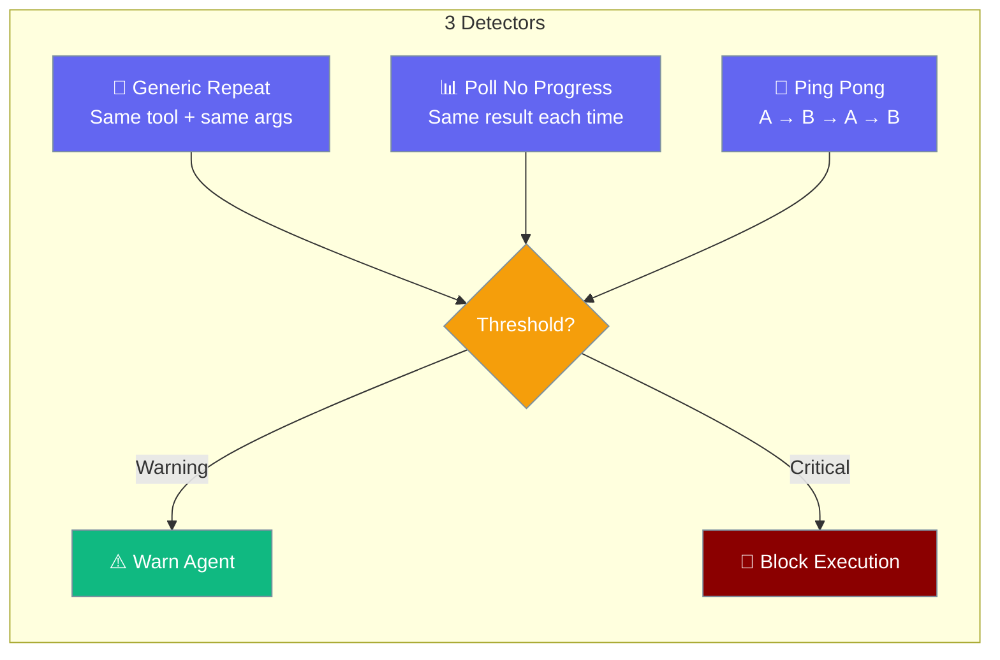
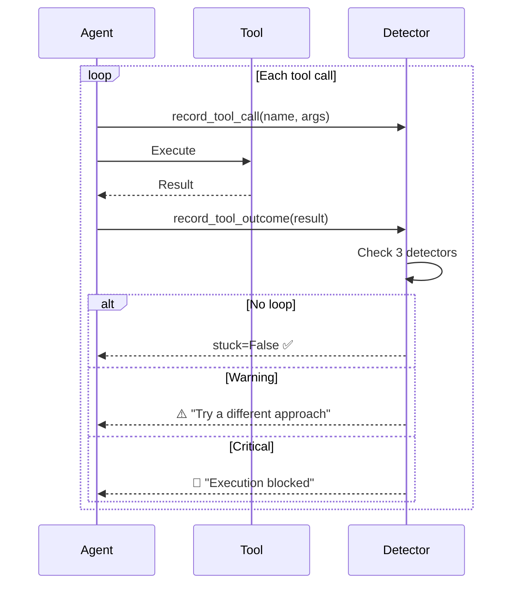

Loop detection prevents agents from getting stuck calling the same tool repeatedly with no progress.



## Quick Start

<Steps>
<Step title="Enable with True">
```python
from praisonaiagents import Agent

agent = Agent(
    instructions="You are a helpful assistant.",
    loop_detection=True  # Uses safe defaults
)
```
</Step>

<Step title="Custom Thresholds">
```python
from praisonaiagents.agent.loop_detection import LoopDetectionConfig

agent = Agent(
    instructions="You are a helpful assistant.",
    loop_detection=LoopDetectionConfig(
        enabled=True,
        warn_threshold=5,       # Warn after 5 identical calls
        critical_threshold=10,  # Block after 10
    )
)
```
</Step>
</Steps>

---

## How It Works



---

## Detectors

| Detector | What It Detects | Example |
|----------|----------------|---------|
| `generic_repeat` | Same tool + identical args N times | `read_file("config.py")` called 10 times |
| `poll_no_progress` | Same args AND same result (no progress) | `check_status("job-1")` returns identical "pending" 10 times |
| `ping_pong` | Alternating A → B → A → B pattern | Two tools oscillating back and forth |

<Note>
`poll_no_progress` uses heuristic tool name matching — tools with "status", "poll", "check", "wait", "ping", "health" in their name are automatically classified as polling tools.
</Note>

---

## Configuration Options

| Option | Type | Default | Description |
|--------|------|---------|-------------|
| `enabled` | `bool` | `False` | Opt-in. Zero overhead when disabled |
| `history_size` | `int` | `30` | Sliding window of recent tool calls |
| `warn_threshold` | `int` | `10` | Identical calls before warning |
| `critical_threshold` | `int` | `20` | Identical calls before blocking (auto-corrected to > warn) |
| `detectors` | `dict` | `{"generic_repeat": True, "poll_no_progress": True, "ping_pong": True}` | Enable/disable individual detectors |

---

## Common Patterns

### Disable a Specific Detector

```python
from praisonaiagents.agent.loop_detection import LoopDetectionConfig

agent = Agent(
    instructions="Monitor server health",
    loop_detection=LoopDetectionConfig(
        enabled=True,
        detectors={"generic_repeat": True, "poll_no_progress": False, "ping_pong": True}
    )
)
```

### Aggressive Detection

```python
agent = Agent(
    instructions="Quick task agent",
    loop_detection=LoopDetectionConfig(
        enabled=True,
        warn_threshold=3,
        critical_threshold=5,
    )
)
```

---

## Best Practices

<AccordionGroup>
<Accordion title="Enable for Autonomous Agents">
Agents running in `autonomy=True` mode should always have loop detection. Long-running autonomous agents are most susceptible to getting stuck.
</Accordion>

<Accordion title="Adjust Thresholds for Polling Tools">
If your agent legitimately polls a status endpoint, increase thresholds or disable `poll_no_progress` for that workflow.
</Accordion>

<Accordion title="Zero Overhead When Disabled">
Loop detection uses stdlib only (`hashlib`, `json`). When `enabled=False` (default), zero CPU cost — the detector returns immediately.
</Accordion>
</AccordionGroup>

---

## Related

<CardGroup cols={2}>
<Card title="Autonomy" icon="robot" href="/docs/features/escalation-pipeline">
  Autonomous agent execution with escalation
</Card>
<Card title="Background Tasks" icon="clock" href="/docs/features/background-tasks">
  Long-running agents with scheduling
</Card>
</CardGroup>
